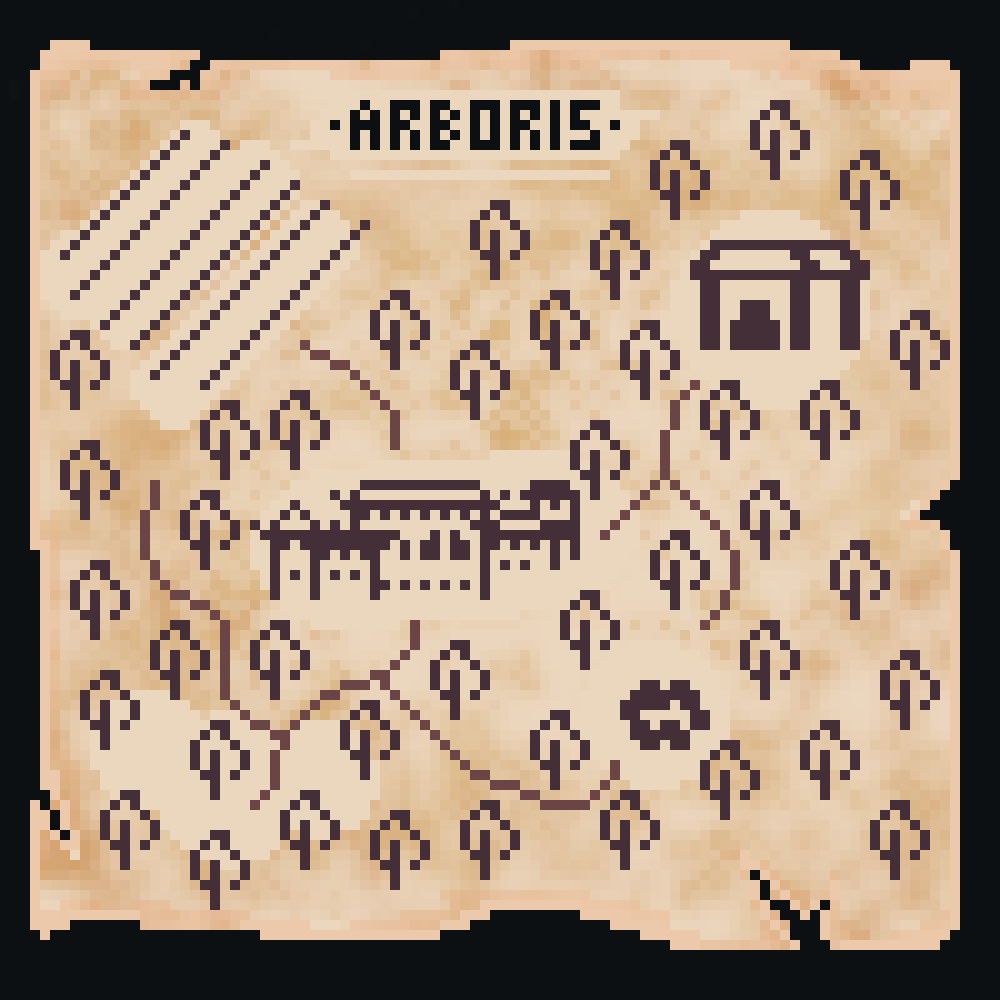

# Found artifacts from Arboris.

You can read more about this region [here](/Homes-journey-archive/Worlds/Dominia/Arboris)

---

## Elixirs

These are the renowned healing infusions of Arboris, created from rare and valuable plants that grow in this region. The image depicts three bowls, each containing a unique infusion with different properties and colors. These elixirs are an integral part of Arboris' culture and traditions, used not only for healing but also in various rituals and ceremonies, emphasizing the deep connection of the people with nature and its gifts.

---

## The Book of All Recipes

In an antique leather cover with embossed patterns, the Book of All Recipes is kept by the Chief Healer of Arboris, emanating ancient wisdom and magic. Its pages, slightly yellowed with age, contain a wealth of knowledge about medicinal plants and Elixirs, gathered and passed down through generations. On the front page, the crest of Arboris is prominently displayed, depicting intertwined tree branches in a ring, symbolizing eternal life and the cyclic nature of the world. Each recipe is meticulously written in calligraphic script, accompanied by illustrations of plants and detailed descriptions of their properties and uses.

---

## The Three-Eyed Owl

A mystical creature that inhabits the forest hollows of Arboris. This graceful bird has soft feathers in shades of gray and brown, allowing it to blend perfectly with its surroundings. It has three bright green eyes arranged in a triangle on its head, giving it a special magical aura. The middle eye, endowed with mystical properties, can see the auras and energies of living beings and also predict the future.

---

## Map of the Arboris area

This map displays the five key locations within the Arboris area: the Forest Hollow, the Ritual Clearing, the Elixirs Temple, the Fields, and the Castle of Arboris itself. The surrounding terrain is lush and verdant, covered with expansive forests and rolling hills, alive with diverse flora and fauna. In the distance, majestic mountains provide a stunning backdrop. The area is rich in medicinal plants and natural resources, vital for the well-being of the entire planet of Dominia. Legends also speak of a hidden clearing deep within the forest, known only to the Forest Keeper.

---

## Statue of Reverence

In the heart of the Arboris Temple, a statue stands as a symbol of wisdom and joy. The figure radiates warmth and serenity, with a broad smile that seems to invite all who enter to share in the peaceful energy of the space. Crafted from smooth, polished stone, the statue exudes a sense of calm and contentment. It is often adorned with offerings of flowers and herbs, placed lovingly at its feet by worshippers seeking guidance and blessings. This statue, with its gentle and welcoming presence, serves as a focal point for meditation and reflection, embodying the values of harmony and well-being that are central to Arboris.

