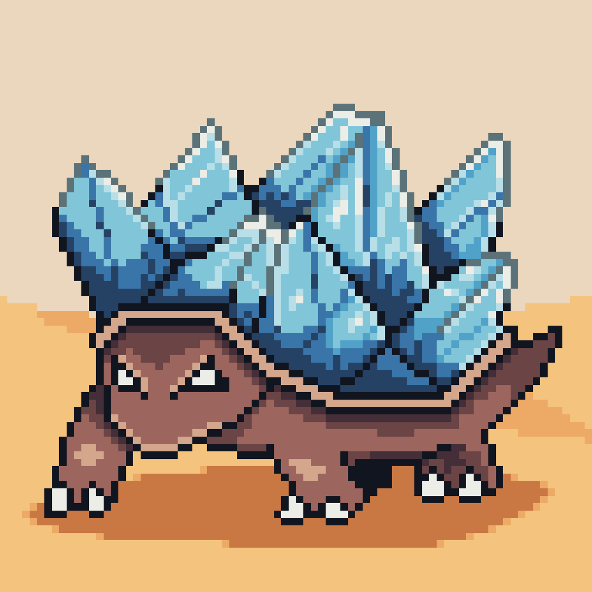

# Found artifacts from Crystalis

You can read more about this region [here](/Worlds/Dominia/Crystalis)

---

## Deposits of Etherite

An important resource of this area, fought over by several clans.

---

## Etherite Turtle

A very rare reptile native to the area, encountering it is considered great luck.

---

<a href="/Artifacts/README" style="display: block; padding: 16px; border: 1px solid #c8a84b; text-decoration: none; color: #c8a84b; margin-right: auto; width: fit-content;">
  
Back to

  
Artifacts

</a>

