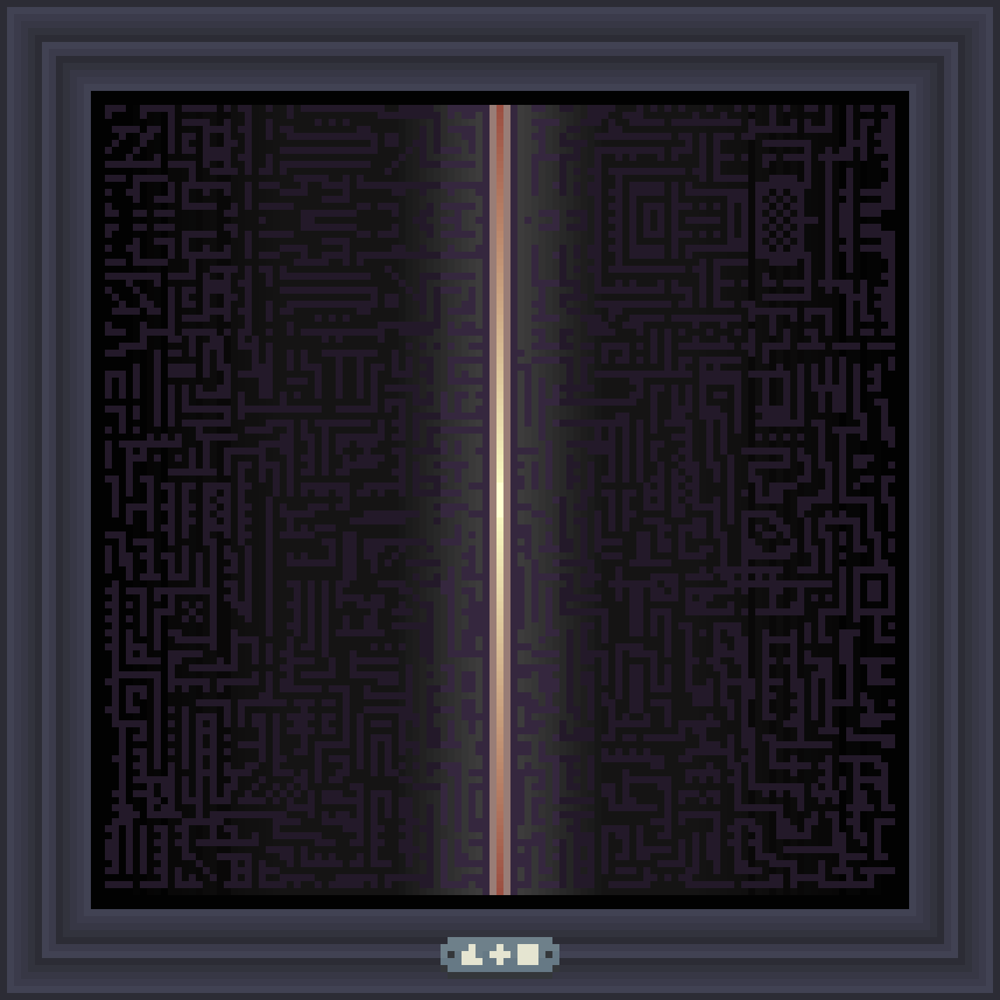
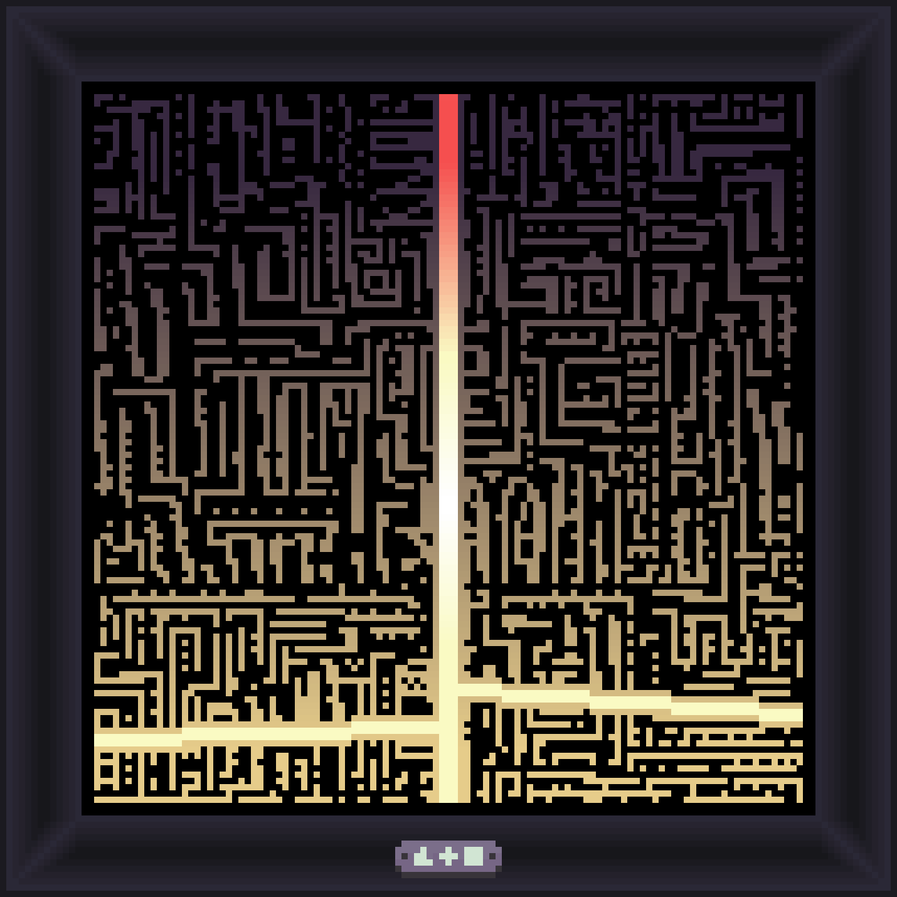
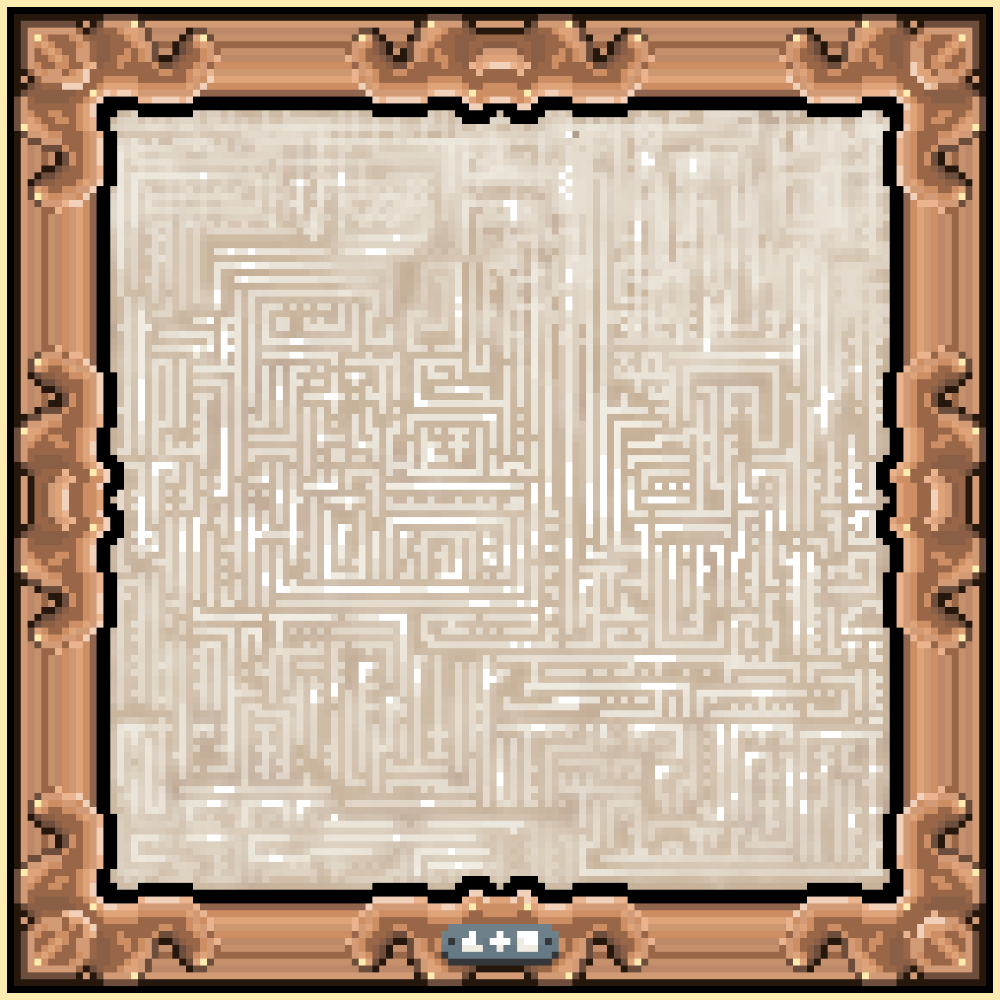
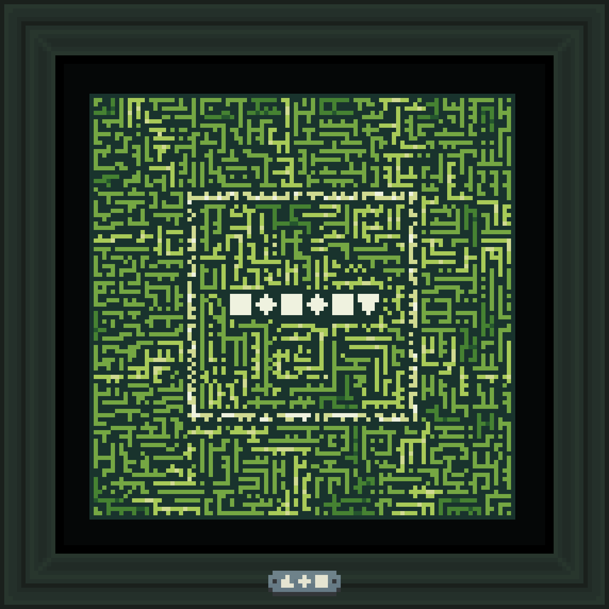
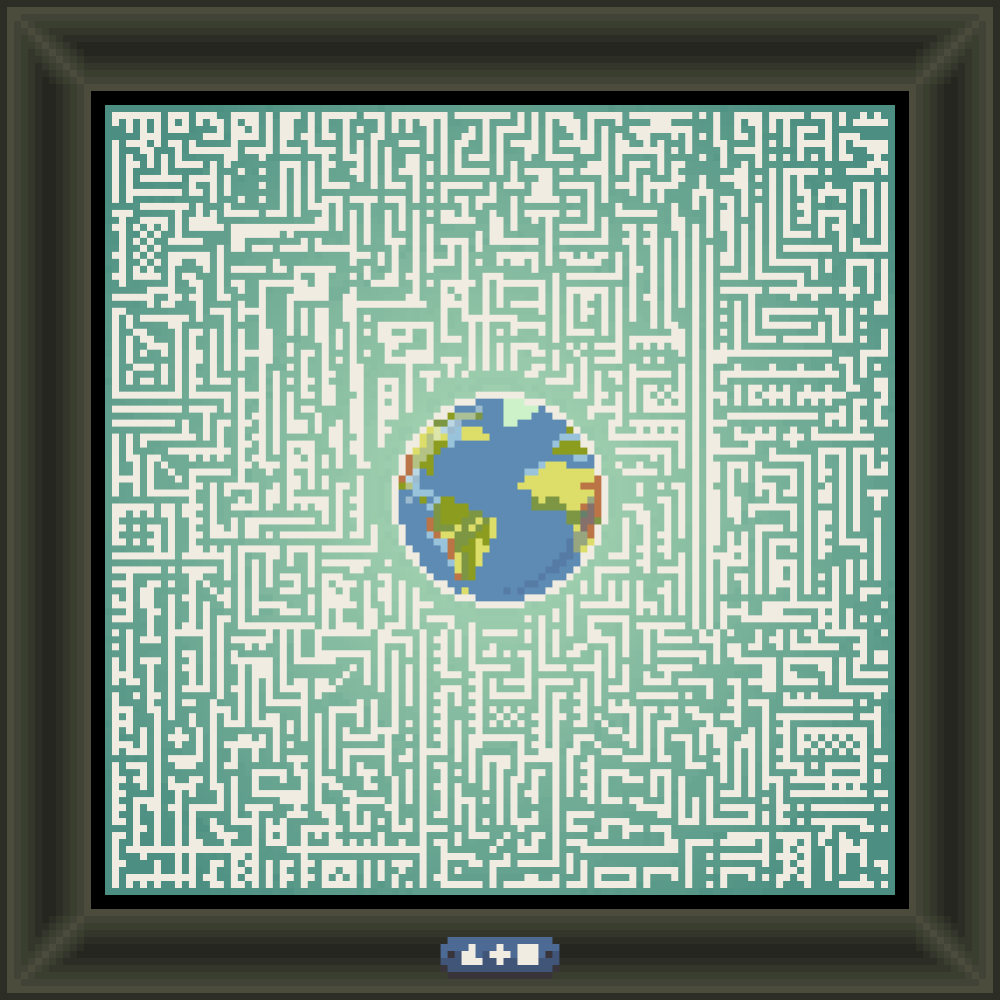
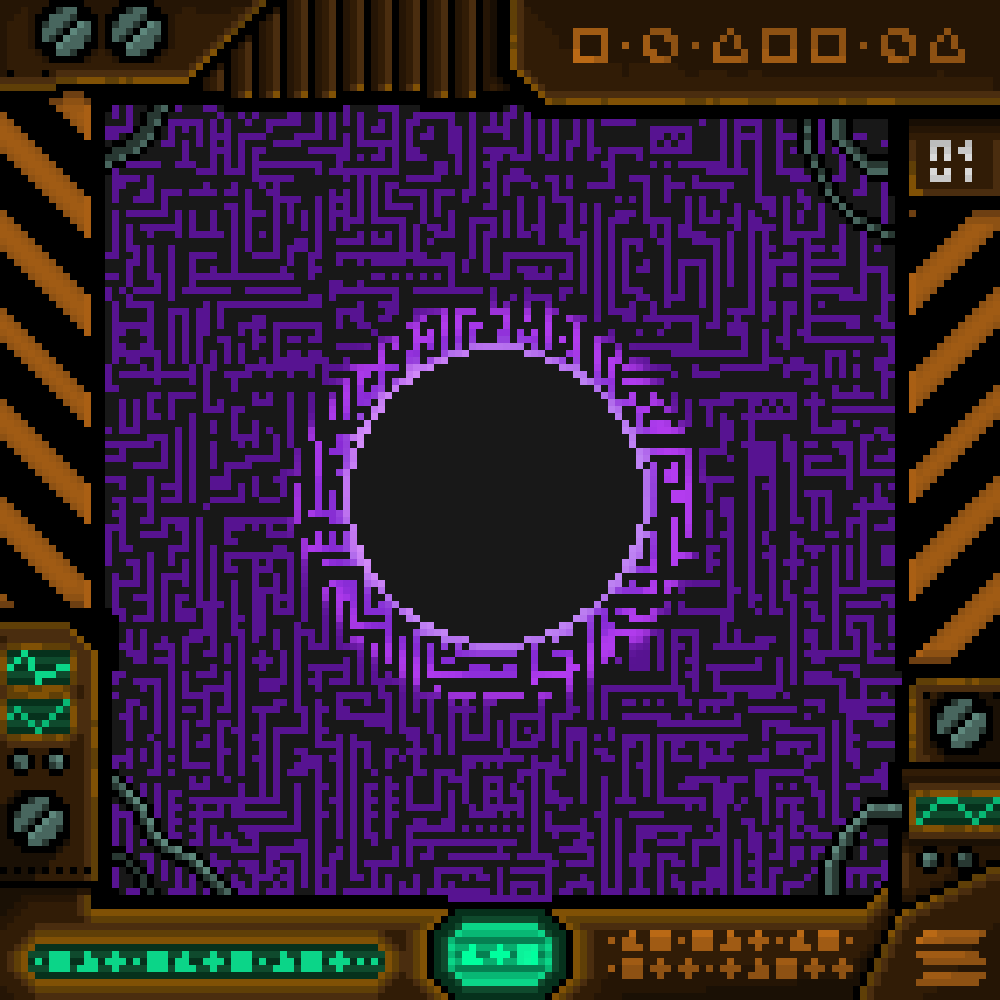

# Collection of Schemes

Among the countless Path Schemes recorded within the Archive, a small number have earned a place apart.

These are Schemes that led somewhere significant — to Worlds previously unknown, to places beyond the edges of all existing records, or to locations so dangerous that their very existence reshaped how Travelers understand the boundaries of the Universe.

Some of these Schemes are studied. Some are forbidden. All of them are preserved.

---

## Scheme of the Outer Edge

A Scheme that led further than any previously documented journey — to regions where the density of Worlds begins to thin and the structure of the Path itself becomes unstable.

---

## The Path to Three Riches

This Scheme was the first to open the World of Dominia for exploration. A discovery of considerable significance — one that led to the recovery of numerous artifacts and the documentation of three distinct civilizations within this World.

---

## Handmade Scheme

Unlike most created Schemes, this was made by a Traveler who had been lost for an extended period and needed to find the way back to the Tavern from an uncharted location.

The fact that it worked — that a Path home could be built from nothing — made it unlike any other Scheme in the Archive.

---

## 

---

## Scheme that lead to Edem

The first Scheme that successfully established lead to Edem. Before it existed, the World appeared in records only as a name — mentioned in fragments of the Book, never confirmed. Once this Scheme proved the route, it was easier to create new Schemes to travel on this World.

---

## Forbidden Scheme

This Scheme is no longer available for use. The Traveler who followed it arrived in a World so thoroughly consumed by Jeet that conscious presence within it became impossible almost immediately upon arrival.

The Traveler survived. The World it leads to has not been revisited.

---

<a href="/Artifacts/README" style="display: block; padding: 16px; border: 1px solid #c8a84b; text-decoration: none; color: #c8a84b; margin-right: auto; width: fit-content;">
  
Back to

  
Artifacts

</a>

