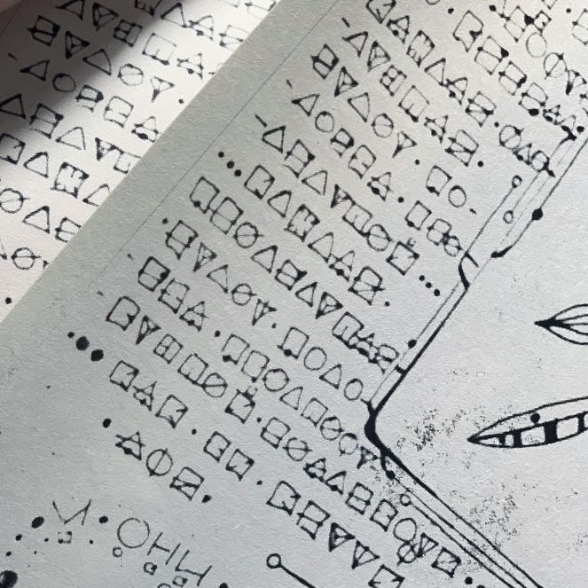

# The Figurative Language

Among all known symbolic systems, the figurative language remains the most ancient and difficult to translate — a method of writing encountered within the ritual symbols of the Valley of Tea Dragons and throughout most surviving fragments of the ancient Book discovered near the Tea Rock.

Unlike conventional writing systems, the figurative language makes almost no use of familiar words or alphabetical structures. Instead, its records consist of geometric figures, connected lines, directions, repeating patterns, and spatial combinations of symbols whose meanings depend directly on their relationship to one another.

The three most common forms found throughout the surviving records are the triangle, the circle, and the square. Despite the apparent simplicity of these shapes, their usage within the language remains highly complex and layered. Depending on the context, the same figure may represent:

* a direction;
* a state;
* a role;
* a type of entity;
* a method of movement;
* or even an entire World.

Among the Villagers, there exists a belief that the tradition of dividing masks by shape partially originated from the figurative language itself. Although it is equally possible that the relationship developed in reverse, confirming or disproving this remains impossible at present. Nevertheless, the recurrence of matching symbols appears far too frequent to be dismissed as coincidence.

According to current observations, the figurative language is used not merely for storing information, but also as a method of describing the relationships between objects, Worlds, and the Essence itself. For this reason, attempts at direct literal translation usually result in the loss of a significant portion of the intended meaning.

While studying the ancient Book, it gradually became clear to me that many records cannot be read linearly like ordinary text. Certain passages require the entire structure to be perceived simultaneously, while some symbols only begin to reveal their meaning after deeper comparison with other records.

At present, it seems to me that the figurative language is not simply an ancient form of writing, but a far more complex system describing the very structure of the Path, the Worlds, and the Essence itself. Perhaps this is precisely why even a fragmentary understanding of the language already allows for the creation of new Schemes of the Path, and with them, the discovery of routes toward previously unknown Worlds.

---

