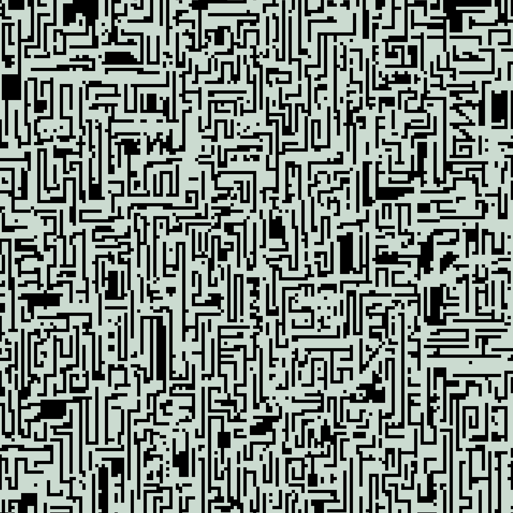

# Schemes of the Path

Schemes of the Path are one of the fundamental concepts involved in traversing the Path, discovering unexplored Worlds, and traveling in general. Despite their outward resemblance to ordinary maps, blueprints, or collections of symbols, to Travelers they are far more than simple directional guides.

Thanks to the exceptionally well-preserved records within the Book, as well as my long and productive work translating its concepts, I have managed to thoroughly understand how these Schemes function and how to reproduce them through sketches. In this work, I am occasionally assisted by the Artchemist.

The foundation of the Schemes consists of complex combinations of figures, lines, symbols, and structures composed in the ancient figurative language. Even so, directly understanding how to establish a Path is often impossible without prior preparation and proper concentration.

However, even with knowledge of the Schemes’ principles, they remain highly unstable. The same route may change over time, certain Worlds disappear entirely from accessible Paths, and some Schemes lead Travelers into places never previously expected to exist.

Among Travelers, there is also a clear understanding that every Scheme is, to a certain extent, unique and never fully separate from the one who uses it. For this reason, some routes become accessible only to particular Travelers, while for others the exact same records remain nothing more than meaningless arrangements of figures. This is precisely why Shen plays such a crucial role in selecting the appropriate Path individually for each Traveler.

Schemes of the Path are not merely instruments of navigation between Worlds, but one of the most ancient and complex systems preserved from the eras predating the Tavern, the Valley, and most other Worlds known today.

Particularly ancient Schemes, or those that once opened Paths to exceptionally well-preserved Worlds, eventually become artifacts in their own right and are regarded as objects of great historical significance.

---

