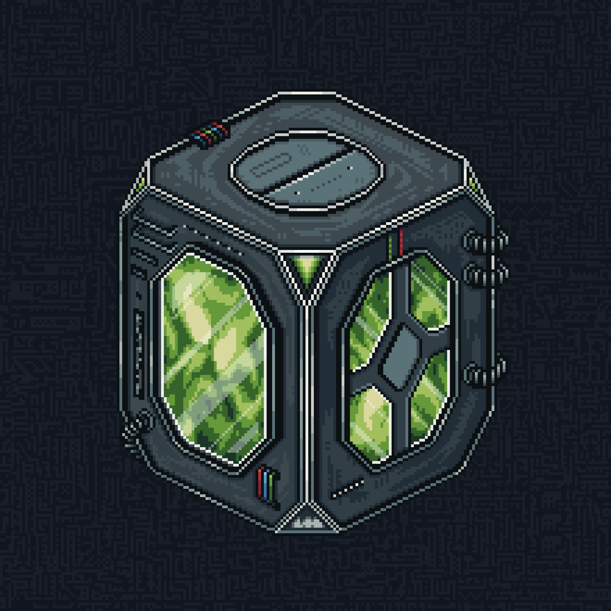

# Chaetron

A substance produced by me that allows Travelers to alter their appearance. Nothing supernatural, honestly. It is essentially a cosmetic product.

I brew it from leftover tea and several other ingredients, all completely natural. Artchemist and Teaveloper assist me greatly in the process.

Once prepared, the finished Chaetron is poured into containers and shipped to the Tavern, where Travelers use it to alter their appearance.

  

---

<a href="/Concepts/README" style="display: block; padding: 16px; border: 1px solid #c8a84b; text-decoration: none; color: #c8a84b;">
  
Back to

  
Concepts

</a>

<a href="/archive/" style="display: block; padding: 16px; border: 1px solid #c8a84b; text-decoration: none; color: #c8a84b;">
  
Back to

  
Begining

</a>

