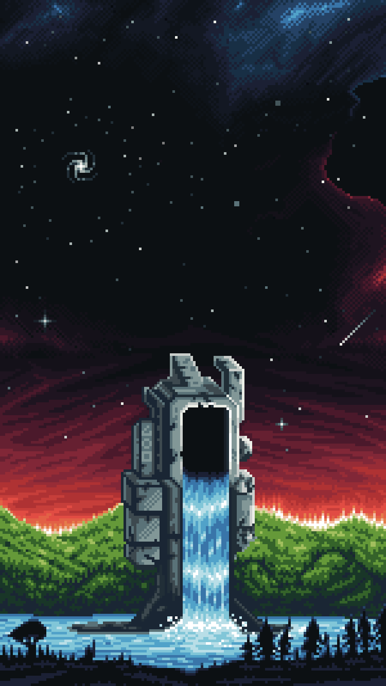

# The Ancient Civilizations

The Ancient Civilizations is the collective term for the countless races, societies, and cultures that existed in the previous Epochs before the dawn of the Current Era.

Although almost all direct records of them have been lost, their existence is confirmed through surviving artifacts, ancient ruins, fragments of translated texts, and — most importantly — the Gates they left behind.

Many of these civilizations reached extraordinary heights of development, and some even began to dimly perceive the true nature of the Great Division and the inevitability of the Return. Yet nearly all of them eventually departed — some fell under the onslaught of Jeet, others collapsed due to internal contradictions, and some simply dissolved into the flow of time.

In the current era, Travelers continue to discover traces of the Departed across various Worlds. Every fragment found is more than just a historical relic. It is a piece of the Essence’s own memory, which, through us, is trying to remember itself.

