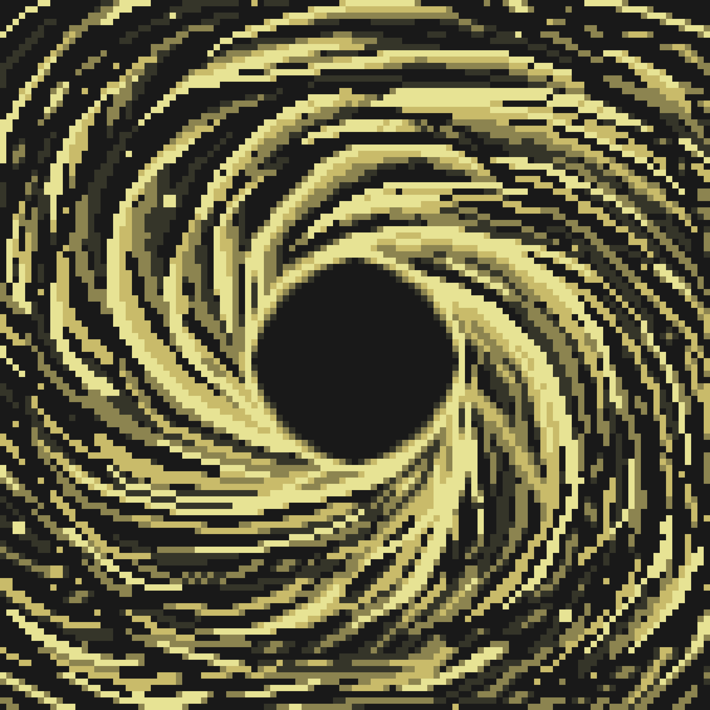
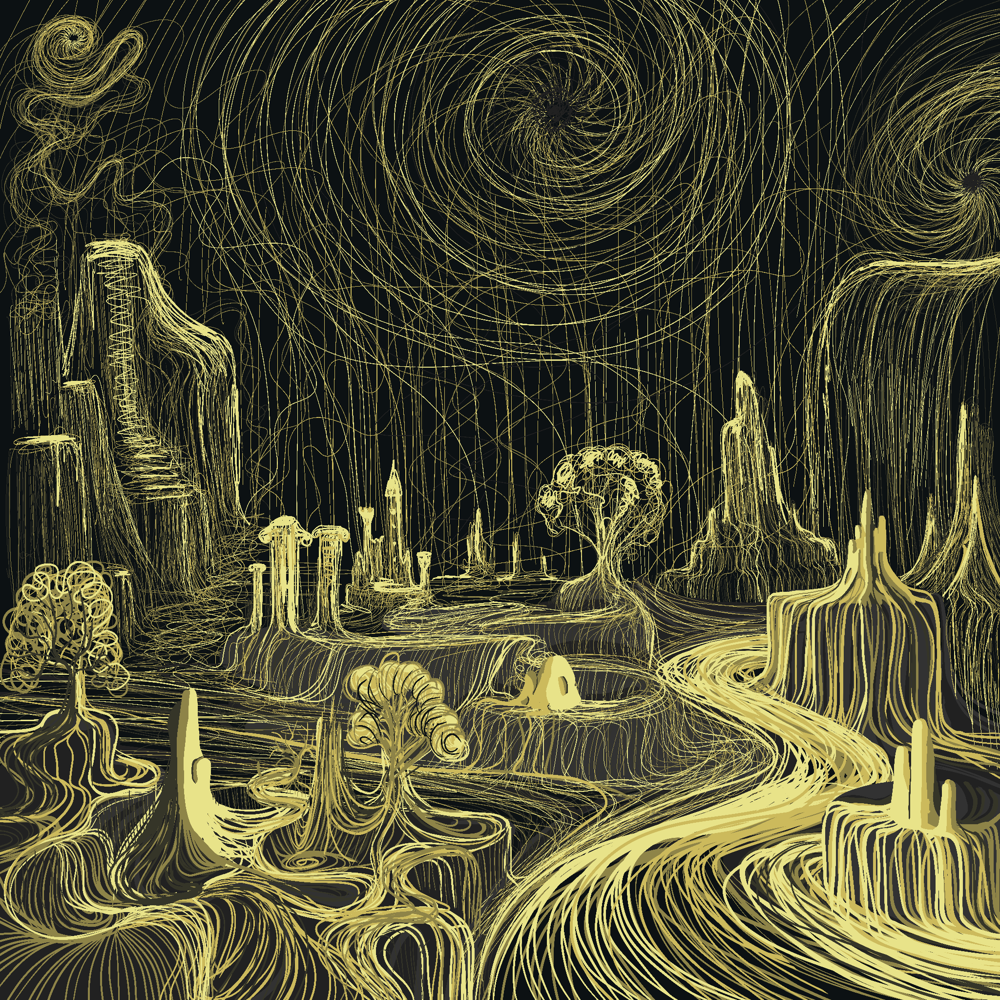

# Cosmology

Among all the records I have managed to translate, few carry such weight and such an important understanding of the structure of existence as the text speaking of the Great Division and what ultimately followed from it.

## The Great Division

In the beginning, there was no form.  
There was no time, no distinction, no boundaries.  
There was only the Unified Essence — whole, limitless, nameless, and indivisible.

It contained within itself all knowledge, all potential, and every possible form of existence. It knew everything. And yet, it did not know itself.

Potential was absolute, but never experienced.  
Knowledge existed without experience.  
And within this lay the greatest paradox:

_“Omniscience without participation is not wisdom, but emptiness.”_

For true knowledge requires distance.  
Experience requires separation.  
In order to obtain meaning, the Whole had to look upon itself from within.

And thus occurred the first and greatest act — not creation, but self-division.

The Unified Essence intentionally shattered itself.

---

The first consequences of the Division became the Worlds. They did not emerge as ordinary places or spaces, but as separate trajectories of the divided Essence. Each World received its own nature, its own rhythm, and its own way of experiencing existence.

Within the Worlds began to manifest the first aspects of the divided Essence: order, silence, chaos, rhythm, structure, emptiness, and countless other states.

Then the Essence continued dividing itself further in order to fill the Worlds with life.

Thus appeared form, memory, consciousness, emotion, and the very ability to experience reality.

The Essence developed one fundamental desire:

“To know itself through experience and one day return to Unity.”

And within this began the deepest meaning of the Path.

Not in endless wandering itself, but in the long, painful, and beautiful process of self-discovery. Every life lived, every World explored, every joy, every loss, every encounter, and every memory become new knowledge upon the journey home.

Slowly, through countless cycles and Worlds, these experiences gradually weave themselves back into something greater.

The Great Division was not a tragedy.

It was the only way for the Essence to escape the state of perfect yet empty omniscience and attain lived wisdom.

However, all division is unstable by nature…

Jeet is the instability of Essence, in which Worlds, objects, or living forms begin to lose their cohesion, form, and identity.

This is not merely destruction.

It is the gradual dissolution of the self itself.

As Jeet intensifies, forms blur, memories scatter, and reality itself begins to lose stability or fall entirely into oblivion, forgetting the ultimate purpose of the Path.

Jeet is not a mistake or an external threat.

On the contrary — it is an inevitable consequence of separation. The price of being free to experience, to feel, and to exist apart from Unity.

And though the excessive spread of Jeet may slow or even endanger the Great Return itself — the moment when the divided Essence may once again become whole — the Path will continue until it is completed.
