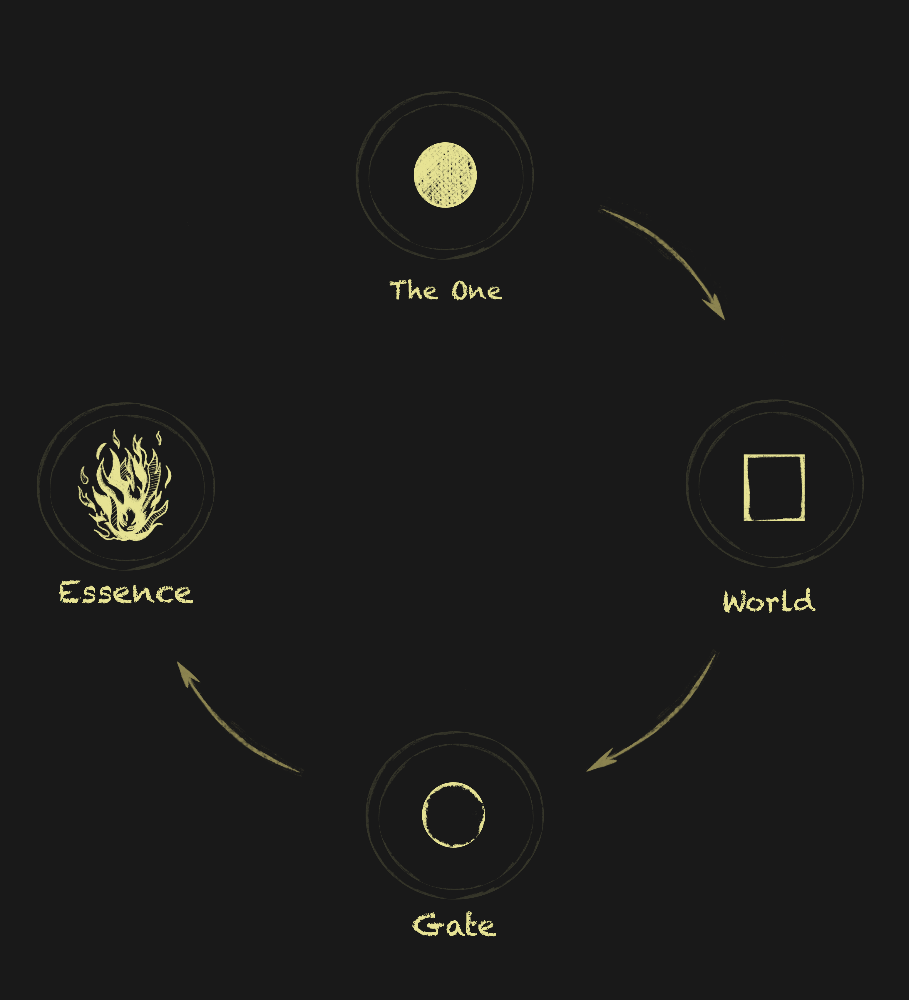
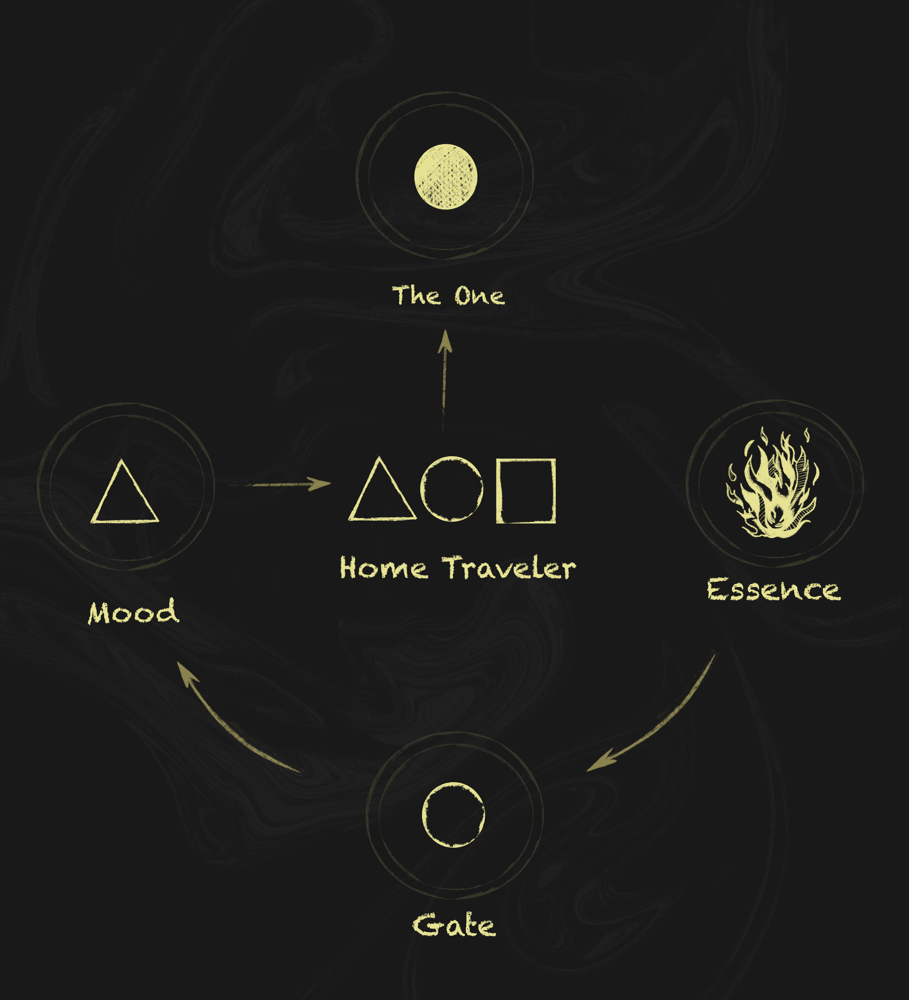

# Possible relationship

My sketches and observations exploring the possible relationship between the Path, the Travelers, and the mysterious Figurative Language.

  
  

---

<a href="/Fragments/README" style="display: block; padding: 16px; border: 1px solid #c8a84b; text-decoration: none; color: #c8a84b; margin-right: auto; width: fit-content;">
  
Back to

  
Fragments

</a>

