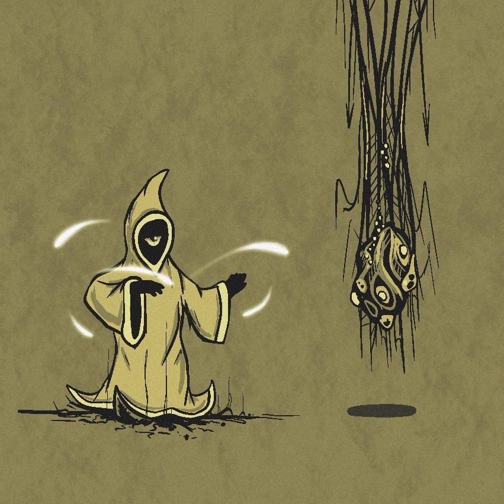

# Umbasir sketch

My sketch imagining how Umbasir might resist the influence of Jeet.

While Travelers are not known to wield magic, I remain convinced that their true potential has not yet been fully revealed...

  

---

<a href="/Fragments/README" style="display: block; padding: 16px; border: 1px solid #c8a84b; text-decoration: none; color: #c8a84b;">
  
Back to

  
Fragments

</a>

<a href="/Fragments/4" style="display: block; padding: 16px; border: 1px solid #c8a84b; text-decoration: none; color: #c8a84b;">
  
Read next

  
Great Legacy

</a>

