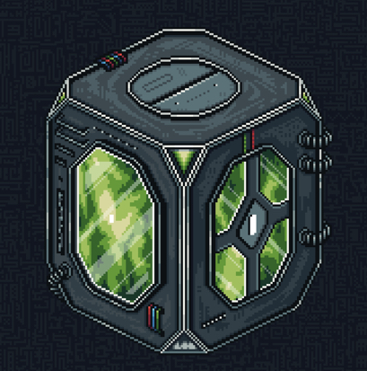

One thing that truly fascinates me is the existence of a spaceport somewhere in the distant lands beyond the Valley.

With whom Tealer managed to negotiate these transportation arrangements remains unknown to me, but this trade route has proven to be vital for maintaining the connection between the Valley and the Tavern.

Alongside Tea and new Schemes intended for Shen, these cargo ships also deliver containers of Chaetron.

---

<a href="/Fragments/README" style="display: block; padding: 16px; border: 1px solid #c8a84b; text-decoration: none; color: #c8a84b; margin-right: auto; width: fit-content;">
  
Back to

  
Fragments

</a>

