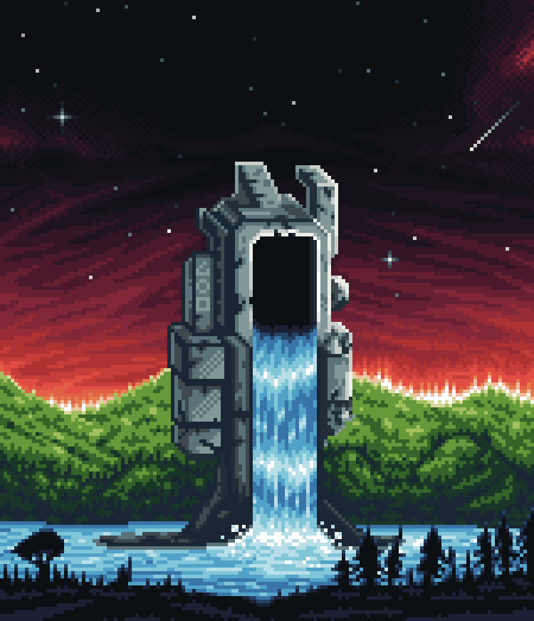

# Great Legacy
A truly beautiful sight, as described to me by [Shen](/Tavern/Shen) during one of her visits to [Edem](/Worlds/Edem).

What she was doing there in the first place, and why a Merhid Gate happened to be present, remains a matter of speculation.

  

---

<a href="/Fragments/README" style="display: block; padding: 16px; border: 1px solid #c8a84b; text-decoration: none; color: #c8a84b; margin-right: auto; width: fit-content;">
  
Back to

  
Fragments

</a>

