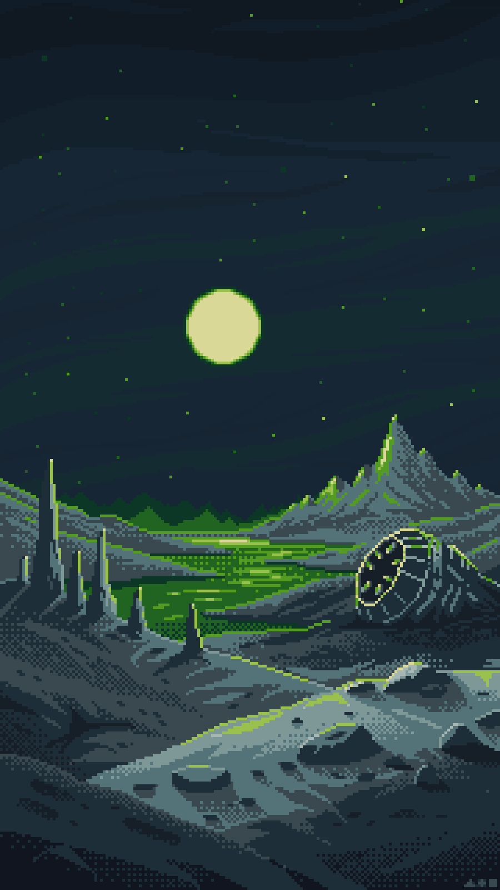

# Unknown Planet

One of the unknown Worlds documented by Traveler #466.

I decided not to include it in the Worlds section, as he provided me with almost no information about it. Then again, according to Shen, he is a rather unusual individual.

  

---

<a href="/Fragments/README" style="display: block; padding: 16px; border: 1px solid #c8a84b; text-decoration: none; color: #c8a84b;">
  
Back to

  
Fragments

</a>

<a href="/Fragments/6" style="display: block; padding: 16px; border: 1px solid #c8a84b; text-decoration: none; color: #c8a84b;">
  
Read next

  
Dormant Dreegan

</a>

