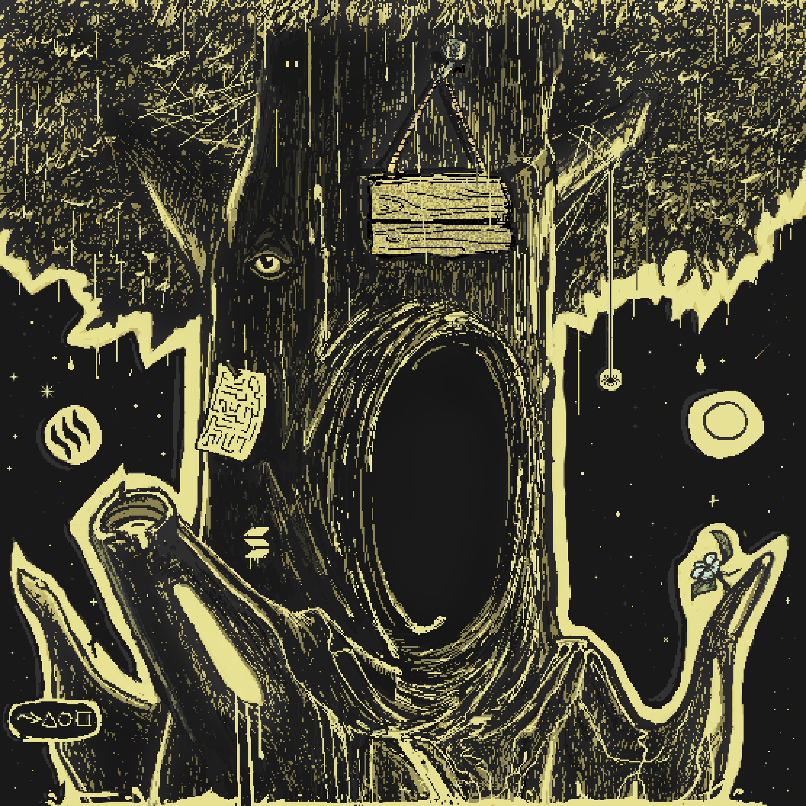

# Dormant Dreegan

One of the earliest illustrations of a dormant [Gate](/Tavern/Gate) that came into my possession.

Various attempts were made to awaken this Dreegan. Numerous artifacts were hung upon it, and several methods were tested, but apparently the Universe does not work that way...

From this, one may conclude that all Gates destined to awaken have already done so, while the rest remain asleep in their eternal oblivion.

  

---

<a href="/Fragments/README" style="display: block; padding: 16px; border: 1px solid #c8a84b; text-decoration: none; color: #c8a84b;">
  
Back to

  
Fragments

</a>

<a href="/Fragments/7" style="display: block; padding: 16px; border: 1px solid #c8a84b; text-decoration: none; color: #c8a84b;">
  
Read next

  
Nomadic Life

</a>

