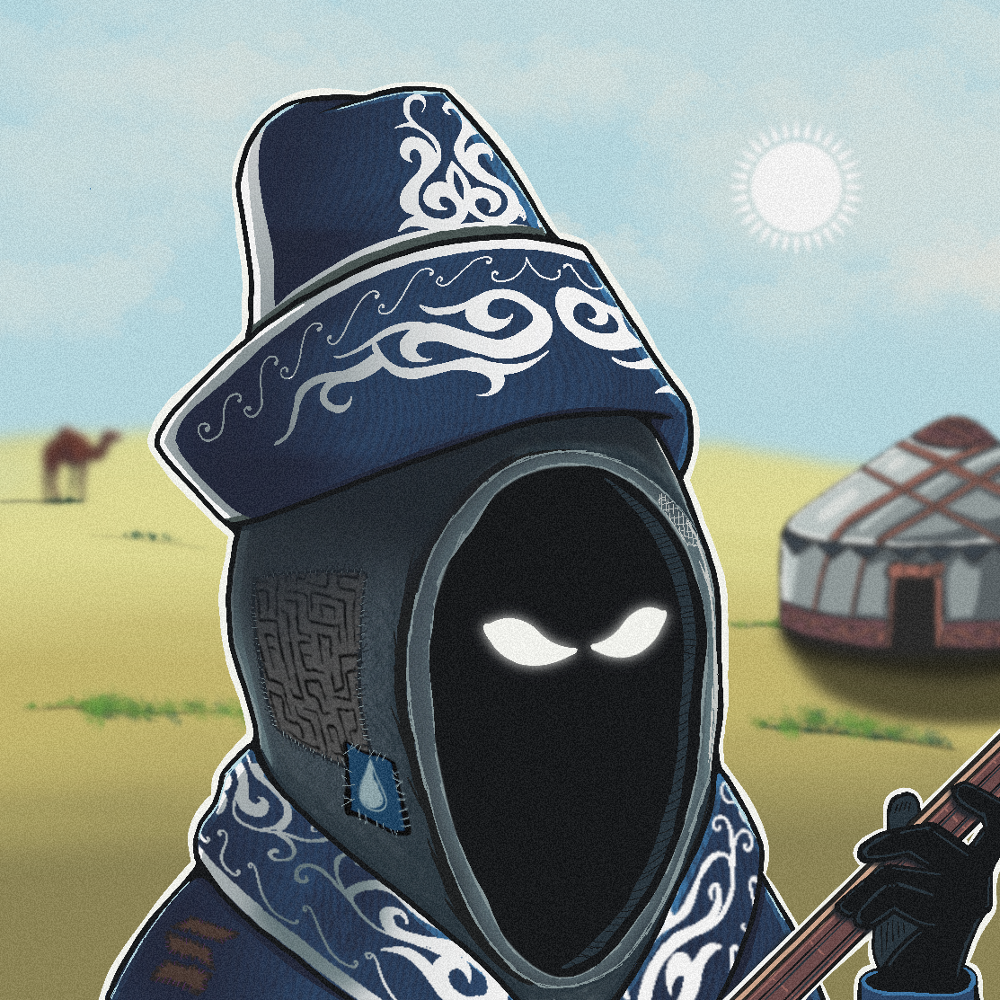

# Nomadic Life

If I remember correctly, this was Traveler #932.

He chose to remain on [Edem](/Worlds/Edem) and live a nomadic life. Well, that is his right.

I do not consider him an [Apostate](/Tavern/Otstup). Perhaps this, too, is simply part of the Path.

  

---

<a href="/Fragments/README" style="display: block; padding: 16px; border: 1px solid #c8a84b; text-decoration: none; color: #c8a84b;">
  
Back to

  
Fragments

</a>

<a href="/Fragments/8" style="display: block; padding: 16px; border: 1px solid #c8a84b; text-decoration: none; color: #c8a84b;">
  
Read next

  
Traveler №578

</a>

