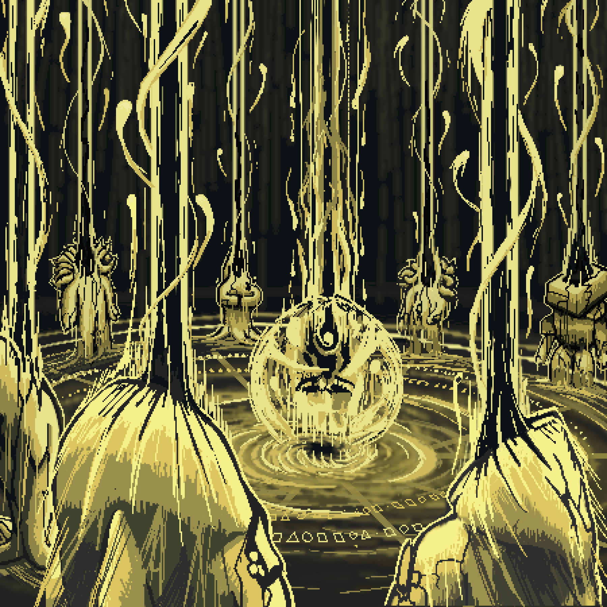

# Unique Travelers

Among all known forms of Travelers, a separate place is occupied by the so-called Unique Travelers — rare forms that emerge through the Ritual of the Ten Gates.

According to the collected records, in order for the ritual to occur, ten Travelers must simultaneously release their Essences, activating and destroying their own Gates. As a result of this process, the shell of the Great Gates is formed — an extremely unstable structure capable of receiving ten Essences at once and giving birth to a new Traveler.

Such cases are considered exceptionally rare even among the Travelers themselves.

The most important distinction between Unique Travelers and ordinary forms is their unusually strong resonance with the memory of vanished civilizations.

From the moment of birth, the Essence begins interacting with the residual imprints of ancient Worlds — fragments of cultures, beliefs, symbols, archetypes, and collective experiences preserved deep within the memory of the Universe itself.

These imprints do not exist in material form. They resemble traces of light in emptiness or echoes of sounds long vanished, continuing to exist even after the disappearance of their original source.

For this reason, the forms of Unique Travelers often resemble lost or seemingly impossible images. Some appear as warriors from ancient legends, others as symbols of heroism, fear, light, or destruction. There are also forms whose origins can no longer be connected to any known civilization.

At the same time, Unique Travelers are not copies or direct incarnations of beings from the past.

They are manifestations of memory itself — Essence that has entered into resonance with something that once held meaning for countless Worlds of previous Eras.

Among Travelers, there exists a belief that it is precisely through Unique forms that Essence is able to preserve the strongest imprints of lived experience even after the complete disappearance of the civilizations to which those memories once belonged.

---

---

## List of currently existed Unique Travelers:

- Tuborg
- Faeron
- Aslex
- Teantist
- Reaper
- Big Vardan
- Immortal Traveler
- Dead Traveler
- Thug Astranaut
- Lost Vitrum
- Cope Guardian
- Tuxar Knight
- Ban'Kai
- Oda Nabunage
- Keybearer
- Bat Traveler
- f14
- Solaris
- Ogniven'
- Seeker
- Maltour
- Abysswalker
- Ryvlen
- Sol King
- Eliza
- Indomitable Queen
- The last Kiiro
- Phlegmor
- Tenraku
- Legionus
- Lord of Terror
- Kezarion
- Unseen
- Kreativ
- Lorian
- Duum
