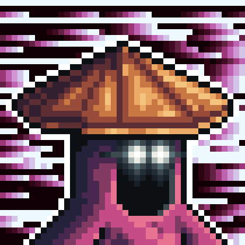

# Asleks

One of the first three. Not born of the Ritual — created as a singular Gate by a civilization that has long since departed. How old he truly is, I cannot say. He himself seems disinclined to count. And in general, in the current era, we do not trouble ourselves much with the keeping of time.

His Path has long been shaped by a single pursuit — a tea that no longer exists. A recipe that, by his conviction, was once known and has since been lost.

It was this search that eventually brought him to the Valley. I will admit that the Scheme leading him here was not drawn by chance.

His visit disrupted our usual rhythm considerably. He asked about every variety of tea grown here, took notes he did not show me, and stayed noticeably longer than his search required. Toward the end, his questions became less and less about tea — he spoke more and more of Shen, and of how eager he was to see her.

---

<a href="/Tavern/1-1/1-1#1-1" style="display: block; padding: 16px; border: 1px solid #c8a84b; text-decoration: none; color: #c8a84b;">
  
Back to

  
Unique Travelers

</a>

<a href="/Tavern/1-1/Tuborg" style="display: block; padding: 16px; border: 1px solid #c8a84b; text-decoration: none; color: #c8a84b;">
  
Read next

  
Tuborg

</a>

