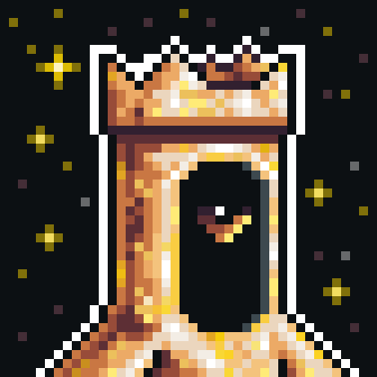

# Tuborg

One of the first three Unique Travelers. Created, not born through the Ritual. A Gate left behind by a civilization that no longer exists.

The crown is part of his form, inherited from those who created him. He seems to regard it without particular enthusiasm. Shen once passed along his words to me directly: “I would have preferred to look different.”

His Path is not the search for artifacts or the accumulation of experience in any conventional sense. Tuborg seeks traces of his civilization. Not records, not ruins — but something less tangible. Something that cannot be touched, yet can be felt upon arriving in the right place.

He is the only one who remembers his creators from within. Not through texts — through a feeling that is difficult to put into words, and which he still carries within himself, from the moment Essence breathed life into his Gate.

>I hope he finds his Home someday.
{: .note }

---

<a href="/Tavern/1-1/1-1" style="display: block; padding: 16px; border: 1px solid #c8a84b; text-decoration: none; color: #c8a84b;">
  
Back to

  
Unique Travelers

</a>

<a href="/Tavern/1-1/Faeron" style="display: block; padding: 16px; border: 1px solid #c8a84b; text-decoration: none; color: #c8a84b;">
  
Read next

  
Faeron

</a>

