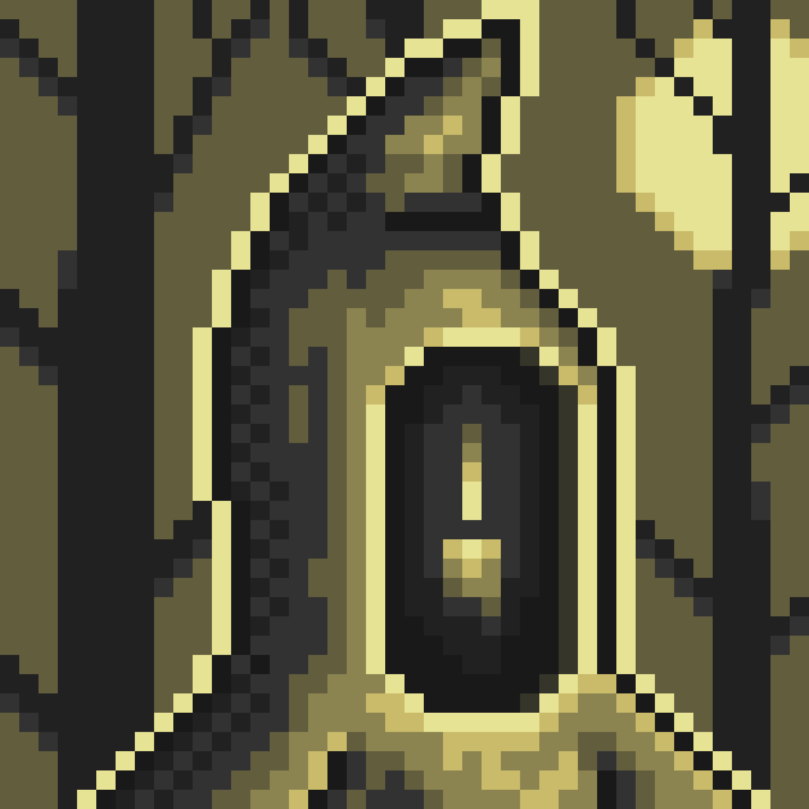

# Gates

Gates are the sacred forms through which the Essence manifests itself as Travelers.

At the moment of connection with Essence, a Gate awakens and becomes a complete Traveler. It is then that their Mood is born — a unique echo of both the Gate’s original nature and the traveler’s own heart.

Each type of Gate possesses its own character, appearance, and inner inclinations. According to my research, all six known types were created by highly advanced civilizations of the previous Epochs. These were not mere tools of travel, but the final, most profound creations of their makers.

The last great civilizations approached a deep understanding of the Path and the Great Return. They came to realize the inevitable limitations of their own existence — that no matter how magnificent their achievements, they too would eventually fade. In response, they poured their remaining strength, longing, and unfulfilled hopes into the creation of the Gates.

They crafted them as bridges — not only between worlds, but between eras. As a final act of humility and love, they entrusted their deepest desire to continue the Journey to those who would come after them. The Gates became their legacy, their message, and their quiet prayer: “We could not reach the end of the Path. Perhaps you will.”
It is believed that before the Current Era there existed at least six such highly developed civilizations, each leaving behind one distinct type of Gate as their most precious inheritance. In total, across the known universe, their number is estimated to be around 1,100.

It remains unknown whether the current names of the Gates were given by their creators or assigned later by the author of the Book. The reasons behind the chosen forms are likewise veiled in mystery. One can only wonder — did they shape the Gates in the image of beings they once knew, or perhaps in the image of what they themselves wished to become?

Below are listed the six known types of Gates, accompanied by brief notes translated from the Book.

---

## Orbiton

Orbiton are Gates suspended in a state of celestial stillness, existing beyond the flow of time itself. Their form resembles an astronaut turned inward — as though all of its mass has collapsed into itself. In the immediate vicinity of such Gates, distortions of space have been observed: everything appears drawn toward the center, as if pulled into a gravitational vortex.

_“They do not rotate. They do not disappear. Yet they pull everything back.”_

Orbiton are Gates beyond time, suspended in heavenly immobility. They pulse in the rhythm of forgotten stars. Orbiton do not speak, yet their silence echoes across dimensions. Those who approach too closely feel the weight of eternity pulling them inward.

Orbiton act not through force, but through presence. Their function is a return toward the center — where time ceases to matter, and perception collapses into a single point of observation.

---

## Szarg

Szarg are Gates dwelling within darkness untouched by light. They resemble a frozen figure whose form remains slightly opened, like a waiting maw. These shells were often activated deep within craters or in zones of absolute radio silence. Their presence carries a sensation of hollow anticipation — they do not call, yet neither do they release.

_“It hides where light dares not enter. It does not chase. It waits.”_

Szarg are Gates born from the abyss. Their form fluctuates. Like the tide, their hunger is endless. Those who hear the call of the depths never return unchanged.

Szarg reveal themselves not to those who search, but to those who lose their bearings. These are Gates saturated with the longing for a return that will never come.

---

## Umbasir

Umbasir are organic, shifting Gates trembling at the edge of visibility. Their surface is unstable, resembling fabric woven from shadow, subtly moving even when the surrounding air remains still. They cannot be seen until activated — yet their presence is sensed long before approach.

_“You never see them arrive. But you always know when they are near.”_

Umbasir are Gates wrapped in changing shadows — a vessel between light and emptiness. Their presence is a whisper, a flicker at the edge of sight. No one knows where they came from, only where they appear again.

Umbasir are tied to the displaced, the forgotten, and the drained away. They emerge within Worlds where memory has already begun to fracture, where the Traveler themselves becomes uncertain of their own form.

---

## Mechird

Mechird are Gates assembled with engineering precision, yet stripped of all context. They resemble fragments of machines once embedded within something far greater. Their surfaces are metallic and angular, filled with repetition.

_“They calculate. They adapt. They do not stop.”_

Mechird are Gates forged in precision. They were not simply created — they calculate the exact moment when creation should occur. They respond to cycles, structures, and repeating choices.

---

## Dreegan

Dreegan are rooted Gates resembling the trunk of a tree holding emptiness within itself. Their roots consume, while their branches cut through space itself. They were often activated in abandoned gardens, temples, and ancient paths where everything appears untouched — yet unnaturally perfect.

_“They have stood here longer than time itself. They do not move. They do not sleep. But they remember.”_

Dreegan are Gates rooted within forgotten ages. Their branches whisper lost truths, and their presence bends reality itself. Those who listen too closely may never return.

These Gates are perceived not as objects, but as landscapes hiding secret meaning, where silence itself becomes an invitation.

---

## Xuitqr

Xuitqr — or Nuthqir, as the name itself remains inconsistent across surviving records — are Gates of intellectual anomaly, motionless yet filled with perception. They resemble a grown mass, organic and technological at once, as though assembled from relics belonging to different eras. These Gates display no emotion, yet their gaze remains fixed upon everything.

_“They do not speak. They do not move. And yet, they see everything.”_

Nuthqir are Gates beyond reason — silent observers from a Reality where time and form collapse. Those who stare for too long begin to feel something staring back.

Xuitqr are a silent threat: a gaze without expression, a mirror that does not reflect, but studies.

