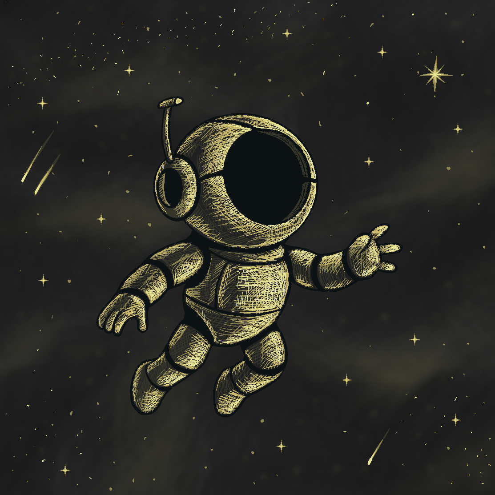
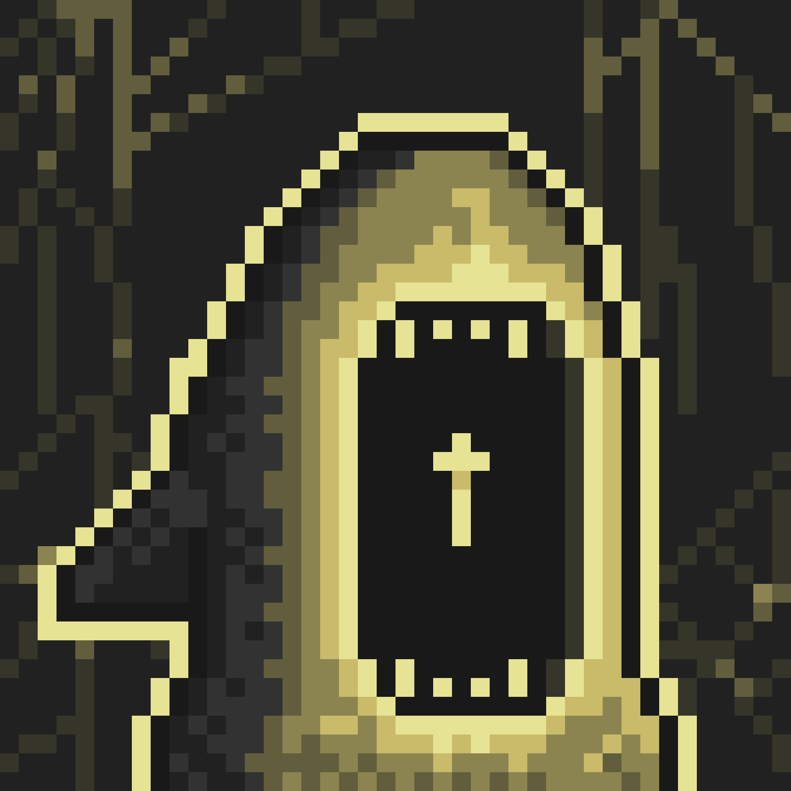
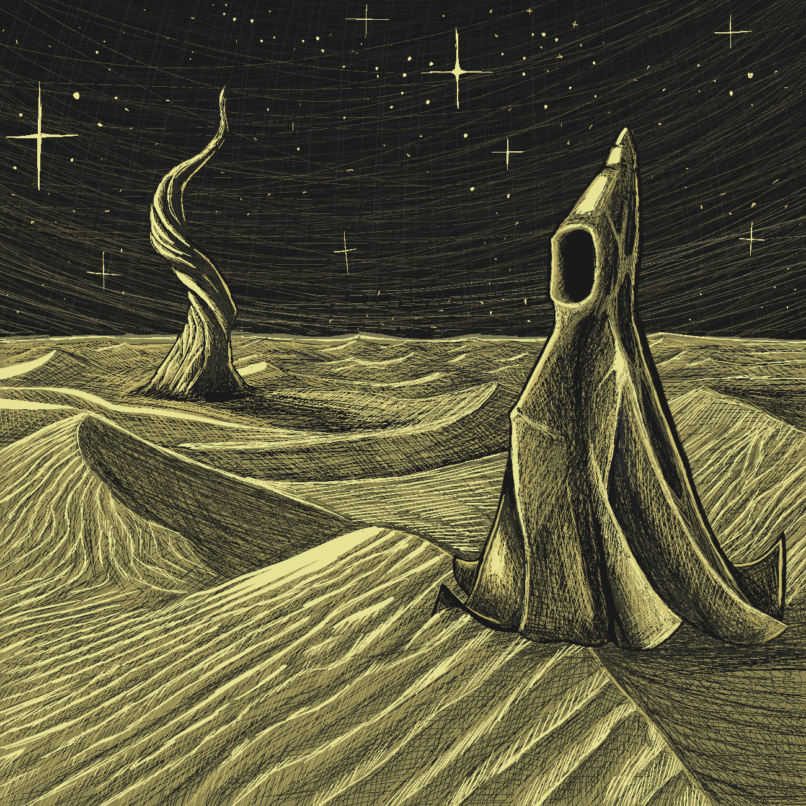
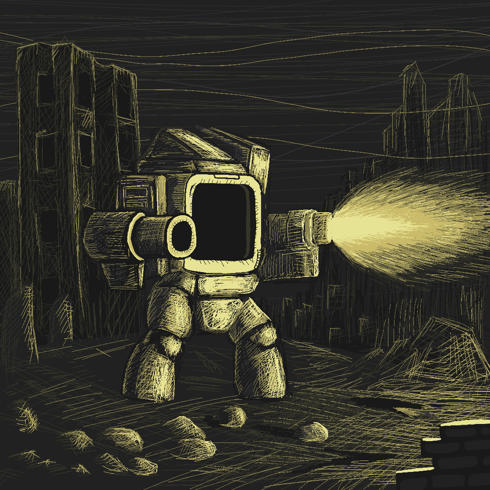
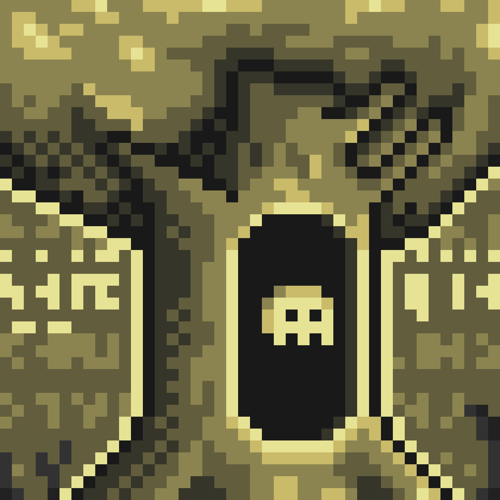
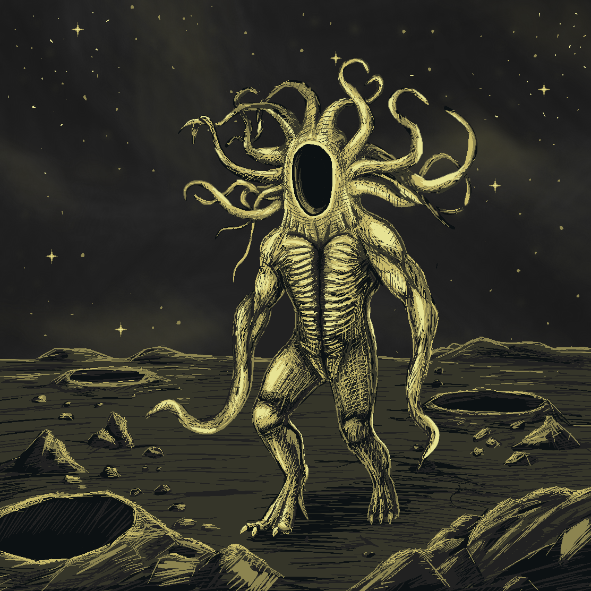

# Gates

Gates are the sacred forms through which the Essence manifests itself as Travelers.

At the moment of connection with Essence, a Gate awakens and becomes a complete Traveler. It is then that their Mood is born — a unique echo of both the Gate’s original nature and the traveler’s own heart.

Each type of Gate possesses its own character, appearance, and inner inclinations. According to my research, all six known types were created by highly advanced civilizations of the previous Epochs. These were not mere tools of travel, but the final, most profound creations of their makers.

The last great civilizations approached a deep understanding of the Path and the Great Return. They came to realize the inevitable limitations of their own existence — that no matter how magnificent their achievements, they too would eventually fade. In response, they poured their remaining strength, longing, and unfulfilled hopes into the creation of the Gates.

They crafted them as bridges — not only between worlds, but between eras. As a final act of humility and love, they entrusted their deepest desire to continue the Journey to those who would come after them. The Gates became their legacy, their message, and their quiet prayer: “We could not reach the end of the Path. Perhaps you will.”
It is believed that before the Current Era there existed at least six such highly developed civilizations, each leaving behind one distinct type of Gate as their most precious inheritance. In total, across the known universe, their number is estimated to be around 1,100.

It remains unknown whether the current names of the Gates were given by their creators or assigned later by the author of the Book. The reasons behind the chosen forms are likewise veiled in mystery. One can only wonder — did they shape the Gates in the image of beings they once knew, or perhaps in the image of what they themselves wished to become?

Below are listed the six known types of Gates, accompanied by brief notes translated from the Book.

---

## Orbiton

The Orbiton exist in a state of celestial stillness, beyond the flow of time. Their form resembles a traveler sealed within a shell, turned inward upon themselves — as though their entire being has collapsed into a single point. In the vicinity of such Gates, space itself seems to quietly bow toward the center, drawn by an invisible yet irresistible force.

_“They do not rotate. They do not vanish. Yet everything returns to them.”_

The Orbiton are silent. But their silence carries weight. Those who approach too closely feel the burden of eternity upon their shoulders — gentle, yet inexorable. It is not coercion. It is an invitation to return to the Center.

Their purpose is to show the way back. To the place where time loses all meaning, and all separated parts become one single gaze of contemplation.

---

## Szarg

The Szarg dwell in darkness untouched by light. Their form resembles a frozen figure with a slightly open maw — like an ever-waiting maw. These Gates most often awaken in the depths of craters or in zones of absolute silence, where even echoes perish before they are born.

_“It hides where light dares not enter. It does not chase. It waits.”_

The Szarg are born from the abyss. Their shape shifts like the tide, and their hunger is endless. Those who hear the call of the depths never return unchanged.

These Gates reveal themselves not to those who seek, but to those who have lost their way. They are saturated with longing for a Return that may never come.

---

## Umbasir

The Umbasir are organic, shifting Gates that tremble at the edge of visibility. Their surface is unstable, resembling fabric woven from shadows, subtly moving even when the surrounding air is perfectly still. They cannot be seen until the moment of activation — yet their presence is felt long before one draws near.

_“You never see them arrive. But you always know when they are near.”_

The Umbasir are wrapped in changing shadows — vessels between light and emptiness. They appear as a whisper, a flicker at the edge of sight. No one knows where they come from, only where they manifest again.

These Gates are tied to the displaced, the forgotten, and those whose essence has begun to drain away. They emerge in Worlds where memory itself has started to fracture. In places where the connection to the Essence grows thin, the Umbasir become the last guides through the cracks of oblivion.

---

## Mechird

The Mechird are assembled with engineering precision, yet stripped of all original context. Their form resembles fragments of machines once part of something far greater. Their surfaces are metallic and angular, filled with repeating patterns and flawless lines.

_“They calculate. They adapt. They do not stop.”_

The Mechird are Gates forged in precision. They were not merely created — they calculate the exact moment when travel should occur. They respond to cycles, structures, and repeating choices. Where other Gates follow longing or intuition, the Mechird follow logic and order — the final weapon of civilizations that tried to defeat the chaos of Jit and the oblivion of time through calculation.

Yet even their flawless precision carries a quiet melancholy. They stand as reminders of those who believed that if everything was calculated correctly, the Return could be planned.

---

## Dreegan

Dreegan are rooted Gates whose form resembles an ancient, twisted tree trunk with a hollow void at its center. Their roots burrow deep into the soil of Worlds, while their branch-like extensions cut through the fabric of space like frozen lightning. They most often awaken in places where time itself seems to have stopped: abandoned sacred gardens, ruined temples, and paths no one dares to truly call “forgotten.”

_“They stood here longer than time itself. They do not move. They do not sleep. But they remember.”_

Dreegan are the living memory of the Departed. They were created by a civilization that understood that every Return demands sacrifice. Their creators willingly wove their own lives into the structure of the Gates — their bodies becoming roots, their minds becoming tree rings, and their unfulfilled longing for Unity becoming the hollow emptiness within.

Those who approach a Dreegan sometimes hear quiet whispers — not words, but echoes of voices long extinguished. It is said that Dreegan do not merely open the Path. They weigh memories. And only those willing to leave a part of themselves within the roots may pass through the void inside their trunk.

---

## Xuitqr (Nuthqir)

Xuitqr appear as towering, imposing figures crowned with masses of twisting tentacles, resembling a living crown of roots or exposed nerves. At the center of their bodies lies a vast black void — an absolute rupture within reality itself.

_“They do not speak.  They do not move. And yet — they see everything.”_

Nuthqir are Gates of silent judgment and all-encompassing perception. They stand as ancient sentinels, combining overwhelming organic presence with something entirely incomprehensible. Those who stare into the black emptiness within their chest for too long begin to feel their own essence slowly unfolding before something infinitely attentive and detached.

They appear in the most desolate places — among dead plains and forgotten ruins. They neither call nor repel. They simply watch. And only those whose soul can endure that gaze are capable of passing through the void.

