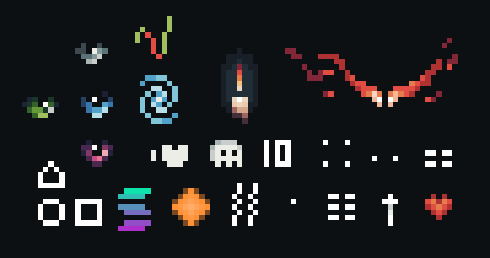

# Moods

Mood is a state that emerges at the moment when a Gate becomes a Traveler.

Translated records and conversations within the Tavern clearly indicate that Mood determines the inner rhythm of the Path and the manner in which a Traveler perceives the Worlds around them.

Some Moods make Travelers calmer and more contemplative. Others drive them toward constant movement, exploration, risk, or deeper investigations into the unknown.

Although Mood often influences the character and behavior of a Traveler, it is not considered an unchangeable fate.

Approximately 25 different types of Moods are known, each unique in its own way and capable of shaping a Traveler’s behavior differently across various Worlds.

---

<a href="/Homes-journey-archive/Tavern/1-1/1-1" style="display: block; padding: 16px; border: 1px solid #c8a84b; text-decoration: none; color: #c8a84b; margin-left: auto; width: fit-content;">
  
Read next

  
Unique Travelers

</a>

