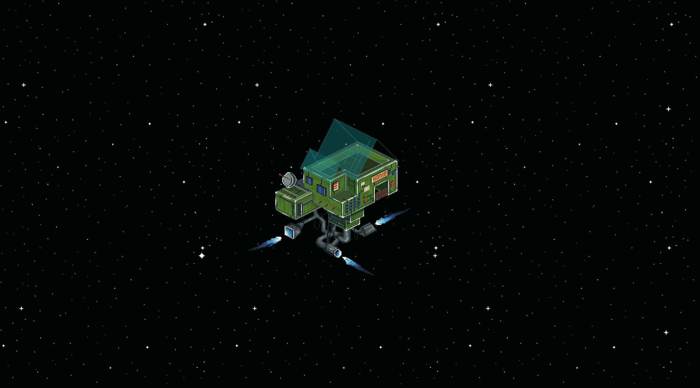

# The Tavern

Among all places that still exist during the Current Era, the Tavern remains one of the few stable points where Paths, Worlds, and stories intersect through the presence of Travelers.

Despite the constant movement and changing visitors, an unusually calm atmosphere persists within the Tavern. According to most descriptions, this place serves simultaneously as a shelter, a place of rest, a space for exchanging stories, and a temporary pause between journeys.

For all Travelers, the Tavern remains the only place they are capable of returning to after long periods spent among ruined, forgotten, or distorted Worlds.

Tea supplied from the Valley of Tea Dragons plays a central role in the life of the Tavern. It was here that tea became an important part of Traveler culture and gradually came to be perceived as inseparable from the Tavern itself.

Most deliveries are carried out by Villagers through hidden trade routes leading beyond the Valley. It is also known that a certain portion of tea is sent here without exception, regardless of season or the condition of the trade routes. The reason for this tradition remains unknown.

Inside, the Tavern is a large and welcoming structure containing a central hall known as the Bar, overseen by Shen, as well as a hangar and numerous cells from which Travelers continue their Path between Worlds.

To this day, I have been unable to determine the true origin of the Tavern.

---

## Main notes here:

- [Home Travelers](Travelers.md)
- [Shen](Shen.md)
- [The Bar](bar.md)
- [Cells](cells.md)

---

  
---
