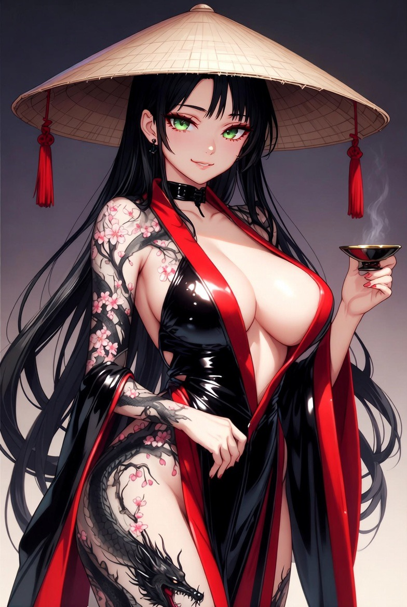

# Shen

Shen is one of the central figures of the Tavern and its permanent keeper. She is responsible for the Bar, the distribution of tea among Travelers, and assisting in the selection of the necessary Schemes before a new journey begins.

Shen is a young woman with long dark hair and bright green eyes. Her body is covered in tattoos depicting blooming sakura and dragons. The most recognizable part of her appearance remains her wide triangular hat with long red tassels, making Shen nearly impossible to mistake for anyone else among the visitors of the Tavern.

She possesses an unusually deep understanding of Moods and is capable of finding an individual approach to almost anyone. For this reason, it is she who is the link between me and the information from the Travelers, and also receives Tea posts, new Schemes and Chaetron from me.

Despite her important role, Shen’s origin remains unknown. I have a guess that she is related to Dominia, specifically to the region of Arboris, though no reliable confirmation of this has ever been discovered. Shen herself rarely shares information about her own past or how long she has remained within the Tavern.

In addition to her work within the Tavern, Shen is also known as a collector of stories, the publisher of her own records, and the author of numerous illustrations dedicated to Travelers, Worlds, and tea culture. Based on her works alone, it would likely be possible to assemble a separate archive in the future.

Among most Travelers, Shen is perceived not only as the keeper of the Tavern, but also as one of the few figures of the Current Era who truly understands the nature of the Path.

>bonus for early readers. Will replace on pixel one later

---

{: width="600" }

---

<a href="/Tavern/GM" style="display: block; padding: 16px; border: 1px solid #c8a84b; text-decoration: none; color: #c8a84b; margin-left: auto; width: fit-content;">
  
Read next

  
GM

</a>

