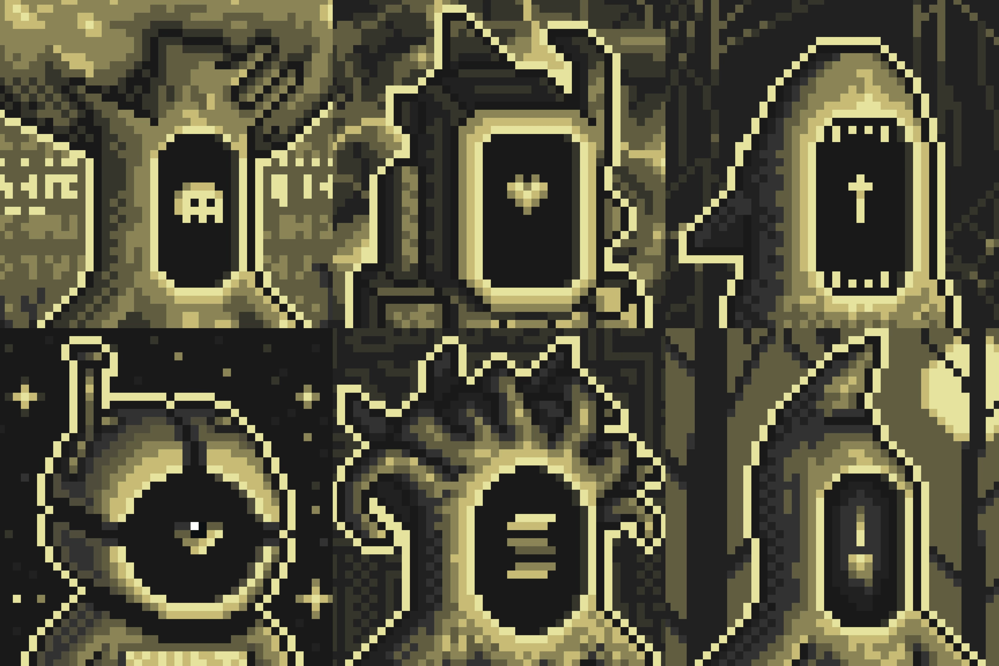

# Home Travelers

  

ravelers are manifested forms of **Essence**, created through passage into one of the six known types of **Gates**.

Their emergence is not the result of randomness or choice. Rather, it is a point of convergence where three fundamental elements combine to form the uniqueness of each Traveler: the type of Gate entered by the Essence, the **Mood** manifested at the moment of connection, and the **World** in which the Gate was located at the time of activation.

Each Traveler carries a unique designation — a number assigned at the moment of their emergence. This number serves as their identifier within the known Universe and is recorded in all Archive entries concerning them. It is neither a rank nor a title, but simply a mark of existence: confirmation that this particular form of Essence has entered the Path.

The union between Essence and a Gate is not an accidental process. According to the translated records, this act appears to have been predetermined as part of the **Path** itself — a final cycle through which Essence is ultimately able to preserve all accumulated experience and impressions, become fully aware of itself, and eventually return to its original unity.

For this reason, the primary purpose of Travelers is the exploration of different Worlds and the collection of knowledge, traces, and remnants left behind by **previous civilizations**. Most of the Worlds known in the **current Era** exist only as fragments of something far older, and in many cases Travelers become the only witnesses capable of preserving what still remains of them.

Despite their differences in appearance, Mood, and origin, Travelers are united by a common internal pull toward the continuation of the Path itself. This desire does not appear to function as a direct command or obligation, but rather as a natural property of Essence seeking experience, movement, and understanding through the observation of Worlds.

In this process, Travelers are aided by the Tavern — the central hub and place of permanent residence from which they depart on their journeys — as well as Shen, Tea, and the Schemes of the Path, all of which help guide them and assist in gathering the necessary experience.

Special mention should also be given to **the Ritual of the 10 Gates**, periodically undergone by certain Travelers, resulting in the appearance of so-called [Unique Travelers](1-1/1-1.md) within the Universe.

---

<a href="/Tavern/Gate" style="display: block; padding: 16px; border: 1px solid #c8a84b; text-decoration: none; color: #c8a84b; margin-left: auto; width: fit-content;">
  
Read next

  
Gates

</a>

