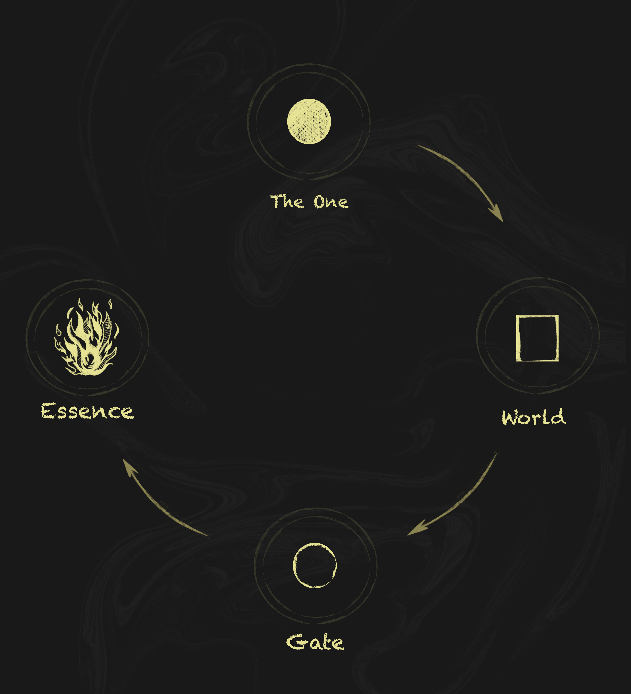
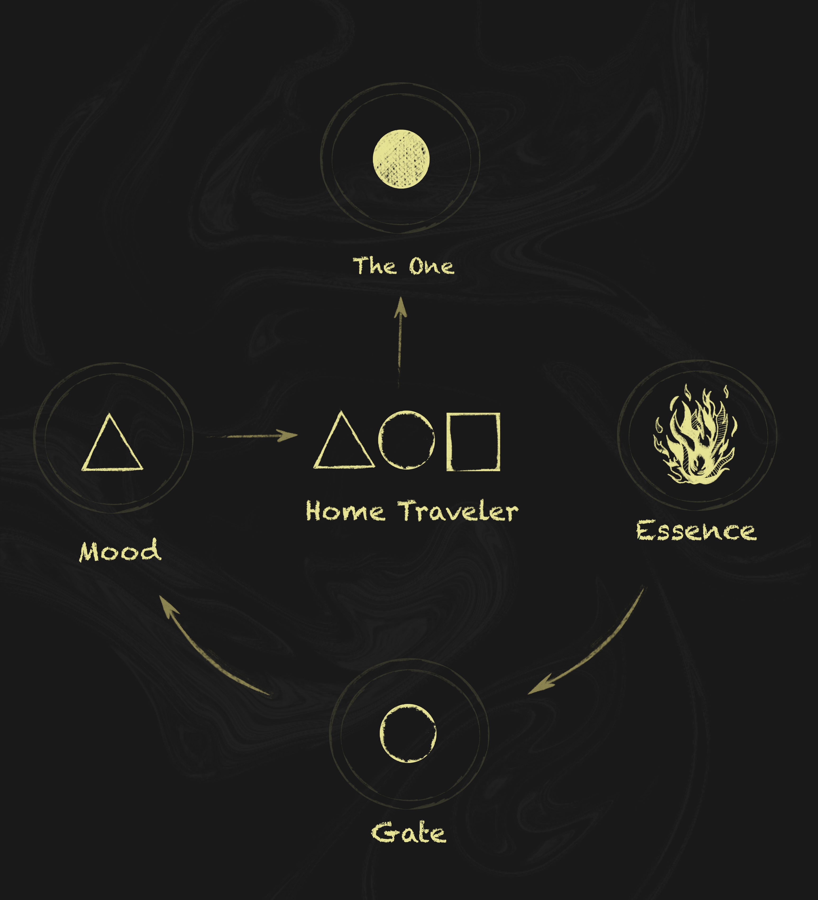

# Home Travelers

ravelers are manifested forms of Essence, created through passage into one of the six known types of Gates.

Their emergence is not the result of randomness or choice. Rather, it is a point of convergence where three fundamental elements combine to form the uniqueness of each Traveler: the type of Gate entered by the Essence, the Mood manifested at the moment of connection, and the World in which the Gate was located at the time of activation.

The union between Essence and a Gate is not an accidental process. According to the translated records, this act appears to have been predetermined as part of the Path itself — a final cycle through which Essence is ultimately able to preserve all accumulated experience and impressions, become fully aware of itself, and eventually return to its original unity.

For this reason, the primary purpose of Travelers is the exploration of different Worlds and the collection of knowledge, traces, and remnants left behind by previous civilizations. Most of the Worlds known in the current Era exist only as fragments of something far older, and in many cases Travelers become the only witnesses capable of preserving what still remains of them.

Despite their differences in appearance, Mood, and origin, Travelers are united by a common internal pull toward the continuation of the Path itself. This desire does not appear to function as a direct command or obligation, but rather as a natural property of Essence seeking experience, movement, and understanding through the observation of Worlds.

In this process, Travelers are aided by the Tavern — the central hub and place of permanent residence from which they depart on their journeys — as well as Shen, Tea, and the Schemes of the Path, all of which help guide them and assist in gathering the necessary experience.

Special mention should also be given to the Ritual of the 10 Gates, periodically undergone by certain Travelers, resulting in the appearance of so-called Unique Travelers within the Universe.

More detailed explanations regarding Travelers and related concepts are provided in the corresponding sections below.
