# Leaders of the Legends

During the Battle for the Great Tea Tree, countless creatures and peoples came to the Valley, seeking the power hidden within its leaves.

Some wished to preserve balance.
Others sought power, immortality, or the salvation of their own lands.

It was during this era that the leaders whose names later became part of the Valley’s Legends first appeared.

---

## Dark Ent Ruby

Dark Ents are ancient and powerful creatures that serve as guardians of the forest and its balance. Their body is covered in bark and lichen, nearly indistinguishable from the surrounding trees. Among them, the Dark Ent Ruby stands out as a leader, striving to preserve the balance in the forest at any cost, even if it means conflict with other forest inhabitants. His determination might make him a formidable opponent, but he acts with a deep sense of responsibility toward nature and its preservation.

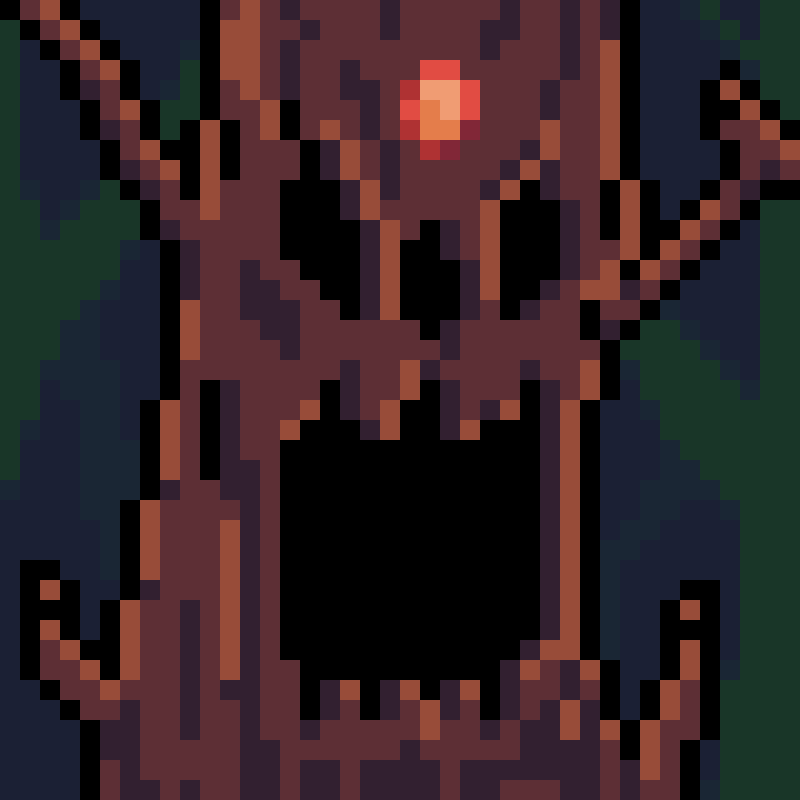

---

## King Skeleton Hong

The Ancient Skeletons are mighty beings serving as guardians of graveyard. Their weathered skeletons are covered in a thin layer of dust and imbued with the auras of past eras. Among them, King Skeleton Hong stands out, striving to preserve the balance in the realm of the dead at any cost. His determination and might make him a formidable adversary, yet he acts with a profound sense of responsibility towards the realm of the dead and its preservation.

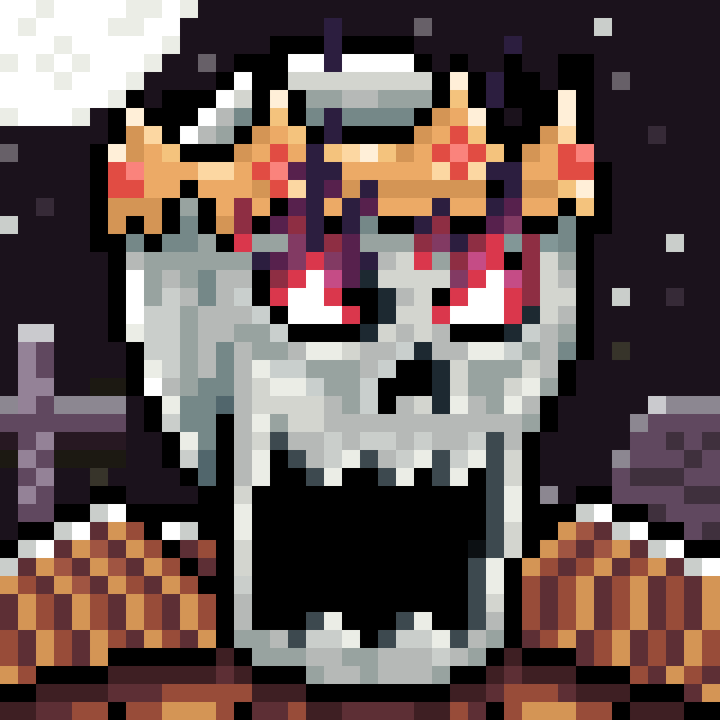

---

## Supreme Cyclop Mudan

The Canyon Cyclopes - ancient beings who guard the rugged canyons, ensuring its balance. Their forms blend with the craggy terrain, exuding power amidst the cliffs. Leading them is the Supreme Cyclop Mudan, dedicated to preserving the canyon's equilibrium at all costs. Mudan's determination and authority make him a formidable leader, governing with a profound sense of duty family its preservation.

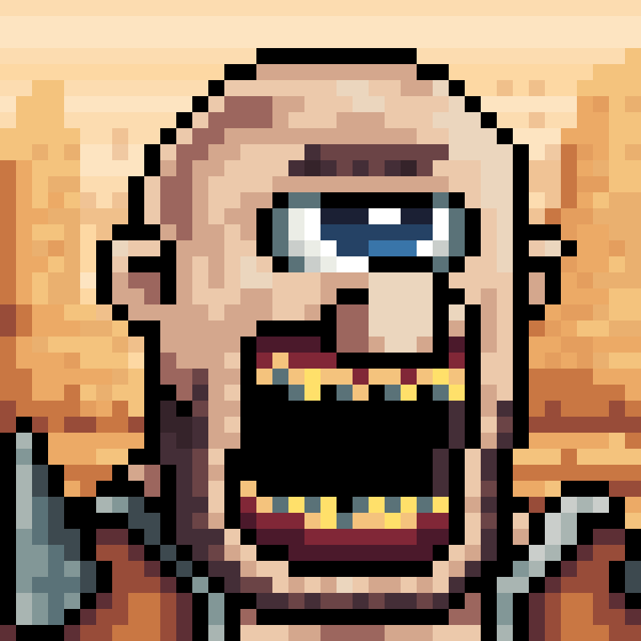

---

## Lord Vampire Pao

Vampires - nocturnal creatures of elegance and danger, their forms gliding through the night with an allure that masks their predatory instincts. Lord Vampire Pao - sovereign of the vampire coven, a figure of aristocratic grace and chilling authority. Within the walls of his ancient castle, he commands both the loyalty of his kindred and the respect of all who dwell in the realm of darkness.

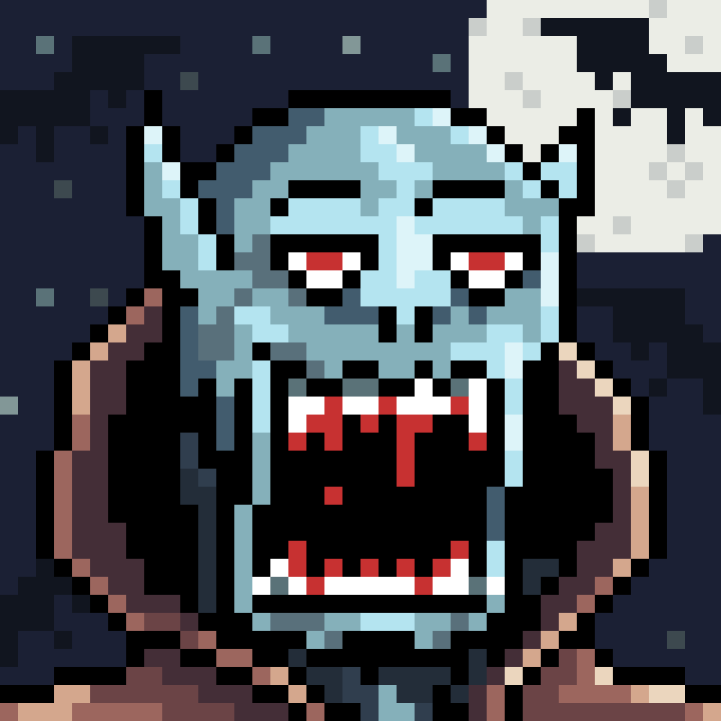

---

## Chief Orc Pin

Orcs - fierce warriors of the wastelands, their rugged forms moving with a predatory grace amidst the desolate terrain. Chief Orc Pin - ruler of the orcish horde, a towering figure of indomitable strength and unyielding determination. Within the heart of their barren stronghold, he commands the loyalty of his kin through sheer force of will, his authority unchallenged in the harsh expanse of the wasteland.

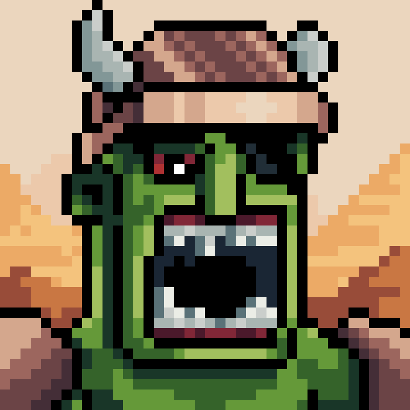

---

## Overlord Demon Keemun

Demons - malevolent beings of the underworld, their forms cloaked in shadow and fire, moving with an otherworldly menace that strikes fear into the hearts of mortals. Overlord Demon Keemun - master of the infernal realm, a figure of terrifying power and ruthless ambition. Within the depths of his fiery domain, he commands the allegiance of his demonic legions, his will unchallenged and his dominion absolute over the forces of darkness.

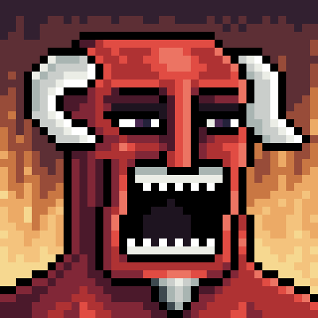

---

## Queen Naga Yin

Nagas - mystical beings of wisdom and power, their serpentine forms moving with a fluid grace that belies their formidable strength and ancient heritage. Queen Naga Yin - ruler of the naga clan, a figure of regal beauty and commanding presence. Within the depths of her enchanted sanctuary, she governs with a blend of benevolence and authority, her word law among her serpentine kin and her wisdom revered by all who seek her counsel.

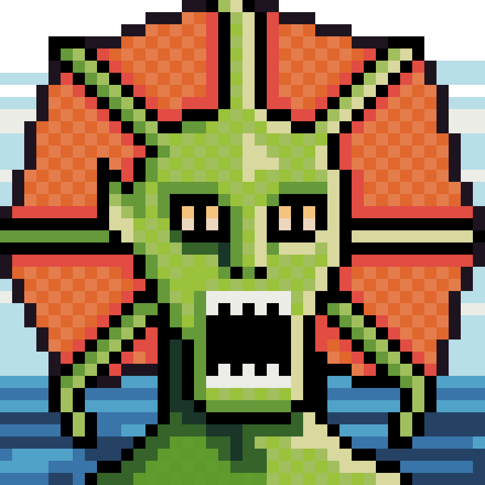

---

## Prince of Dark Elves Shen

Dark Elves - elusive beings of shadow and intrigue, their movements as silent and graceful as the night itself, shrouded in an air of mystery and danger. Prince of Dark Elves Shen - heir to the dark elven throne, a figure of enigmatic allure and quiet authority. Within the labyrinthine halls of his subterranean palace, he commands the loyalty of his people and the respect of all who navigate the complex web of dark elven politics.

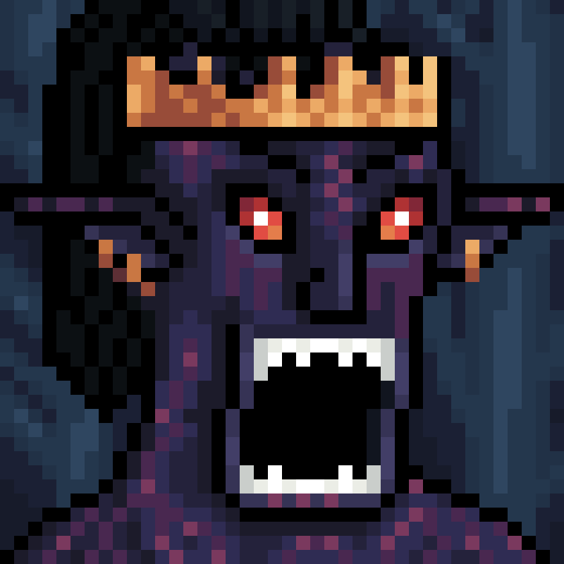

---

## King of the Ghosts Ya Bao

Ghosts - ethereal beings of sorrow and mystery, their translucent forms drifting through the realms of the living, bound by the memories of their past lives.King of the Ghosts Ya Bao - ruler of the spectral realm, a figure of haunting majesty and somber authority. Within the shadowy expanse of his forsaken domain, he commands an army of loyal spirits, their presence felt in the eerie silence that follows his every command, as they safeguard the boundaries between the living and the dead.

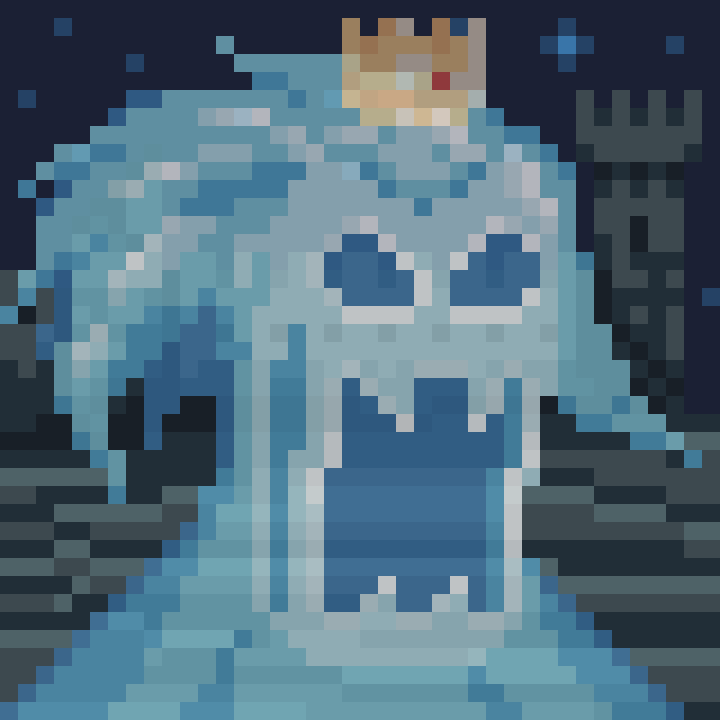

---

## Queen Spider Shu

Spiders - cunning and silent predators, their webs intricately woven in the darkest corners, where few dare to tread, awaiting their prey with patient precision.Queen Spider Shu - sovereign of the arachnid legions, a figure of dark beauty and ruthless control. Deep within her cavernous lair, she commands an army of loyal spiders, their threads stretching across the land as they carry out her will, ensnaring all who challenge her dominion in their inescapable webs.

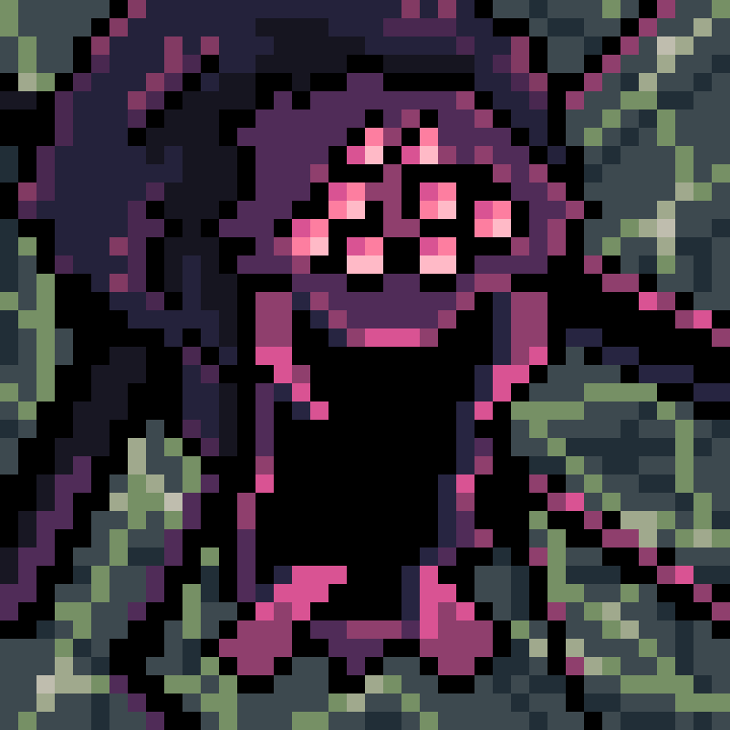

---

## King Monkey Slowly

Monkeys - agile and resourceful creatures, their quick movements and clever minds making them masters of the treetops and cunning strategists of the wild.King Monkey Slowly - ruler of the monkey clans, a figure of calm authority and sharp intellect. From his perch high in the jungle canopy, he leads his loyal army with a balance of wit and wisdom, their coordinated efforts ensuring his domain remains untamed and fiercely protected.

---

## Ancient God Samovar

Eldritch Spawn - otherworldly beings of chaos and dread, their twisted forms and incomprehensible minds embodying the primal fears of the unknown. Ancient God Samovar - an unfathomable entity of immense power, revered and feared as the progenitor of the Eldritch Spawn. From the depths of his abyssal domain, he commands his nightmarish legions, their grotesque shapes and eldritch whispers spreading his will across the realms, a chilling reminder of the unfathomable forces that lie beyond mortal understanding.

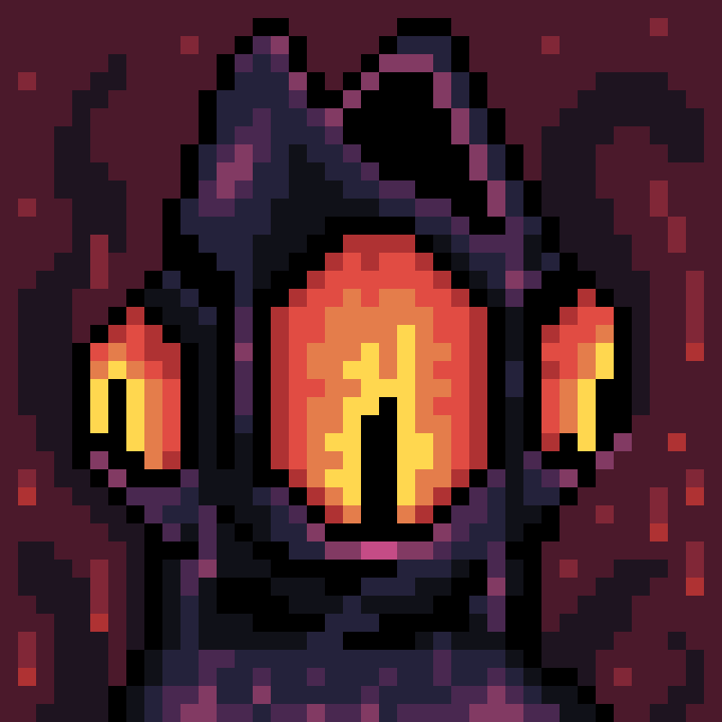
