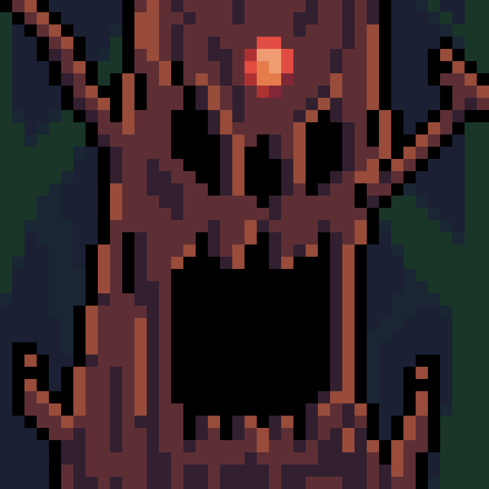
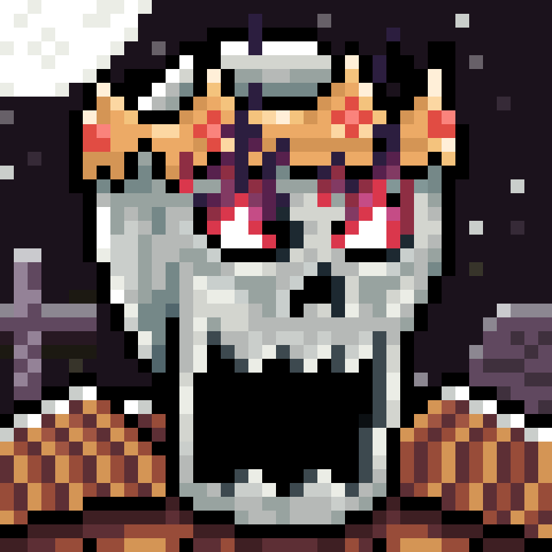
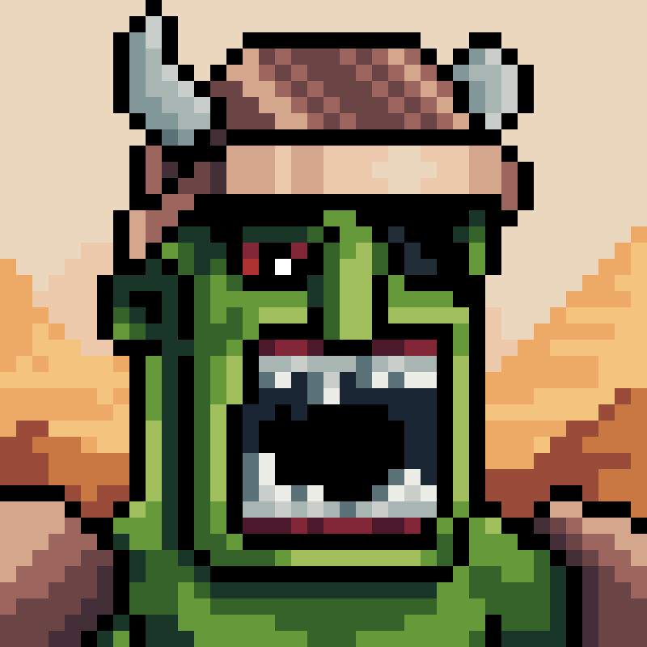

# The Tea Gods

There are only legends about them...

---

## Dark Ent Ruby

Dark Ents are ancient and powerful creatures that serve as guardians of the forest and its balance. Their body is covered in bark and lichen, nearly indistinguishable from the surrounding trees. Among them, the Dark Ent Ruby stands out as a leader, striving to preserve the balance in the forest at any cost, even if it means conflict with other forest inhabitants. His determination might make him a formidable opponent, but he acts with a deep sense of responsibility toward nature and its preservation.

---

## King Skeleton Hong

The Ancient Skeletons are mighty beings serving as guardians of graveyard. Their weathered skeletons are covered in a thin layer of dust and imbued with the auras of past eras. Among them, King Skeleton Hong stands out, striving to preserve the balance in the realm of the dead at any cost. His determination and might make him a formidable adversary, yet he acts with a profound sense of responsibility towards the realm of the dead and its preservation.

---

## Supreme Cyclop Mudan

The Canyon Cyclopes - ancient beings who guard the rugged canyons, ensuring its balance. Their forms blend with the craggy terrain, exuding power amidst the cliffs. Leading them is the Supreme Cyclop Mudan, dedicated to preserving the canyon's equilibrium at all costs. Mudan's determination and authority make him a formidable leader, governing with a profound sense of duty family its preservation.

---

## Lord Vampire Pao

Vampires - nocturnal creatures of elegance and danger, their forms gliding through the night with an allure that masks their predatory instincts. Lord Vampire Pao - sovereign of the vampire coven, a figure of aristocratic grace and chilling authority. Within the walls of his ancient castle, he commands both the loyalty of his kindred and the respect of all who dwell in the realm of darkness.

---

## Chief Orc Pin

Orcs - fierce warriors of the wastelands, their rugged forms moving with a predatory grace amidst the desolate terrain. Chief Orc Pin - ruler of the orcish horde, a towering figure of indomitable strength and unyielding determination. Within the heart of their barren stronghold, he commands the loyalty of his kin through sheer force of will, his authority unchallenged in the harsh expanse of the wasteland.

---
