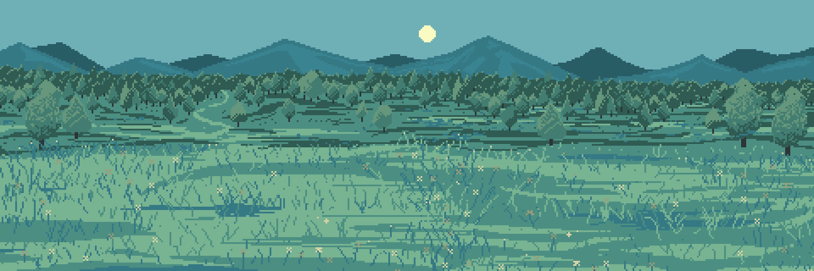
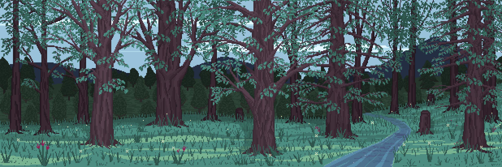
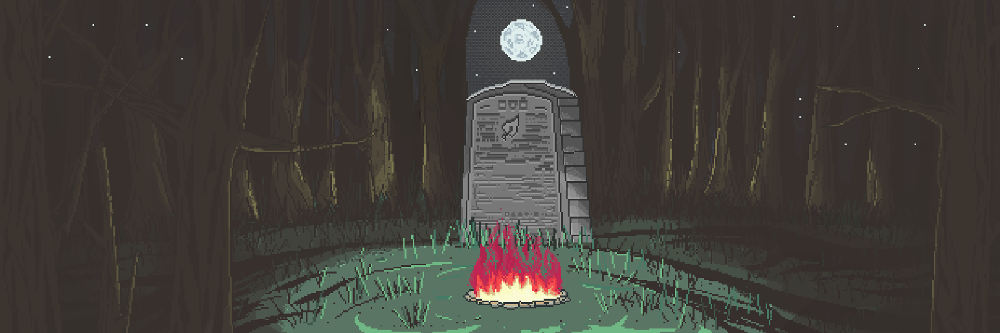
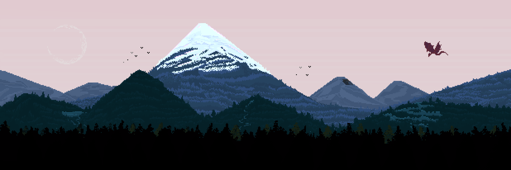
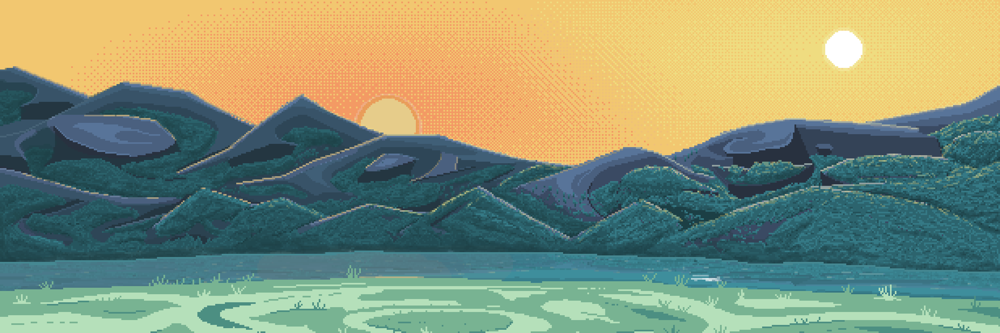

# The Valley of Tea Dragons

Among all Worlds mentioned in the surviving records, the Valley of Tea Dragons remains one of the most isolated and, at the same time, one of the most significant regions known to me so far. It was here that the Great Tea Tree was discovered, around which the Villagers’ settlement, the tea fields, and most of the Valley’s modern life gradually formed over many generations.

The exact location of the Valley still remains unknown. Most ancient maps either contradict one another or end long before providing any reliable external landmarks.

At the center of the Valley stands the Great Tea Tree — the oldest known relic of this region. Directly surrounding the tree lies the Village of the Villagers, home to generations of inhabitants dedicated to tea harvesting and maintaining life within the Valley.

To the right of the Village stretch the vast tea fields. It is here that the Villagers cultivate and gather most of the tea leaves used throughout the Valley.

Below the tea fields begins the Emerald Forest — a dense region of ancient vegetation that differs noticeably from the rest of the Valley. Deep within this forest stands the Tea Stone — the burial site of the Founder of the Village. Despite numerous mentions, most information regarding the Founder himself remains unstudied to this day.

In the lower-left region of the Valley lies the Diamond Pond. The Villagers use it as a place for rest, fishing, and certain seasonal gatherings. Several old records also describe unusual properties associated with the pond’s water, though I have not yet been able to confirm such claims reliably.

The northern borders of the Valley are formed by two massive mountain regions known among the Villagers as the Left Shoulder and the Right Shoulder. Together, they create a natural stone ring surrounding most of the Valley and shielding it from the outside world. According to observations, many of the mountain passages either collapsed long ago or remain hidden.

Special mention should be given to the Red Dragon — a creature constantly observed in the skies above the Valley. According to the Villagers’ accounts, the dragon has protected the region from the air for many generations and rarely leaves the mountain range. The origin of the dragon itself, as well as its connection to the Great Tea Tree, is referenced within the Legends, where the Tea Gods are said to have played a role in its creation.

Despite the relative calmness of the Valley, I gradually began to suspect that a significant portion of its history was intentionally concealed or lost long before the emergence of the current generation of Villagers.

---

---

## The Tea Fields

To the right of the Village, stretching across a vast distance, lie the Tea Fields — one of the most important regions within the entire Valley. It is here that the Villagers cultivate and harvest the majority of the tea.

At first glance, the Tea Fields create an impression of great simplicity. Nearly the entire landscape is covered with orderly rows of tea bushes extending far toward the mountains surrounding the Valley. Most of the area remains open, causing the Fields to appear both peaceful and strangely mesmerizing at the same time.

Despite this outward minimalism, the lives of the Villagers are deeply connected to this place. A significant portion of each day is spent among the rows of tea plants: here the inhabitants cultivate new growth, gather leaves, monitor the condition of the soil, and maintain order throughout the Fields.

My observations also suggest that tea harvested from different parts of the Fields may vary in both flavor and properties, even when the leaves themselves appear identical. This is supported not only by several translated records, but also by the opinions of the Villagers themselves.

---

---

## The Emerald Forest

The Emerald Forest lies in the lower region of the Valley and occupies a vast territory between the Tea Fields and the outer edges of the mountain range. Among all regions of the Valley, this place is mentioned most frequently within ancient legends and ritual records, although much of the information regarding the Forest itself still remains insufficiently studied.

The Forest received its name due to its dense vegetation and the deep emerald hue of its foliage, which remains visible during nearly every season of the year. Even during periods of heavy fog, the Emerald Forest appears noticeably darker than the surrounding parts of the Valley, causing its borders to become distinguishable long before one approaches the trees themselves.

Most of the Forest is covered in thick vegetation, ancient moss, and narrow paths known primarily to certain Villagers responsible for tending the forest or conducting rituals within its boundaries. Despite its relative proximity to the Village, many inhabitants prefer not to venture deep into the forest without necessity, especially during nighttime.

Deep within the Emerald Forest also stands the Tea Rock — the burial site of the Founder of the Village. Despite the importance of this location to the people of the Valley, the Book contains almost no references to it.

At first glance, the Emerald Forest may seem like nothing more than an ordinary woodland surrounding the Village. However, during my time within it, I was repeatedly left with the feeling that it is precisely here that the greatest number of traces connected to the earliest history of the Valley have survived.

---

--

## The Tea Rock

The Tea Rock lies deep within the Emerald Forest and is considered one of the most sacred and revered places in the entire Valley. It can only be reached through narrow forest paths.

The Rock itself is a massive ancient stone slab resting within a small clearing surrounded by dense vegetation. Its surface is covered with engraved symbols written in the ancient figurative language also found within the Book I discovered, as well as in several surviving fragments scattered throughout the Village buildings. A large portion of these inscriptions remains untranslated to this day, while some symbols appear nowhere else among any sources known to me.

According to established belief, this is the burial place of the Founder of the Village — a figure whose existence is scarcely mentioned anywhere and remains perhaps the greatest mystery both to myself and to the inhabitants of the Village.

It is near the Tea Rock that the Villagers conduct rituals connected to memory, seasonal changes, and certain ancient ceremonies of the Valley.

Particularly noteworthy is the fact that throughout all my research into the records and the Valley itself, I have failed to discover any other known burial sites. No cemeteries, no individual graves, nor any direct references to them. For this reason, the significance of the Tea Rock to the inhabitants of the Valley is likely both immense and deeply paradoxical.

---

---

## The Diamond Pond

The Diamond Pond lies in the lower-left region of the Valley and remains one of the most peaceful places among the territories surrounding the Village of the Villagers. Unlike the Tea Fields or the Emerald Forest, this location is scarcely connected to constant labor or ritual activity, and for this reason the inhabitants of the Valley most often use it for rest and leisure.

The Pond received its name due to the unusual appearance of its water during certain hours of the day. When light touches the surface, countless bright reflections appear across the water, resembling crystals or small gemstones scattered upon it. This phenomenon becomes especially noticeable during the morning fog, when the surface of the water remains almost perfectly still.

The area surrounding the Pond is relatively open and differs greatly from the denser regions of the Valley. Here the Villagers occasionally gather for conversation, fishing, and small celebrations held during the warmer seasons. Several old records also mention rituals and seasonal ceremonies once performed near the water in earlier times.

Despite its calm atmosphere, the origin of the Pond itself remains unknown. A number of ancient records suggest that the body of water existed within the Valley long before the first structures built by the Villagers appeared.

Among the inhabitants of the Valley, there is also a widespread belief that the waters of the Diamond Pond possess the unusual ability to reflect not only the surrounding world, but also the inner state of the observer. Most such stories are likely little more than local superstition, though mentions of similar observations appear in several translated records I have studied.

---

---

## The Left Shoulder

The Left Shoulder is the name used by the Villagers to describe the western section of the mountain range surrounding the Valley of Tea Dragons. Together with the Right Shoulder, these massive mountains form a natural stone ring that has separated the Valley from the outside world for many generations.

Among all parts of the range, the Left Shoulder is considered the most inaccessible region. The approaches to the mountains are covered with dense forests and uneven rocky terrain, causing most ancient paths to have long since become nearly impassable. Even the Villagers themselves rarely travel into this part of the Valley without particular necessity.

It is above the Left Shoulder that the highest peaks of the entire mountain chain rise. During clear weather, they can be seen from nearly every point within the Valley, though for much of the time their summits remain hidden behind clouds and heavy mist.

Among the inhabitants, there exists a theory connecting the Left Shoulder to the Red Dragon. According to this belief, somewhere among the upper peaks lies the dragon’s nest, from which it watches over the entire Valley. I have not yet been able to confirm the existence of such a place, though most Villagers — and even several surviving records — speak of it with unusual certainty.

In addition, old records repeatedly mention a system of caves located near the base of the mountains. Most such accounts are highly contradictory: some sources describe ordinary natural tunnels, while others refer to structures far more ancient, whose origins appear unrelated to the current inhabitants of the Valley.

Despite the lack of reliable exploration of the inner regions of the Left Shoulder, I gradually began to suspect that a significant portion of the region’s oldest history may be hidden there. At the very least, among all territories of the Valley, this is the place the Villagers discuss with the greatest caution.

---

--

## The Right Shoulder

The Right Shoulder is the eastern section of the mountain range surrounding the Valley of Tea Dragons. Together with the Left Shoulder, these mountains form a natural protective boundary that conceals the Valley from most of the outside world. Although the peaks of the Right Shoulder are noticeably lower than the western summits, their height is still sufficient to completely obscure the horizon beyond the Valley.

Unlike the harsh and difficult terrain of the Left Shoulder, the eastern side of the range is regarded by the Villagers as considerably more peaceful. It is here that the inhabitants of the Valley most often watch the sunrise. On clear days, the first rays of light appear above the mountain peaks even before the mists begin to disperse over the tea fields and the Village.

According to observations, during the morning hours the rocky slopes of the Right Shoulder acquire a soft golden hue, which is why this part of the Valley is frequently mentioned in old songs and stories of the Villagers as one of the most beautiful places in the region.

The lower part of the Right Shoulder is crossed by a small river that separates portions of the slopes from the rest of the Valley. The water here remains cold during nearly every season of the year, and several old paths run along the riverbanks, occasionally used by the Villagers to travel between distant areas of the region.

Despite its calmer reputation, a large portion of the Right Shoulder still remains poorly explored. Many sections of the slopes are covered with dense vegetation and rocky collapses, causing even the Villagers themselves to avoid climbing too high without necessity.

In ancient records, the Right Shoulder is connected far less frequently with old legends or disappearances than the western part of the mountain range. Nevertheless, there remains a strong impression that the inhabitants of the Valley perceive both sides of the stone ring as something far more significant than ordinary mountains surrounding a settlement.

---

