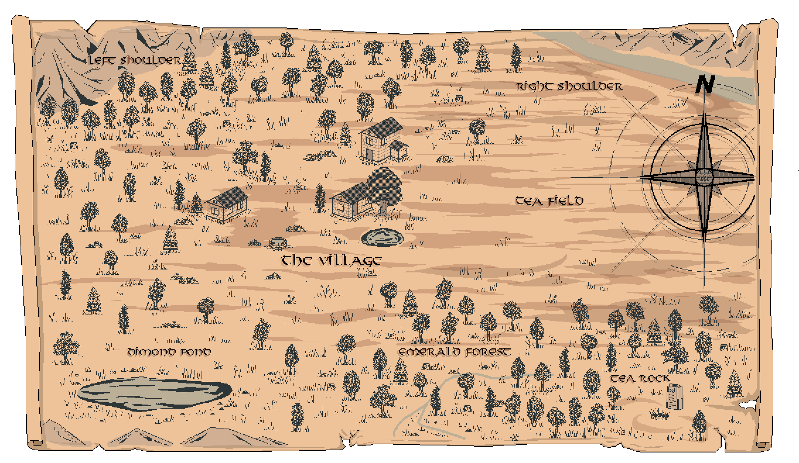

# The Valley of Tea Dragons

Among all locations mentioned in the surviving records, the Valley of Tea Dragons remains one of the most isolated and, at the same time, one of the most significant regions known to me so far. It was here that the Great Tea Tree was discovered, around which the Villagers’ settlement, the tea fields, and most of the Valley’s modern life gradually formed over many generations.

The exact location of the Valley still remains unknown. Most ancient maps either contradict one another or end long before providing any reliable external landmarks.

At the center of the Valley stands the Great Tea Tree — the oldest known relic of this region. Directly surrounding the tree lies the Village of the Villagers, home to generations of inhabitants dedicated to tea harvesting and maintaining life within the Valley.

To the right of the Village stretch the vast tea fields. It is here that the Villagers cultivate and gather most of the tea leaves used throughout the Valley.

Below the tea fields begins the Emerald Forest — a dense region of ancient vegetation that differs noticeably from the rest of the Valley. Deep within this forest stands the Tea Stone — the burial site of the Founder of the Village. Despite numerous mentions, most information regarding the Founder himself remains unstudied to this day.

In the lower-left region of the Valley lies the Diamond Pond. The Villagers use it as a place for rest, fishing, and certain seasonal gatherings. Several old records also describe unusual properties associated with the pond’s water, though I have not yet been able to confirm such claims reliably.

The northern borders of the Valley are formed by two massive mountain regions known among the Villagers as the Left Shoulder and the Right Shoulder. Together, they create a natural stone ring surrounding most of the Valley and shielding it from the outside world. According to observations, many of the mountain passages either collapsed long ago or remain hidden.

Special mention should be given to the Red Dragon — a creature constantly observed in the skies above the Valley. According to the Villagers’ accounts, the dragon has protected the region from the air for many generations and rarely leaves the mountain range. The origin of the dragon itself, as well as its connection to the Great Tea Tree, is referenced within the Legends, where the Tea Gods are said to have played a role in its creation.

Despite the relative calmness of the Valley, I gradually began to suspect that a significant portion of its history was intentionally concealed or lost long before the emergence of the current generation of Villagers.

---

---
## More about life into Village

- [Village](Village.md)
- [Villagers](Villagers/README.md)
- [Great Tea Tree](Tree.md)
- [Home](Home.md)
- [Tea Home](Tea_home.md)
- [Workshop](Workshop.md)

## More about locations of the Valley

- [Tea Fields](Field.md)
- [Emerald Forest](Forest.md)
- [The Tea Rock](Rock.md)
- [Diamond Pond](Pond.md)
- [Left Shoulder](L_shoulder.md)
- [Right Shoulder](R_shoulder.md)

---

## More notes related to the Valley

- [The Legend of the Battle for the Great Tea Tree](Legends/README.md)
