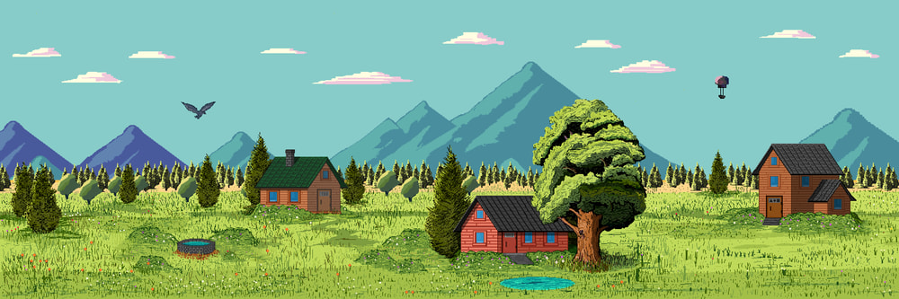
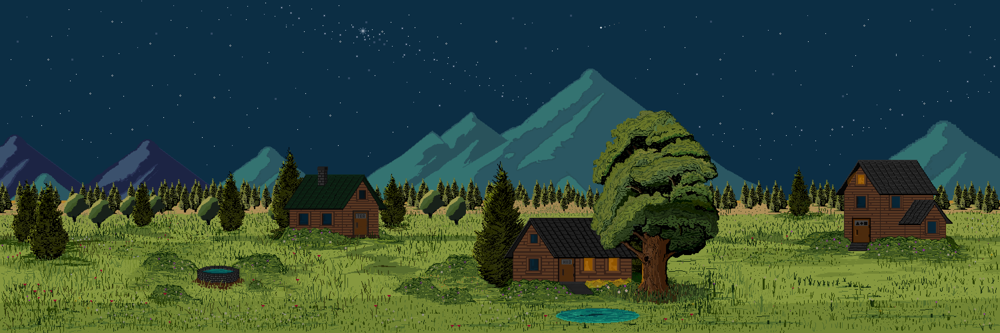
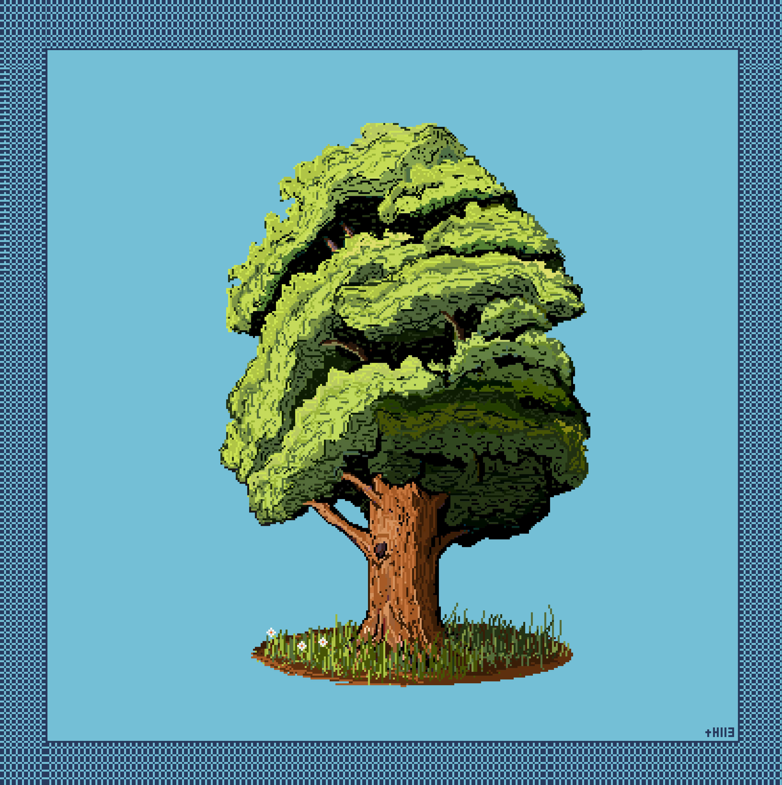
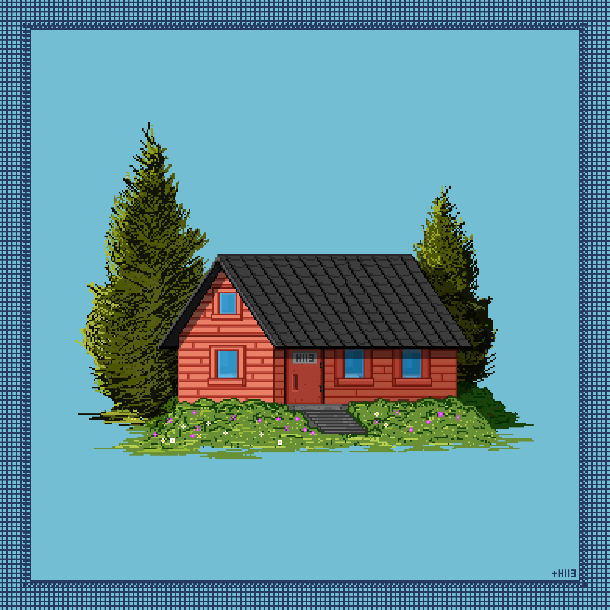
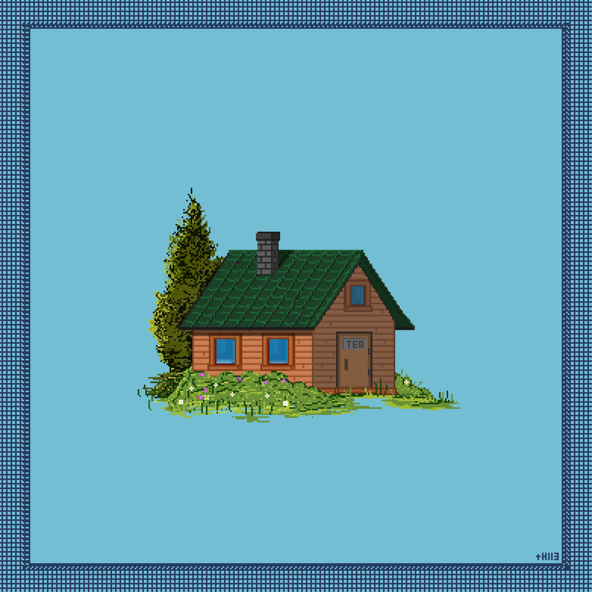
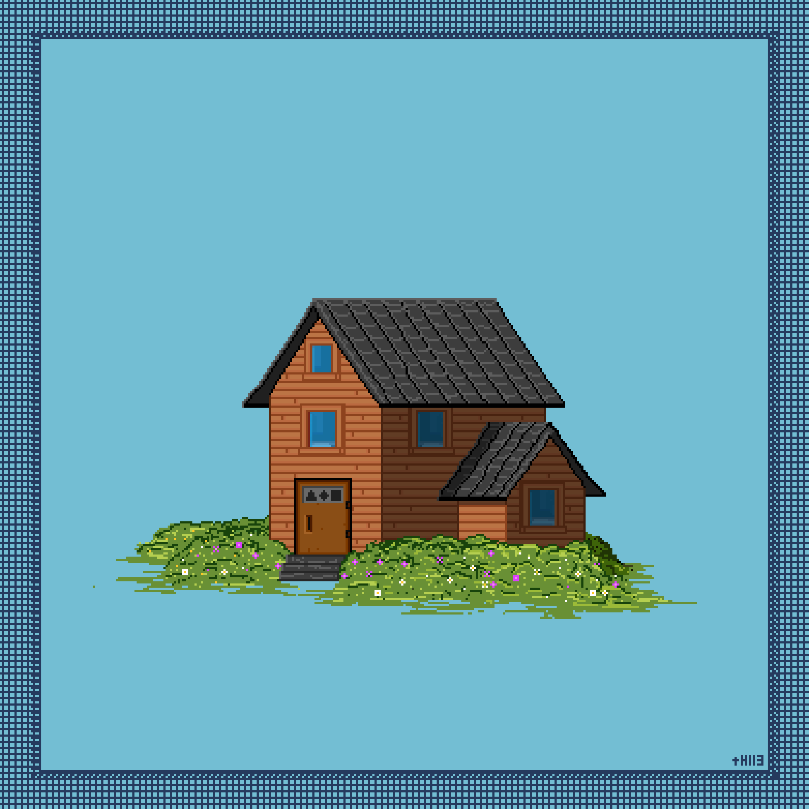

# The Village

According to my research, the Village inhabited by the people of the Valley was founded some time after the appearance of the Great Tea Tree. Although the villagers themselves rarely speak about the exact history of its origin, nearly all surviving sources agree on one point: the Village was originally built around the tree and has remained inseparable from the Valley throughout many generations.

At present, the Village exists as a small settlement serving as the home of the Villagers. Its central area consists primarily of three large structures: the House, the Tea House, and the Workshop. Each of them fulfills its own role in the daily life of the Villagers and will be examined separately in later records.

Not far from the center of the settlement lies a small pond. During warmer seasons, villagers often gather near it for rest, conversation, and fishing.

Special mention should be given to the Well of Fortune — an old stone structure whose origins also trace back to ancient times. Among the Villagers, there exists a belief that objects not originally belonging to the Valley can sometimes be retrieved from the depths of the well. Most such stories are generally regarded as local superstition, though I have managed to discover several fragments of records indirectly supporting the existence of similar incidents.

Despite the outward calmness of the Village, living here creates a persistent feeling that a significant part of its history was lost long before the emergence of the current generation of Villagers. Many buildings have been reconstructed multiple times, ancient symbols carved into the stones continue to fade, and certain sections of the Village were eventually demolished over time.
  
---

---

## The Great Tea Tree

Among all of my research, there exist no records more ancient than the mentions of the Great Tea Tree. Most translated fragments suggest that the Tree existed long before the appearance of many known and already vanished civilizations, the Tavern, and even the Village within the Valley.

In the oldest known legend, the creation of the Tree is attributed to the Tea Gods. Records regarding this account can be found within the [corresponding section](Legends/README.md).

The Tree itself cannot be mistaken for any other form of life existing within the Valley. Its enormous trunk rises above the entire village, the tea fields, and even parts of the surrounding mountains, while its crown is so vast and dense that even during clear weather, sections of the land beneath it remain covered in soft shadow. At certain hours, the leaves acquire a deep golden-green hue, causing the Tree to appear almost luminous through the mists of the Valley. Despite its immense size, however, the Tree does not resemble an ancient ruin, but rather a living and constantly changing organism.

All tea known within the Valley originates from this Tree. For this reason, the inhabitants of the Valley regard it not only as a sacred object, but also as the foundation of their very existence. For many generations, the Villagers have maintained the tea fields surrounding the Tree and continued the harvesting of its leaves.

During my research, some fragments describe the Tree as merely an unusually massive plant. Others portray it as a living structure capable of influencing both the surrounding world and the condition of living beings.

Of particular interest are the records connected to the Tree’s effect on memory and perception. Certain translations claim that prolonged exposure to its presence enhances clarity of thought and concentration. However, opposing testimonies also exist, describing distortions in the perception of time and the gradual loss of one’s sense of reality.

---

{: width="600" }

---

## The Home

Among all structures within the Village, the Home plays one of the most important roles in the lives of the Villagers as their primary hearth. Despite the complete absence of luxury, this place remains the center of the Valley’s daily life and the only location where the inhabitants truly allow themselves to rest from the constant labor surrounding tea production.

The exact time of the Home’s construction could not be determined. Judging by the condition of its foundation and the variation in materials used throughout the structure, the building has been rebuilt and expanded many times by different generations of Villagers. Certain sections appear significantly older than the rest, though their original purpose can no longer be identified.

Inside, the Home consists of a large communal space divided into several living areas. It is here that the Villagers sleep, eat, wait out periods of heavy fog and rain, and gather together in the evenings after work. Most of the interior is illuminated by the warm light of lanterns and furnaces, creating a constant atmosphere of calmness and comfort.

Despite the simplicity of its interior, the inhabitants of the Valley treat the Home with visible respect. Many old objects within the building are passed down between generations, while certain parts of the interior appear to have remained unchanged for an extremely long time.

From my own experience, it feels as though the Home holds a far greater meaning for the Villagers than simply being a place for sleep and meals. In many ways, the entire sense of everyday life within the Valley seems to be built around it.

---

{: width="600" }

---

## The Tea Home

Among all other structures within the Village, the Tea Home remains the most lively and active place. Unlike the Home, which is primarily intended for rest and the everyday life of the Villagers, the Tea Home serves as a space for meetings, conversations, communal gatherings, and everything connected to the storage, preparation, and tasting of tea.

Most surviving records consistently describe the Tea Home as one of the central places where the Villagers gather for the very act of shared tea drinking itself. From my own experience, I can say that within the Valley, the consumption of tea long ago ceased to be a simple daily habit and gradually became an essential part of local culture and communication.

The interior of the Tea Home is usually filled with the warm light of lanterns, the scent of freshly brewed tea, and the constant quiet murmur of conversation. Various rooms are also occupied by countless prepared tea leaves — dried, stored, or still undergoing different stages of tea production.

It is here that our main gatherings take place. Discussions concerning the tea harvest, the condition of the fields, preparations for upcoming seasons, and other matters affecting the life of the Valley are all held within these walls. Certain translated records also suggest that more ancient rituals and ceremonies were once conducted inside the Tea House, though most such traditions appear to have been lost long ago.

The process of tea brewing itself receives particular and deliberate attention here. Even minor details — including the temperature and quality of water, the shape of the teaware, and the precise brewing time — are treated with noticeable seriousness. The origins of many such practices are usually explained by the Villagers simply as “the old ways,” refined by our ancestors over many years, perhaps even centuries.

---

{: width="600" }

---

## The Workshop

Among the three main structures of the Village, the Workshop remains perhaps the most unusual place. Unlike the House and the Tea House, whose purposes are understandable to nearly anyone, the activities carried out within the Workshop follow truly unique directions.

It is here that the villagers engaged in various crafts and artistic practices work — or once worked. Within the Workshop one could encounter painters, woodcarvers, creators of tea utensils, weavers, musicians, and other masters whose occupations often extend far beyond ordinary craftsmanship.

Most objects used throughout the Valley are created here: from simple lanterns and tea cups to complex decorative structures and works of art. Some of the Villagers’ creations serve purely practical purposes, yet a significant portion of the objects produced possess spiritual or artistic meaning, and are often valued far beyond the borders of the Valley itself.

Inside the Workshop, the sounds of labor are almost constant: the creaking of tools, quiet music, and conversations between craftsmen. The atmosphere within this building differs noticeably from the rest of the Village. During ordinary work, there is a persistent feeling that the Villagers regard the act of creating art as something far more significant than simple craftsmanship alone.

---

{: width="600" }

---

[Read about Villagers](/Homes-journey-archive/Valley/Villagers/README){: .btn }
[Read the Legend](/Homes-journey-archive/Valley/Legends/README){: .btn }
