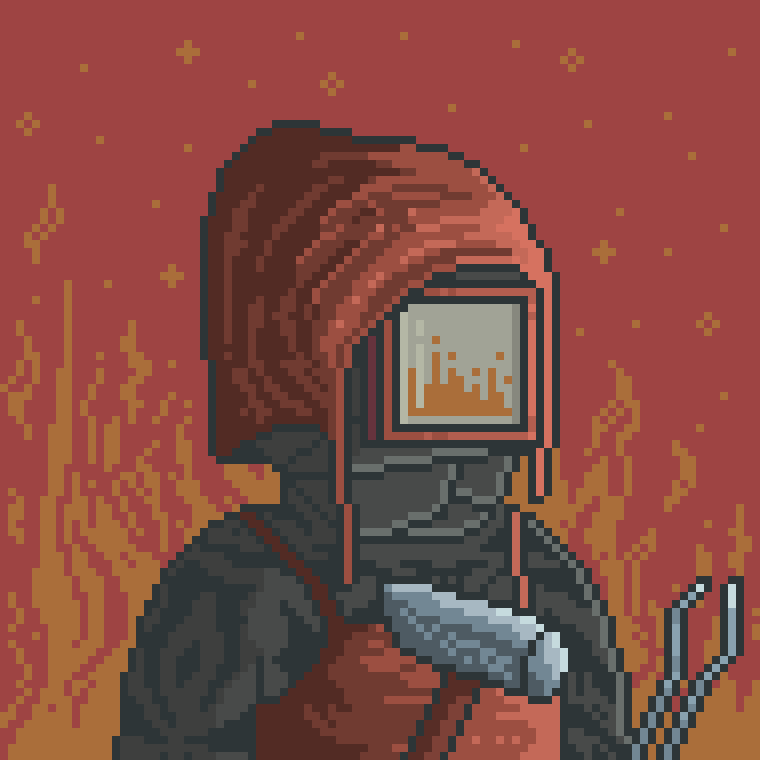

# The Blacksmith

Blacksmith is one of the villagers responsible for crafting and repairing tools used throughout the Valley.

Most metal objects found within the settlement — are believed to have passed through his forge.

Despite the simplicity of his work, many villagers consider his craftsmanship essential to the daily life of the Valley.

---

<a href="/Homes-journey-archive/Valley/Villagers/README" style="display: block; padding: 16px; border: 1px solid #c8a84b; text-decoration: none; color: #c8a84b;">
  
Back to Villagers

  

</a>

<a href="/Homes-journey-archive/Valley/README" style="display: block; padding: 16px; border: 1px solid #c8a84b; text-decoration: none; color: #c8a84b;">
  
Bacl to the Valley

  

</a>

