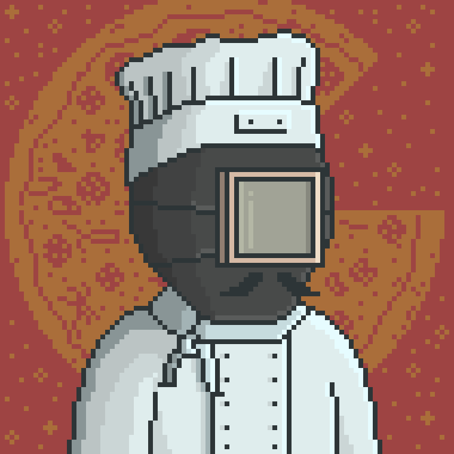

# The Cook

Cook is one of the villagers responsible for preparing food and tea within the Valley.

Many recipes preserved among the villagers are believed to have passed through his kitchen, often changing over time as new ingredients and methods appear within the settlement.

Some villagers consider his cooking an important part of daily life in the Valley.

