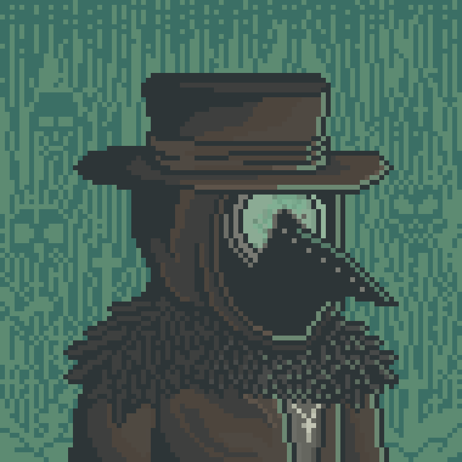

# The Teasculapius

Teasculapius is one of the villagers responsible for healing practices within the Valley.

Most treatments involving tea mixtures, herbal preparations, and traditional remedies are believed to originate from his work.

In addition to medicine, Teasculapius is also associated with older rituals and ceremonial practices preserved within the village for generations.

Some villagers consider his methods unusual, though many still seek his help during illness or recovery.

