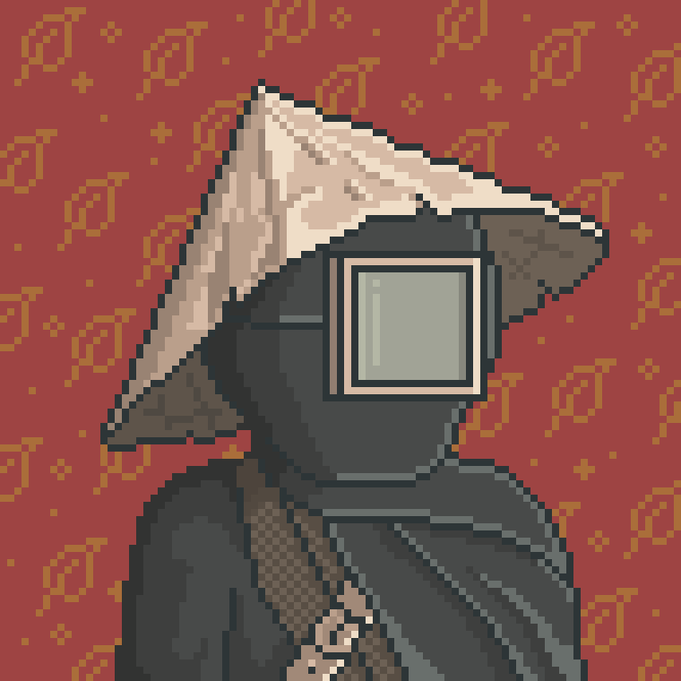

# The Tea Harvester

Tea Harvester is one of the villagers responsible for gathering tea leaves from the Tea fields.

Much of the daily work connected to the harvest season is organized around his routines and knowledge of the growing regions.

Some villagers believe that experienced harvesters are capable of sensing changes in the condition of the tea long before they become visible to others.

---

<a href="/Homes-journey-archive/Valley/Villagers/README" style="display: block; padding: 16px; border: 1px solid #c8a84b; text-decoration: none; color: #c8a84b;">
  
Back to Villagers

  

</a>

<a href="/Homes-journey-archive/Valley/README" style="display: block; padding: 16px; border: 1px solid #c8a84b; text-decoration: none; color: #c8a84b;">
  
Bacl to the Valley

  

</a>

