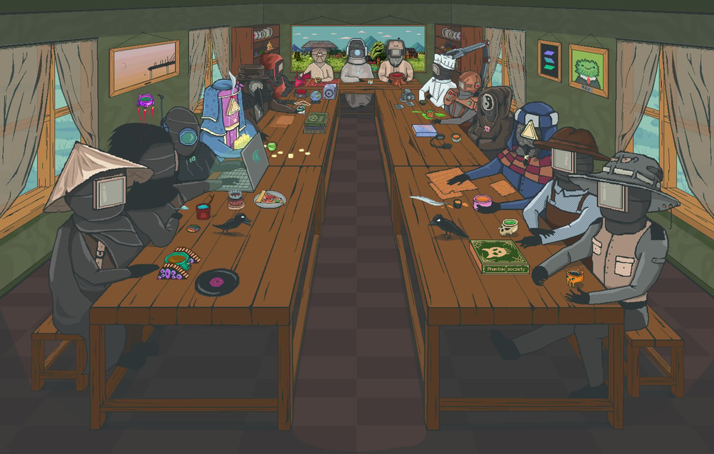

# Villagers

Among all inhabitants of the Valley, the Villagers form the foundation of its daily life. For many generations, they have maintained the Tea Fields, preserved the Village, crafted objects within the Workshop, conducted ceremonies, and continued traditions whose origins have, in many cases, long since been forgotten.

The appearance of the Villagers has remained nearly unchanged throughout all known history of the Valley. Most wear heavy clothing that conceals the body almost entirely, while their faces are always hidden behind masks.

The shape of each mask is directly connected to the craft or responsibility of a particular Villager. Triangular masks are most commonly associated with those involved in trade, supply organization, and matters connected to the structure of village life. Circular masks are usually worn by artists, musicians, ceremony keepers, and villagers whose work relates to spiritual or cultural traditions. Square masks are primarily seen among craftsmen and villagers responsible for physical labor and the maintenance of the Village itself.

Despite these distinctions, the Villagers rarely divide one another by status or importance of profession. Every role within the Valley is regarded as a necessary part of the overall order.

Despite the apparent simplicity of their daily life, there is a strong sense that much of the Villagers’ knowledge was never directly written down, but instead passed through tradition, craft, shared labor, and tea ceremonies. Because of this, many ancient customs continue to exist even when their original meaning can no longer be fully explained through words.

---

## Known Villagers:

<a href="/Valley/Villagers/Arborist" style="display: block; padding: 12px; border: 1px solid #c8a84b; text-decoration: none; color: #c8a84b;">
  
Arborist

</a>

<a href="/Valley/Villagers/Artchemist" style="display: block; padding: 12px; border: 1px solid #c8a84b; text-decoration: none; color: #c8a84b;">
  
Artchemist

</a>

<a href="/Valley/Villagers/Blacksmith" style="display: block; padding: 12px; border: 1px solid #c8a84b; text-decoration: none; color: #c8a84b;">
  
Blacksmith

</a>

<a href="/Valley/Villagers/Cook" style="display: block; padding: 12px; border: 1px solid #c8a84b; text-decoration: none; color: #c8a84b;">
  
Cook

</a>

<a href="/Valley/Villagers/Fisherman" style="display: block; padding: 12px; border: 1px solid #c8a84b; text-decoration: none; color: #c8a84b;">
  
Fisherman

</a>

<a href="/Valley/Villagers/Harvester" style="display: block; padding: 12px; border: 1px solid #c8a84b; text-decoration: none; color: #c8a84b;">
  
Tea Harvester

</a>

<a href="/Valley/Villagers/Mechanic" style="display: block; padding: 12px; border: 1px solid #c8a84b; text-decoration: none; color: #c8a84b;">
  
Mechanic

</a>

<a href="/Valley/Villagers/Monk" style="display: block; padding: 12px; border: 1px solid #c8a84b; text-decoration: none; color: #c8a84b;">
  
Tea Monk

</a>

<a href="/Valley/Villagers/Shearer" style="display: block; padding: 12px; border: 1px solid #c8a84b; text-decoration: none; color: #c8a84b;">
  
Tea Shearer

</a>

<a href="/Valley/Villagers/Tealder" style="display: block; padding: 12px; border: 1px solid #c8a84b; text-decoration: none; color: #c8a84b;">
  
Tealder

</a>

<a href="/Valley/Villagers/Tealer" style="display: block; padding: 12px; border: 1px solid #c8a84b; text-decoration: none; color: #c8a84b;">
  
Tealer

</a>

<a href="/Valley/Villagers/Teantist" style="display: block; padding: 12px; border: 1px solid #c8a84b; text-decoration: none; color: #c8a84b;">
  
Teantist

</a>

<a href="/Valley/Villagers/Teasurer" style="display: block; padding: 12px; border: 1px solid #c8a84b; text-decoration: none; color: #c8a84b;">
  
Teasurer

</a>

<a href="/Valley/Villagers/Tj" style="display: block; padding: 12px; border: 1px solid #c8a84b; text-decoration: none; color: #c8a84b;">
  
TJ

</a>

<a href="/Valley/Villagers/Doctor" style="display: block; padding: 12px; border: 1px solid #c8a84b; text-decoration: none; color: #c8a84b;">
  
Teasculapius

</a>

<a href="/Valley/Villagers/WebTeaveloper" style="display: block; padding: 12px; border: 1px solid #c8a84b; text-decoration: none; color: #c8a84b;">
  
Web Teaveloper

</a>

---

  

---

<a href="/Valley/Legends/README" style="display: block; padding: 16px; border: 1px solid #c8a84b; text-decoration: none; color: #c8a84b; margin-left: auto; width: fit-content;">
  
Read next

  
The Legend

</a>

