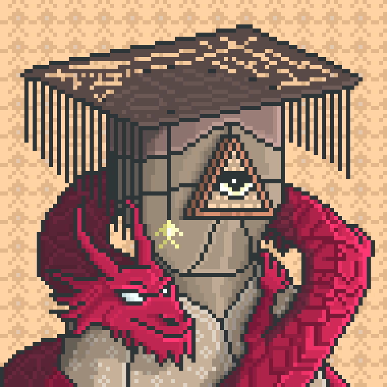

# The Tealder

Tealder is regarded as the current leader and overseer of the Valley settlement.

Most decisions related to village organization, seasonal work, and communication between different groups of villagers eventually pass through him.

He is rarely seen without the young Red Dragon that accompanies him throughout the settlement — a creature many villagers consider deeply connected to the older Legends of the Valley.

Despite his authority, Tealder is known for maintaining close contact with the daily life of the village rather than remaining distant from it.

---

<a href="/Valley/Villagers/README" style="display: block; padding: 16px; border: 1px solid #c8a84b; text-decoration: none; color: #c8a84b;">
  
Back to Villagers

  

</a>

<a href="/Valley/README" style="display: block; padding: 16px; border: 1px solid #c8a84b; text-decoration: none; color: #c8a84b;">
  
Back to the Valley

  

</a>

