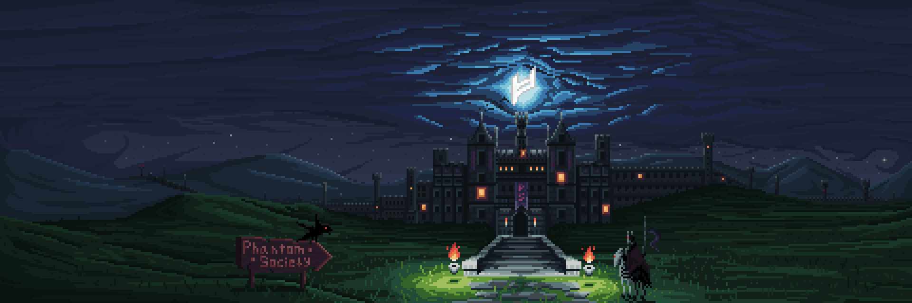
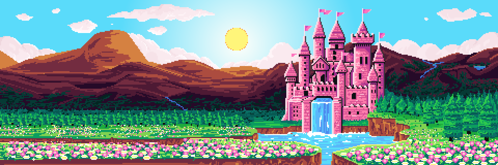
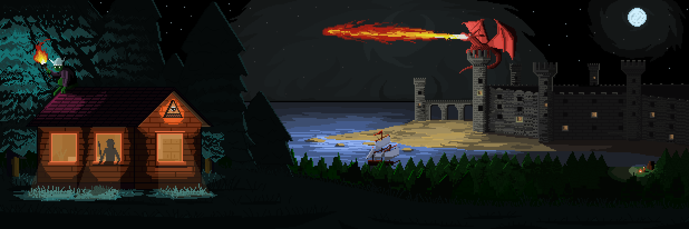

# Bastion

Bastion is a World of enormous fortresses, stone citadels, bridges, towers, and isolated kingdoms built among mountains, cliffs, forests, endless valleys, and even above the clouds.

According to Traveler records, much of Bastion is covered in ancient defensive structures connected by roads, walls, watchtowers, and fortified settlements. Travelers describe this World as cold and quiet, filled with the sounds of wind, rain, and what still seems to be the distant crackling of firewood, metallic mechanisms, hoofbeats, and faraway bells echoing across the valleys.

---

## Cloudy Castle

---

## PS Castle

---

## Princess Castle

---

## Old Castle

