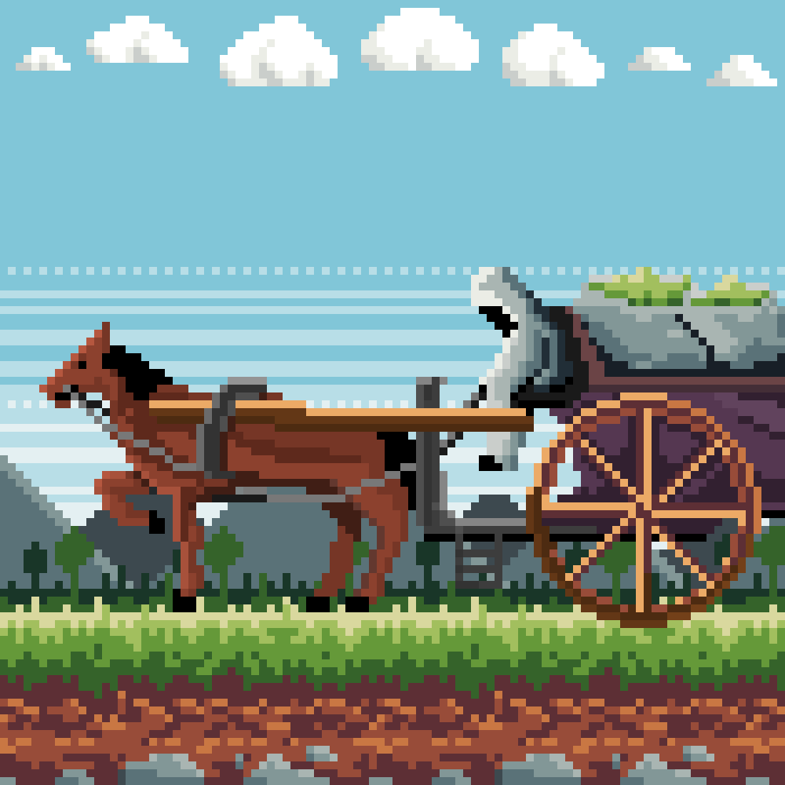

# Events of Arboris

Known events happened on this area

---

## Ritual of Elixirs Preparation

The moment of the ritual of preparing healing elixirs by the Grand Ceremonial Master in Arboris. At an ancient stone altar, he carefully mixes the necessary ingredients in a large wooden bowl.

---

## Harvesting Medicinal Plants

In the Arboris Plantations, surrounded by mountains, the process of harvesting valuable medicinal plants takes place. Workers, dressed in gray tunics, carefully cut the plants and place them in woven baskets. The air is filled with the scent of fresh greenery and blooming plants. This harvesting process is carried out in harmony with nature, following age-old traditions and rituals passed down through generations. The workers meticulously select only the best plants to preserve their medicinal properties.

---

## Meditation with Elixirs

At a picturesque clearing on the edge of the forest hollow, the Chief Healer of Arboris has gathered with the residents for meditation and drinking Elixirs. The forest hollow, with treehouses in the background, creates an atmosphere of seclusion. The healer serves Elixirs to the residents, and they all sit together, immersed in meditation.

---

## Secrets of the forest

The Forest Keeper walks gracefully through the serene forest clearing, his presence a blend of strength and tranquility. Towering trees with thick canopies create a cool, shaded path, where dappled sunlight filters through the leaves. The air is filled with the soft rustle of leaves and the melodious songs of birds. Flowers and medicinal plants line the path, their vibrant colors adding to the beauty of the scene. The Forest Keeper moves with purpose, his steps silent and sure, as he observes the health of the flora and fauna around him. This clearing, alive with the harmony of nature, is both his domain and sanctuary, where the secrets of the forest are known only to him.

---

## Journey of the Elixirs

A trader from Arboris carefully transports Elixirs through the dense forests, their cart filled with beautifully crafted containers holding the precious plants. The path ahead is winding and shaded by towering trees, creating a tranquil yet mysterious atmosphere. The trader moves with a practiced ease, knowing the value of the cargo and the importance of delivering it safely. As they travel the faint scent of herbs fill the air, marking the journey as one of both commerce and tradition, connecting Arboris to distant lands through the trade of these cherished remedies.

---

[Back to Arboris]({{ site.baseurl }}/Worlds/Dominia/Arboris){: .btn }

