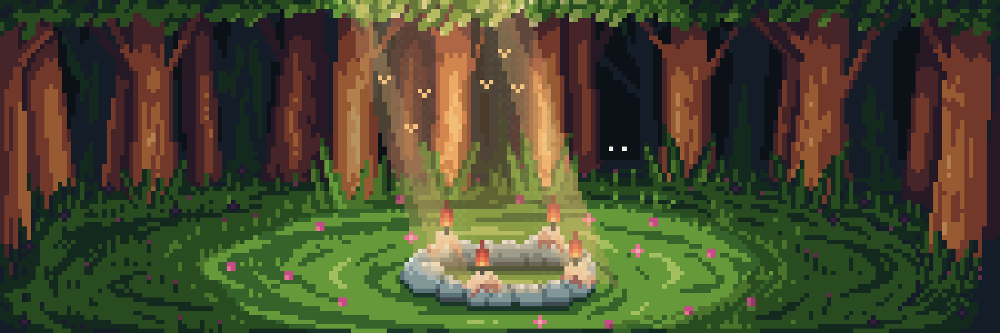
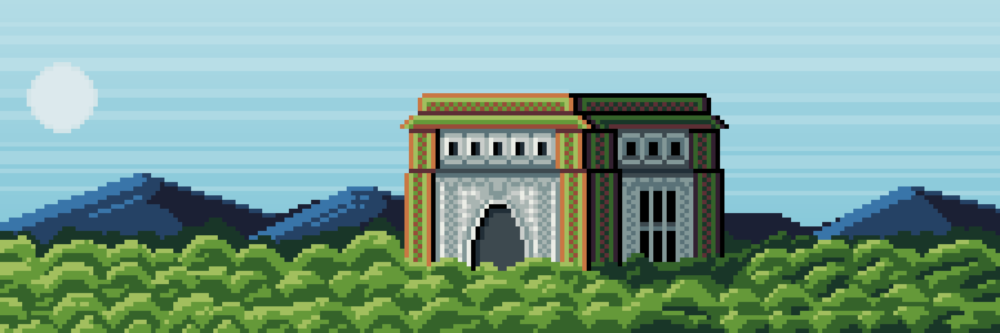
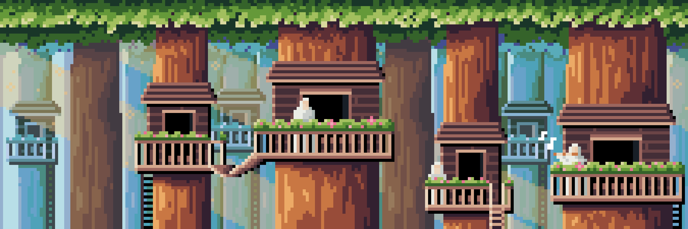
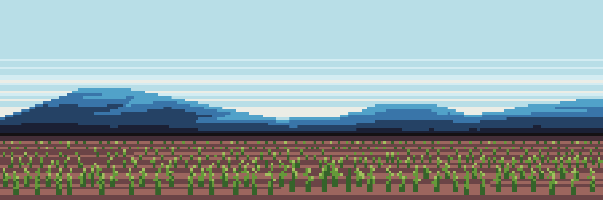
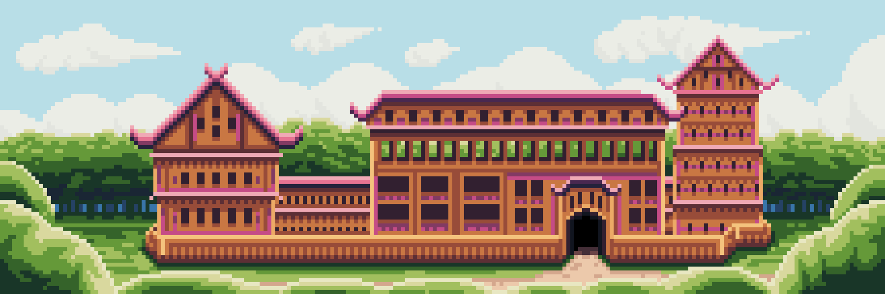

# Locations of Arboris

Known locations of this area

---

## Ritual Clearing

In the heart of Arboris lies the Ritual Clearing, a serene forest sanctuary essential to the community. Tall trees surround a perfect circle of stones, each one meticulously placed. Soft green grass and colorful flowers cover the ground, with natural wax candles adorning the stones. This clearing is a sacred space where the people of Arboris perform rituals to honor nature and brew their healing elixirs. The rituals, led by the Grand Ceremonial Master, are believed to channel the forest’s energy into the elixirs, enhancing their potency. As birds sing and small animals move quietly among the foliage, sunlight filters through the trees, creating a peaceful, sacred atmosphere.

---

## The Temple of Elixirs

The majestic Temple of Elixirs, constructed from wood and stone, serves as the center for rituals involving healing infusions in Arboris. Inside the temple are altars and special areas for conducting ceremonies. In the center of the temple stands an ancient stone altar where the ingredients for the Elixirs are mixed. The walls of the temple are adorned with carvings. Surrounding the temple is a lush forest, adding a unique atmosphere to this sacred place.

---

## Forest Hollow

A picturesque and tranquil area where part of the local population resides. Here, tall trees grow around treehouses, their dense canopies creating cool shade. The residents of the forest hollow lovingly tend to the flowers and herbs growing around their homes. They gather them to create Elixirs and to decorate their houses. Each home is surrounded by a small garden, filled with various plants, giving the area a scenic appearance. This is the heart of the Arboris community, a symbol of their unity with nature and harmony with the surrounding world. It is a place where residents live in harmony with nature, caring for it and drawing strength and inspiration from it.

---

## The Fields

The fields where the inhabitants of Arboris gather medicinal plants stretch endlessly, presenting a minimalist landscape. Soft green waves of meticulously tended plants extend to the horizon, creating a harmonious canvas of nature. In the distance, majestic mountains rise, their silhouettes barely visible in the morning mist. The sunlight gently illuminates the fields, playing with the dewdrops and adding a touch of magic and tranquility to the place.

---

## Castle of Arboris

The Castle of Arboris stands as a majestic structure crafted entirely from rich, dark wood, blending seamlessly with the surrounding forest. Tall and elegant, the castle is adorned with rare pink trees, known as Rosalyn Trees, their delicate blossoms adding a touch of ethereal beauty to the scene. The branches of these trees gently arch over the castle’s walls, creating a canopy of soft color that contrasts with the deep greens of the dense forest. The castle’s architecture reflects the harmony between nature and craftsmanship, with intricate carvings and natural patterns that echo the surrounding wilderness. It is a place of tranquility and reverence, where the essence of Arboris is preserved and celebrated.

---

[Back to Arboris]({{ site.baseurl }}/Worlds/Dominia/Arboris){: .btn }

