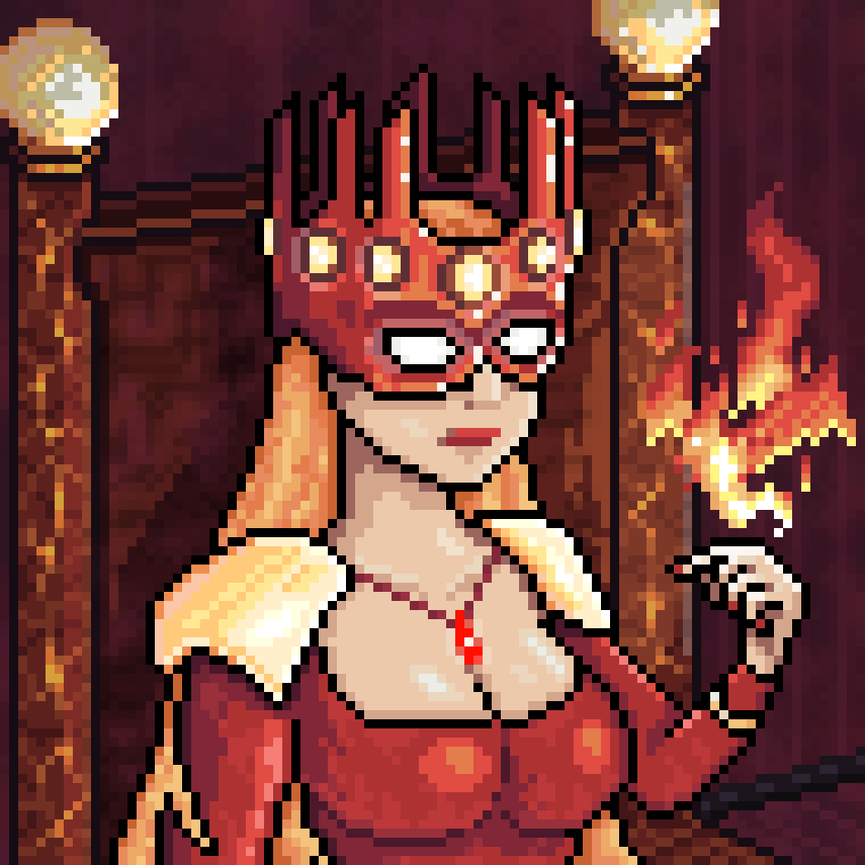
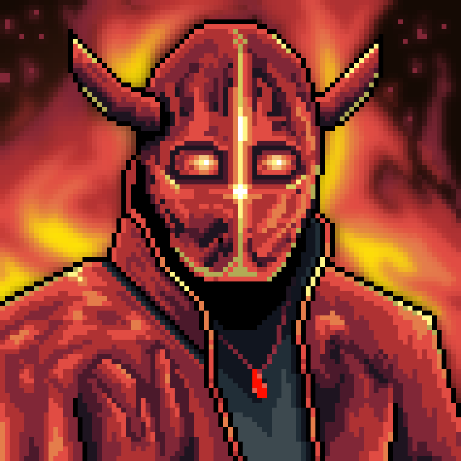
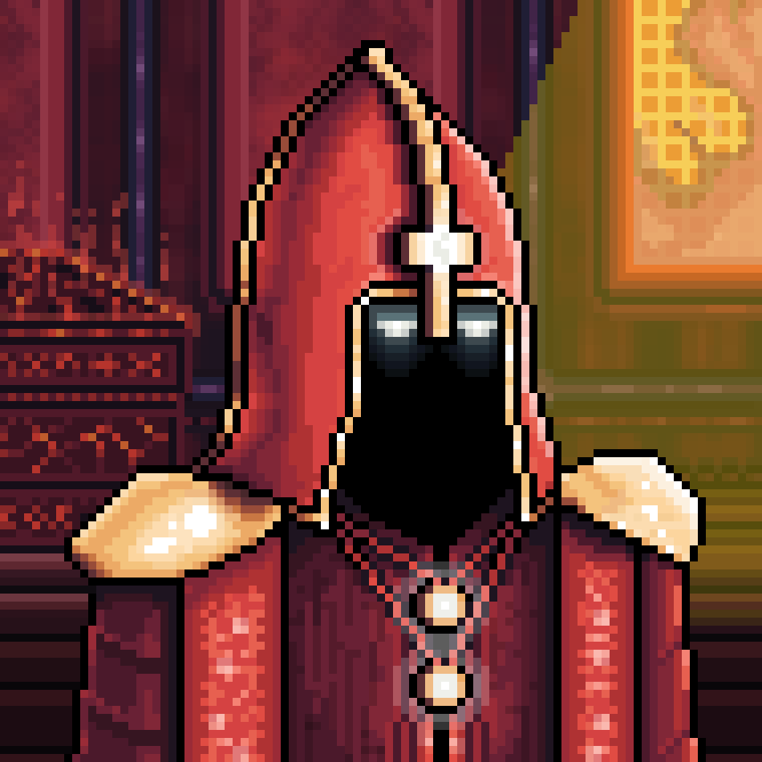

# Characters of Igneon

Known characters of this area

---

## Fire Queen

The Fire Queen of Igneon is a majestic and captivating figure, clad in a luxurious, form-fitting dress of fiery hues. Her crown, resembling flames, is encrusted with fiery stones. The Queen's face is hidden beneath a mask adorned with fiery patterns, through which her bright eyes gleam. Long, wavy, fiery-red hair cascades over her shoulders. Massive golden epaulets and numerous ornaments emphasize her status and power. A warm, bright aura surrounds her, creating the impression of invisible tongues of flame. The Queen is a wise and charismatic ruler whose influence extends to all aspects of life in Igneon.

---

## Directof of the Lava Factory in Igneon

Marcus Infernos, the director of the Lava Factory in Igneon, is a large and muscular man with a rugged and weathered face marked by scars from working with lava. His eyes, deep and piercing, glow with a bright orange hue, reflecting the fiery nature of his work. Marcus wears practical yet impressive clothing made from heat-resistant materials. Heavy gloves with metal inserts protect his hands, and various tools and devices for working with lava hang from his belt. His face is concealed by a mask that completely covers it, leaving only his eyes visible. The mask is made of black metal with gold and orange inlays and is adorned with horns, enhancing the Director's status and imposing presence.

---

## Fire Priest

The Fire Priest, clad in a red robe adorned with runes, amulets, and golden pauldrons, serves in the majestic Church of Fire, where every element of the interior reflects the power and beauty of the fire element. In this church, filled with the light of flames and magical relics, ceremonies and rituals are held that strengthen the connection of the inhabitants of Igneon with their spiritual heritage and natural element.

---

<a href="/Worlds/Dominia/Igneon" style="display: block; padding: 16px; border: 1px solid #c8a84b; text-decoration: none; color: #c8a84b; margin-right: auto; width: fit-content;">
  
Back to

  
Igneon

</a>

