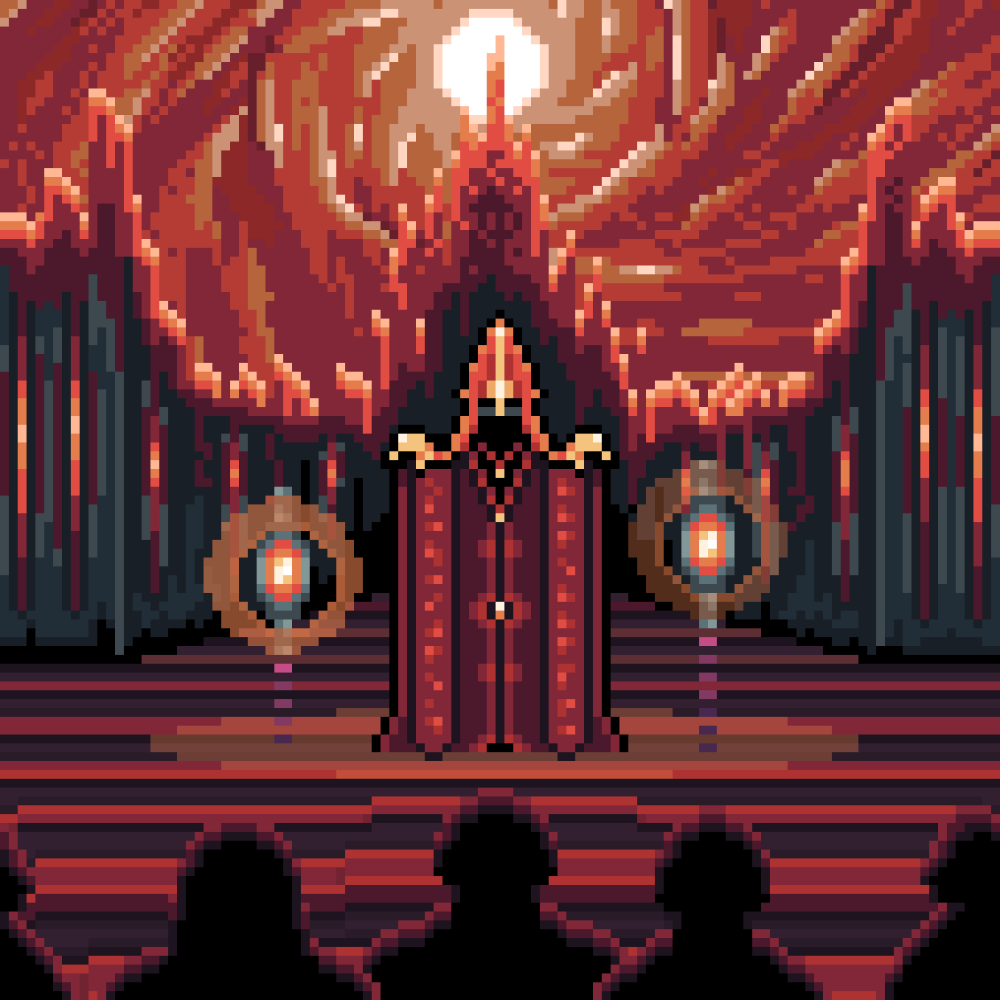
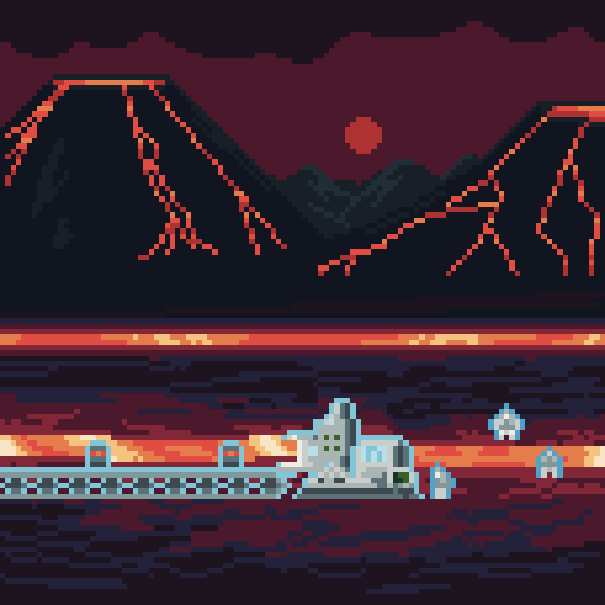

---
title:
nav_exclude: true
---

# Events of Igneon

Known events what happened on this area

---

## Fire Ritual

Under the night sky of the planet Dominia, when the Fire Lake in the Igneon region glows brightly, an ancient fire ritual takes place in the center of the city of Igneon. On the central square, bathed in the mystical light of lava flows, the high priest begins the ceremony. He uses unusual technological lanterns, which seem like artifacts from another era, blending magic and advanced technology. Crowds of townspeople gather in the square. Everyone awaits the start of the ceremony, which is held only once a century and has immense significance for the city. To the rhythmic sounds of drums and melodious chants, the high priest raises the lantern, and fiery beams merge with the celestial glow of the lava lakes. At that moment, it seems as if nature itself enters a mysterious dance with the light. This rare event holds great importance for the city of Igneon. It not only symbolizes the unity of the townspeople and their connection with nature but also serves as a source of blessing and prosperity for the entire region.

---

## Lava Extraction

A large-scale lava extraction operation has unfolded on the lava fields of the Igneon region. Massive lava excavators with enormous buckets and heat-resistant manipulators dig lava from active flows, transporting it along long conveyor belts to processing plants. Workers, clad in special thermal protective gear, oversee the processes and maintain the equipment. Thermal insulation barriers and cooling systems protect people and machinery from the intense heat and lava splashes. In the background, active volcanoes and mountain ranges rise, creating a dramatic landscape shrouded in smoke and steam.

---

## Address to the people

The Fire Queen stands on the balcony of her majestic royal tower, facing the crowd gathered below. She is dressed in a luxurious fiery red gown adorned with golden patterns, wearing an amulet in the shape of a fiery drop around her neck and a crown inlaid with gold and fiery stones. In her hands, she holds a fiery scepter. Her long, wavy red hair flows in the wind, and her face is partially hidden by a mask with fiery symbols. The balcony is made of fire-resistant materials, adorned with golden elements and fiery symbols. The railings are inlaid with flame patterns that shimmer in the light of large torches set at the corners of the balcony. Below, at the base of the tower, the residents of Igneon have gathered. Their faces show admiration and respect.

---

## Deal

Before you lies the majestic hall of the royal tower of Igneon, illuminated by the soft glow of lava flowing along the walls and ceiling. In the center of the hall hovers a metallic table with a levitation mechanism, upon which lies a plant specimen presented by a representative of Arboris. The Director of the Lava Factory and the Fire Queen are interested in external trade with these people. Despite possessing valuable energy resources, Igneon is in need of food and live plants, which are rare in this region.

---

<a href="/Worlds/Dominia/Igneon" style="display: block; padding: 16px; border: 1px solid #c8a84b; text-decoration: none; color: #c8a84b; margin-right: auto; width: fit-content;">
  
Back to

  
Igneon

</a>

