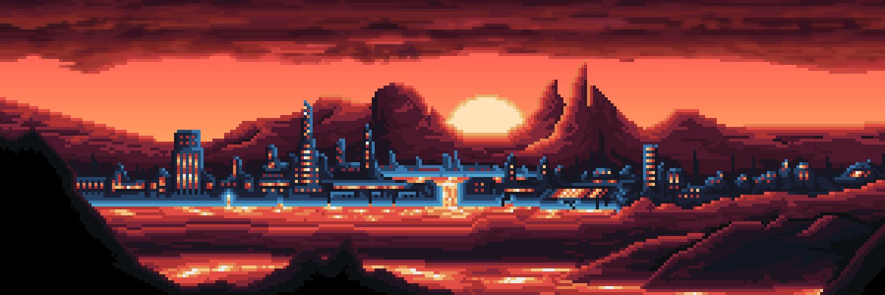
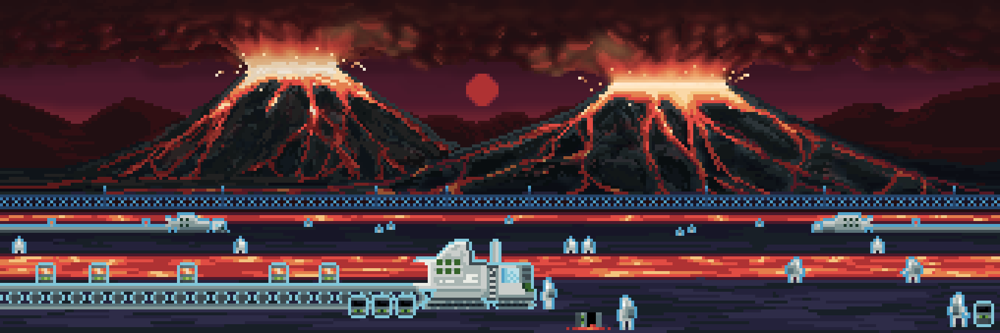
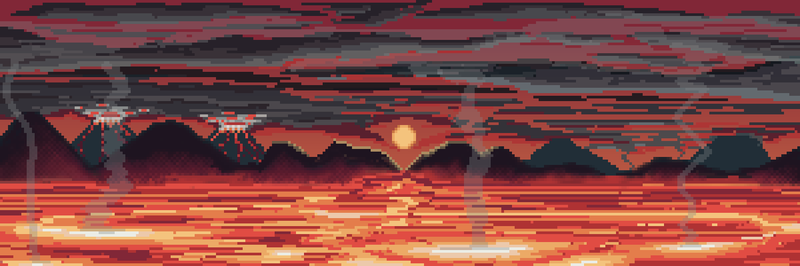

# Locations of Igneon

Known locations from this area

---

## The City of Igneon

The city of Igneon is set against the backdrop of vast lava lakes, creating a dramatic and unique landscape. Tall fireproof buildings, constructed from heat-resistant materials, rise above the ground, combining sturdy structures with elegant glowing elements. Highways with thermal-resistant coatings are illuminated by bright lights, reflecting off the lava flows. Mountains can be seen in the distance, framing the city and giving it a sheltered and secluded appearance. Pillars of flame and smoke rising from the lava lakes create a mystical and formidable atmosphere, highlighting the uniqueness and grandeur of the city of Igneon.

---

## The Fire Lake

Under the night sky of the planet Dominia, the Fire Lake in the Igneon region spread out, creating an astonishing spectacle of light and mystery. The lava lakes emit fiery jets of steam, resembling living creatures. Driven by the night wind, pillars of fire pierce the sky, like dancing demons in the nocturnal haze. The moonlight reflects in the fiery streams, giving them a mysterious and enigmatic glow. In the distance, the silhouettes of mountains shrouded in dark clouds create a contrast between the fiery brightness and the mystical darkness. This place is filled with the energy and power of nature, embodying the wondrous and perilous world of the planet Dominia.

---

## The Two Springs

The Two Springs location in Igneon features two massive volcanoes spewing streams of molten lava down their slopes. At the base of the volcanoes, intensive lava mining operations are underway: huge lava excavators with massive buckets and heat-resistant manipulators dig up the lava and load it onto conveyors, which transport it to processing plants. Workers dressed in thermal protection suits monitor the process and maintain the equipment. Around the work zones, thermal insulation barriers and cooling systems are installed to protect against heat and lava eruptions. The landscape at the foot of the volcanoes is covered with solidified lava flows, through which roads and highways are laid. Columns of smoke and steam rising from the volcanoes and lava flows create an atmosphere of constant movement and activity, illuminated by the bright light of the lava and reflections on the metallic surfaces of the machines.

---

## The Lava Sea

Before you stretches the vast Lava Sea, its viscous, dense surface constantly moving and shimmering with bright streams of lava. Lava fountains periodically shoot molten droplets into the air, creating bright flashes of light. Massive black cliffs rise around the Lava Sea, partially submerged in the lava. Their surfaces bear traces of erosion and fiery explosions. In the background, the "Two Springs" volcanoes tower, erupting lava and ash into the sky. Their slopes are covered with solidified lava and bordered by thick clouds of smoke.

---

<a href="/Worlds/Dominia/Igneon" style="display: block; padding: 16px; border: 1px solid #c8a84b; text-decoration: none; color: #c8a84b; margin-right: auto; width: fit-content;">
  
Back to

  
Igneon

</a>

