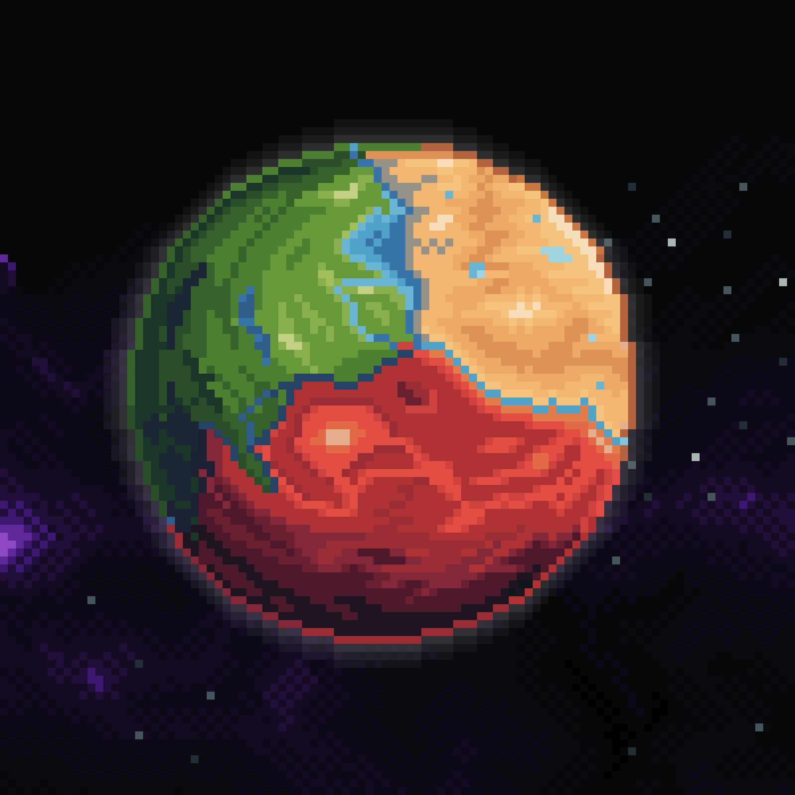

# The Dominia

According to the surviving descriptions, the Dominia was a large and highly diverse planet with a developed internal structure, numerous regions, and signs of at least three distinct peoples having existed there.

At present, the three most thoroughly documented regions of the Dominia are Arboris, Igneon, and Crystalis. Despite belonging to the same World, these territories differ greatly from one another in appearance, atmosphere, architecture, and the overall condition of their environments.

The exact period during which this World existed remains impossible to determine. However, judging by the large number of recovered Artifacts and the unusually well-preserved records, its decline appears to have occurred not so long ago.

  

---

<a href="/Homes-journey-archive/Worlds/Dominia/Igneon" style="display: block; padding: 16px; border: 1px solid #c8a84b; text-decoration: none; color: #c8a84b; margin-left: auto; width: fit-content;">
  
Read next

  
Igneon

</a>

