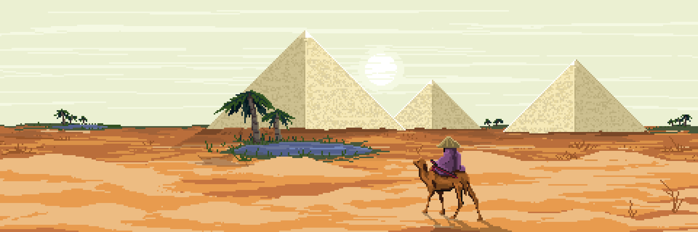
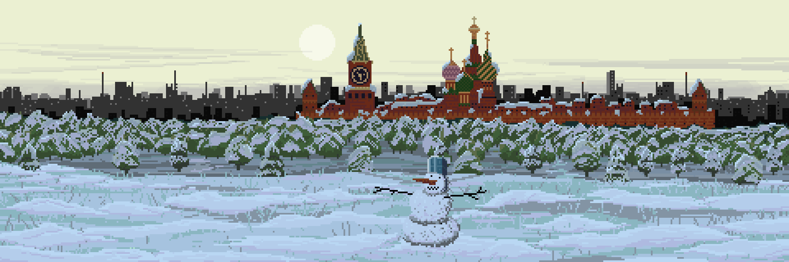
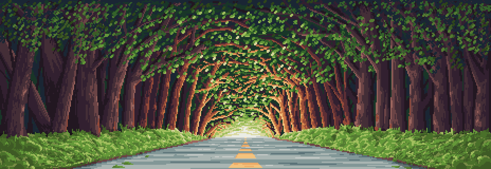
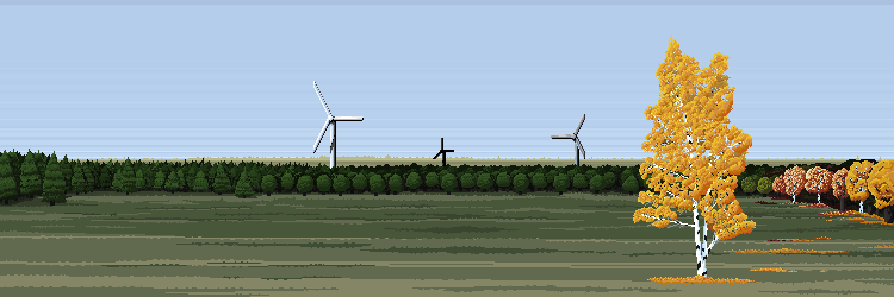
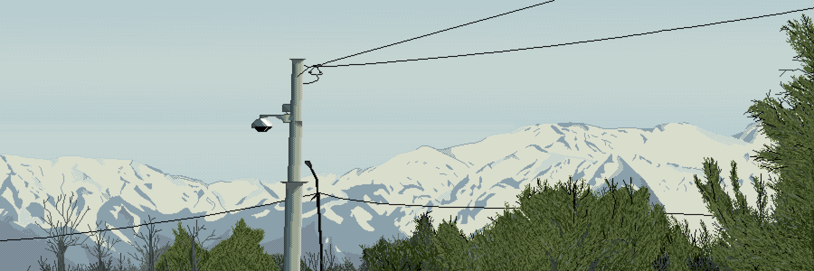
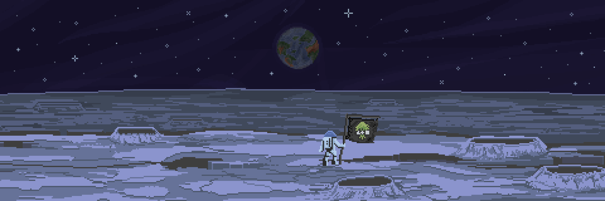
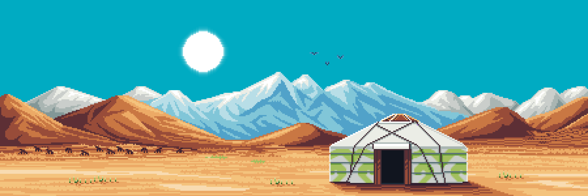
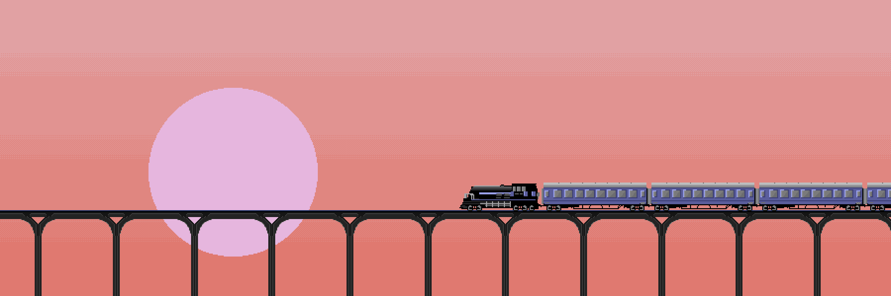
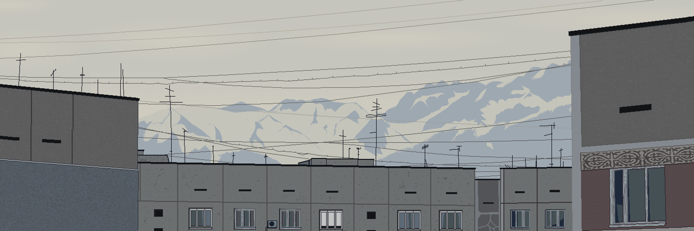

# Edem

Edem is a World composed of countless cities, coastlines, roads, stations, and human settlements spread across forests, oceans, and mountain ranges.

According to preserved Traveler records, Edem was distinguished by an extraordinary diversity of cultures, architecture, and ways of life. Vast neon megacities existed alongside quiet coastal towns, old railway stations, densely populated districts, and nearly untouched natural regions.

Most observations describe Edem as a noisy, warm, and constantly moving World filled with city lights, the sounds of transport systems, rain, music, and the scents of streets, oceans, vegetation, and human life.

At present, most of Edem is considered abandoned or existing in a state of gradual decay. However, surviving artifacts, records, and fragments of infrastructure continue to be discovered by Travelers throughout various regions of the World.

---

## Egypt

---

## Russia

---

## Sea Journey

---

## Forest

---

## Autumn

---

## Building

---

## Stolb

---

## Moon

---

## Kazakhstan

---

## Road

---

## Home

