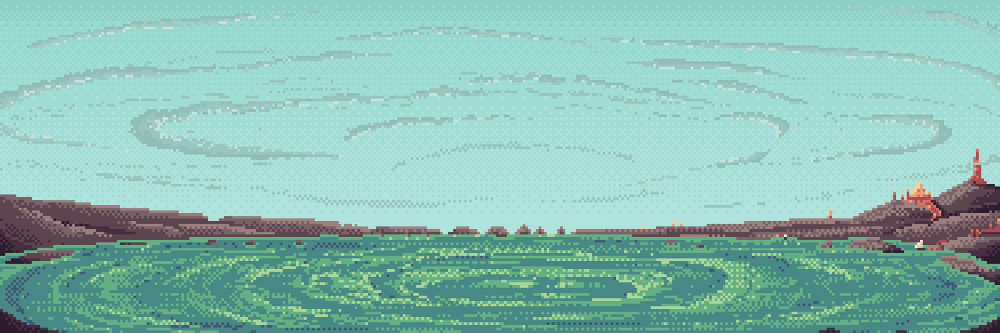
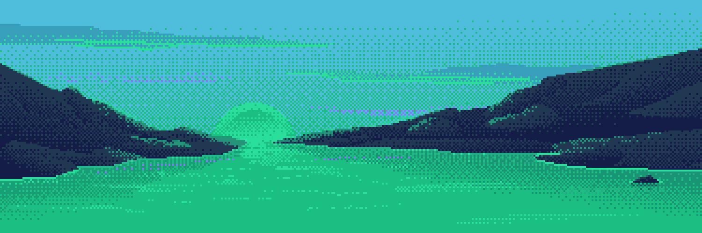
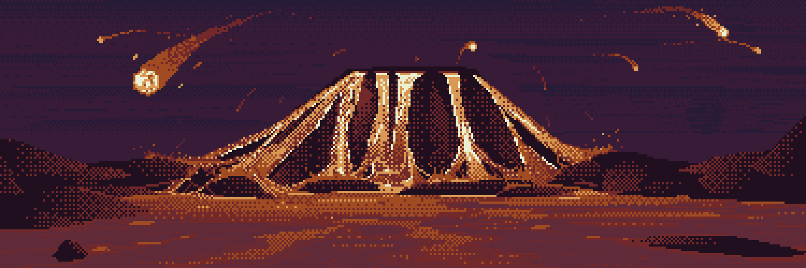
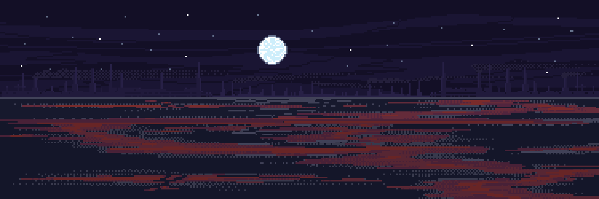
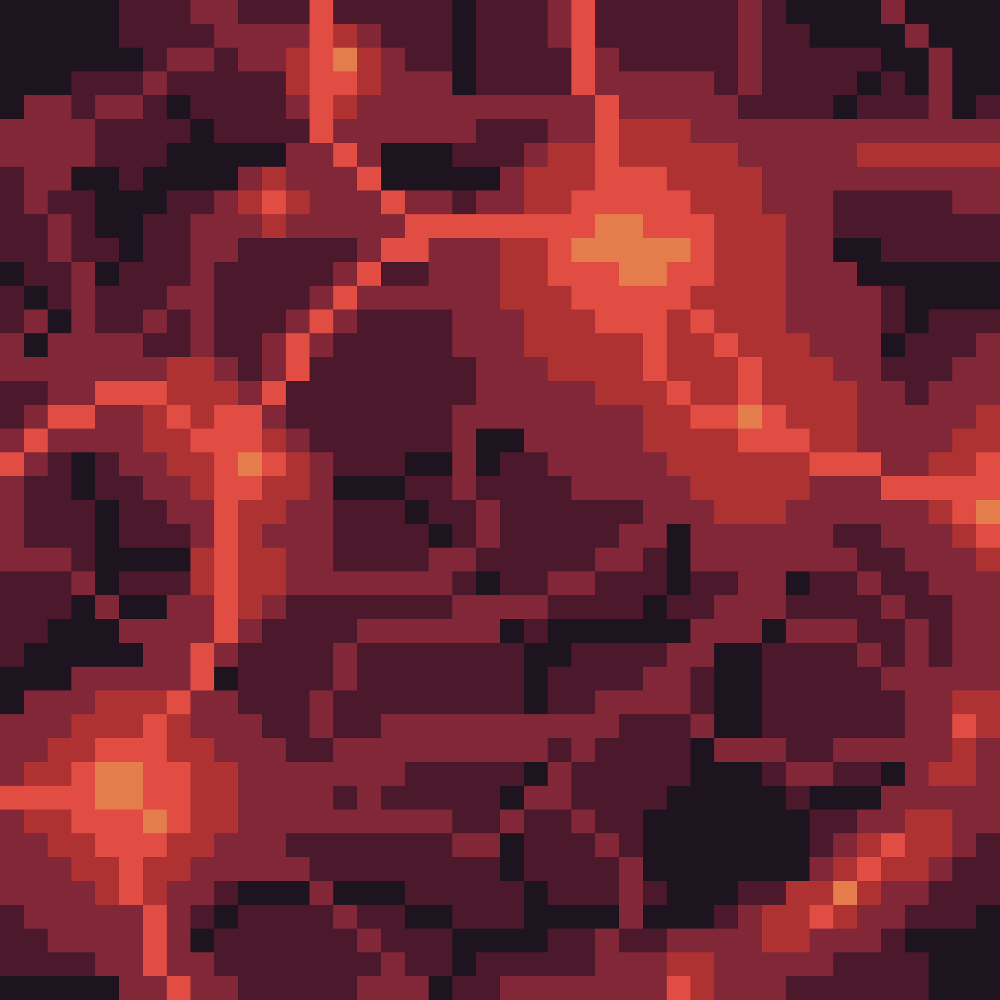
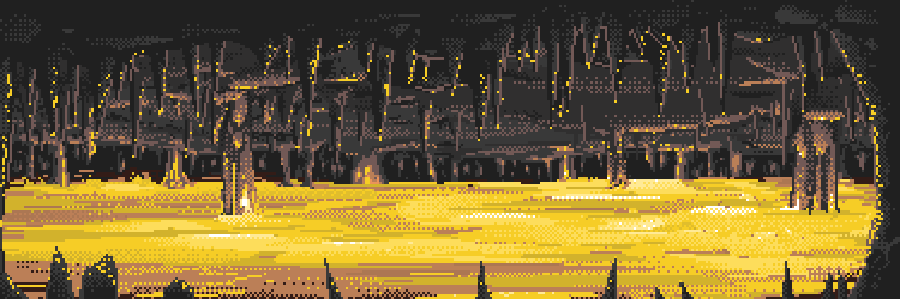

# Mireon

Mireon is one of the few known Worlds where nearly all stable environments exist in a fluid state. Oceans, rivers, mists, and even certain layers of the atmosphere are composed of unusual liquid substances whose true nature remains only partially understood.

According to Traveler records, the surface of Mireon is divided into several immense regions, each possessing its own medium, color, temperature, atmosphere, sounds, and scent. At present, six primary states have been documented.

---

## Tea

The Tea region consists of vast warm oceans of pale green liquid, above which light steam and slowly moving fog are almost always present. The air is filled with a soft herbal aroma, while the surface of the liquid reflects light as if something alive is constantly moving beneath it.

Most Travelers describe this region as an unusually quiet place where only the faint sounds of waves, the creaking of old wooden piers, and the distant clinking of dishes from remote settlements can be heard.

---

## Acid

Acid is considered one of the most dangerous and unstable regions of Mireon. Vast lakes of poisonous glowing colors constantly evaporate, filling the air with thick fumes and a sharp metallic scent.

The surface of the liquid continuously bubbles and shifts in color, while loud cracking and hissing sounds occasionally emerge from the depths, as though the environment itself is slowly dissolving the surrounding world.

---

## Lava

The Lava region is formed from endless volcanic fields, rivers of liquid fire, and black stone plateaus covered in ash. The sky here is almost always stained with dark red tones, while the air is filled with heat and the smell of burning stone.

Travelers often describe deep vibrations beneath the ground, distant volcanic rumbling, and occasional meteor showers illuminating the surface of Mireon with sudden flashes of light.

---

## Petroleum

Petroleum occupies the darkest regions of Mireon. Black viscous oceans stretch across abandoned industrial structures, metallic platforms, and ruined extraction complexes.

The air here is heavy with the smell of oil, rust, and smoke. Most of the region remains submerged in darkness, interrupted only by the faint glow of old machinery and dim reflections upon the surface of the liquid.

Many Travelers note the near-complete absence of sound, broken only by the distant hum of pipelines and the slow creaking of metal structures.

---

## Blood

Blood is considered one of the most disturbing states of Mireon. Dark crimson rivers and lakes run through enormous canyons and lowlands covered in dense red mist.

The liquid appears unusually dense and moves slowly even across open terrain. The air carries a heavy metallic scent, and during the night strange pulsating sounds can sometimes be heard rising from beneath the surface, resembling the heartbeat of something enormous.

Some Travelers claim that the silence of this region is what they remember most vividly.

---

## Gold

Gold is found primarily within the immense underground systems of Mireon. Streams of molten golden liquid illuminate ancient caverns, pillars, and ruined structures with a soft amber glow.

The surface of the metal moves slowly and almost silently, creating the sensation that the entire surrounding space has become motionless. The air here is dry and hot, while the walls of many caverns are covered in reflections resembling distant stars.

According to Traveler records, the region of Gold is one of the easiest places in Mireon to lose the sense of time.

