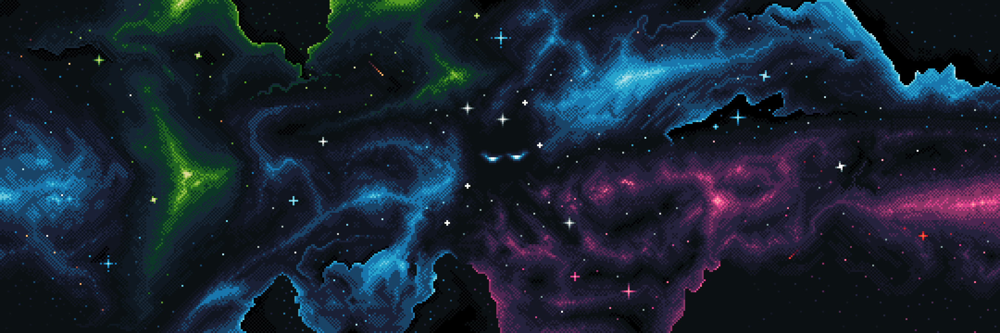

# Home Worlds

ithin the universe of Home’s Journey, I generally use the term Worlds to describe the various places, regions, and realities that exist within the infinite expanse of the Essence.

Some Worlds take the form of entire galaxies or civilizations. Others may consist of isolated regions, valleys, ruins, or enclosed spaces that exist according to their own laws.

Each World possesses its own atmosphere, history, and traces of the Path.

> *The following records represent fragmented observations, reconstructions, sketches, and rare information gathered from Traveler testimonies, recovered artifacts, and translated fragments of the Book.*
{: .highlight }

---

<a href="/Valley/README" style="display: block; padding: 16px; border: 1px solid #c8a84b; text-decoration: none; color: #c8a84b; margin-left: auto; width: fit-content;">
  
Read next

  
The Valley of Tea Dragons

</a>

