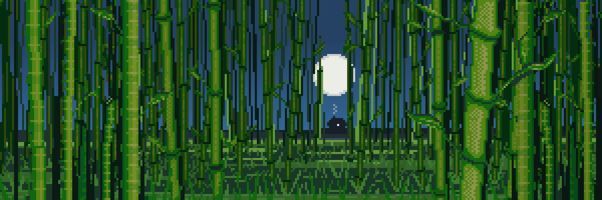

# Less Explored Worlds

Among the partially translated records and the relatively rare journeys into these Worlds, enough scattered mentions still remain to assemble this general note.

In most cases, only isolated regions, brief observations, unstable routes, or singular artifacts were ever documented — many of which can no longer be accurately traced to their original source. Some of these Worlds were encountered only once, after which no Traveler was able to rediscover the Path leading back to them.

---

## Solana

Solana is among the most unusual Worlds mentioned in surviving records. Unlike most known locations, references to this World appear repeatedly across unrelated Paths, distant Worlds, and even records that otherwise share no common origin.

Travelers often describe Solana as a place where the boundaries between realities become unusually thin. Symbols, landscapes, and fragments associated with this World have been documented far beyond its known borders, as though traces of Solana continue to manifest across multiple dimensions simultaneously.

The reason for this phenomenon remains unknown.

---

## Mallow

Mallow is a sparsely documented World known primarily through surviving works of art recovered from various archives. Most descriptions mention vast pink plains, luminous skies, and isolated structures scattered across the landscape.

Unlike many other Worlds, Mallow is most often remembered not for its cities or inhabitants, but for the remarkable amount of artwork believed to have originated there. Some Travelers even speculate that artistic creation itself once played a central role in the culture of this World.

---

## Bamboo

Bamboo is a heavily overgrown World where immense bamboo forests cover most known regions. In many places the vegetation grows so densely that sunlight rarely reaches the ground.

Travelers describe long silent paths, endless green corridors, and the constant sound of wind moving through the stalks. Despite numerous expeditions, only a small portion of Bamboo has ever been explored.

---

<a href="/Artifacts/README" style="display: block; padding: 16px; border: 1px solid #c8a84b; text-decoration: none; color: #c8a84b; margin-left: auto; width: fit-content;">
  
Read next

  
Artifacts

</a>

